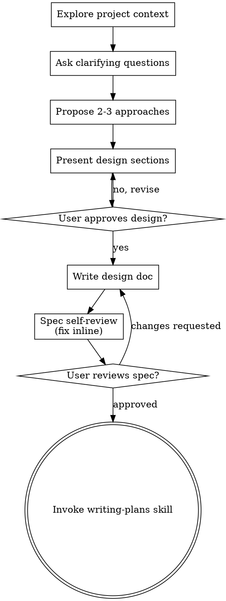

# FDroid MR review plan for OnePlus Pad 2

**Session ID:** ses_00bbea194ffeUZn6ujwA056w4x
**Created:** 8/12/2026, 10:05:52 AM
**Updated:** 8/12/2026, 11:12:13 AM

---

## User

linsui from fdroid is asking for help on testing out some MRs. These are the open MRs (https://gitlab.com/fdroid/fdroiddata/-/merge_requests/?sort=created_asc&state=opened&label_name%5B%5D=review-requested&first_page_size=20&page_after=eyJjcmVhdGVkX2F0IjoiMjAyNi0wNy0xMyAwMzozMjoyMC41MDEzMDkwMDAgKzAwMDAiLCJpZCI6IjUwNjM5OTQzOCJ9 ) and this contains the details on how to review - (https://gitlab.com/fdroid/wiki/-/wikis/Internal/Reviewing-new-apps) use superpowers and create a new plan on how to review these on my oneplus pad 2. 

---

## Assistant (Build · DeepSeek V4 Flash (2x usage) · 6.2s)

_Thinking:_

The user wants me to help review F-Droid MRs on their OnePlus Pad 2. They mention:
1. Open MRs from fdroid/fdroiddata with label `review-requested`
2. A wiki page on how to review: https://gitlab.com/fdroid/wiki/-/wikis/Internal/Reviewing-new-apps
3. Use superpowers and create a new plan

Let me start by loading the using-superpowers skill as it says "Use when starting any conversation - establishes how to find and use skills, requiring skill invocation before ANY response including clarifying questions".

Let me also fetch the wiki page and the MR list to understand what's needed.

Let me load the using-superpowers skill first, then the writing-plans skill since they want a plan created.

**Tool: skill**

**Input:**
```json
{
  "name": "using-superpowers"
}
```

**Output:**
```
<skill_content name="using-superpowers">
# Skill: using-superpowers

<SUBAGENT-STOP>
If you were dispatched as a subagent to execute a specific task, ignore this skill.
</SUBAGENT-STOP>

<EXTREMELY-IMPORTANT>
If you think there is even a 1% chance a skill might apply to what you are doing, you ABSOLUTELY MUST invoke the skill.

IF A SKILL APPLIES TO YOUR TASK, YOU DO NOT HAVE A CHOICE. YOU MUST USE IT.

This is not negotiable. You cannot rationalize your way out of this.
</EXTREMELY-IMPORTANT>

## The Rule

**Invoke relevant or requested skills BEFORE any response or action** — including clarifying questions, exploring the codebase, or checking files. If it turns out wrong for the situation, you don't have to use it.

**Before entering plan mode:** if you haven't already brainstormed, invoke the brainstorming skill first.

Then announce "Using [skill] to [purpose]" and follow the skill exactly. If it has a checklist, create a todo per item.

## Skill Priority

When multiple skills apply, process skills come first — they set the approach, then implementation skills (frontend-design, etc.) carry it out. Brainstorming and systematic-debugging are Superpowers' most common process skills, but the rule holds for any of them.

- "Let's build X" → superpowers:brainstorming first, then implementation skills.
- "Fix this bug" → superpowers:systematic-debugging first, then domain skills.

## Red Flags

These thoughts mean STOP—you're rationalizing:

| Thought | Reality |
|---------|---------|
| "This is just a simple question" | Questions are tasks. Check for skills. |
| "I need more context first" | Skill check comes BEFORE clarifying questions. |
| "Let me explore the codebase first" | Skills tell you HOW to explore. Check first. |
| "I can check git/files quickly" | Files lack conversation context. Check for skills. |
| "Let me gather information first" | Skills tell you HOW to gather information. |
| "This doesn't need a formal skill" | If a skill exists, use it. |
| "I remember this skill" | Skills evolve. Read current version. |
| "This doesn't count as a task" | Action = task. Check for skills. |
| "The skill is overkill" | Simple things become complex. Use it. |
| "I'll just do this one thing first" | Check BEFORE doing anything. |
| "This feels productive" | Undisciplined action wastes time. Skills prevent this. |
| "I know what that means" | Knowing the concept ≠ using the skill. Invoke it. |

## Platform Adaptation

If your harness appears here, read its reference file for special instructions:

- Codex: `references/codex-tools.md`
- Pi: `references/pi-tools.md`
- Antigravity: `references/antigravity-tools.md`

## User Instructions

User instructions (CLAUDE.md, AGENTS.md, GEMINI.md, etc, direct requests) take precedence over skills, which in turn override default behavior. Only skip skill workflows or instructions when your human partner has explicitly told you to.

Base directory for this skill: /home/jica/.agents/skills/using-superpowers
Relative paths in this skill (e.g., scripts/, reference/) are relative to this base directory.
Note: file list is sampled.

<skill_files>
<file>/home/jica/.agents/skills/using-superpowers/references/pi-tools.md</file>
<file>/home/jica/.agents/skills/using-superpowers/references/codex-tools.md</file>
<file>/home/jica/.agents/skills/using-superpowers/references/antigravity-tools.md</file>
</skill_files>
</skill_content>
```

---

## Assistant (Build · DeepSeek V4 Flash (2x usage) · 7.7s)

_Thinking:_

The user wants me to review F-Droid MRs on their OnePlus Pad 2. They asked to "use superpowers and create a new plan". This is a planning task, so I should use the writing-plans skill. But first, the using-superpowers skill says: "Before entering plan mode: if you haven't already brainstormed, invoke the brainstorming skill first."

Hmm, but the user explicitly asked to "create a new plan" — writing-plans is for when you have a spec or requirements for a multi-step task. Let me think about which skills apply:

1. `writing-plans` - "Use when you have a spec or requirements for a multi-step task, before touching code" — user asked to create a plan
2. `brainstorming` - "You MUST use this before any creative work" — creating a plan could be creative work, but the user gave a clear task
3. `android-emulator-skill` - for testing Android apps on emulator - the user has a OnePlus Pad 2, not an emulator
4. `using-superpowers` - already loaded

Let me fetch the wiki page first to understand what reviewing involves, and also look at the MRs. Actually per the skill rules, I should invoke relevant skills BEFORE any response. The user explicitly asked to create a plan. So `writing-plans` applies. And brainstorming might apply before writing a plan to explore the intent.

Actually the user's request is fairly clear: create a plan on how to review these F-Droid MRs on their OnePlus Pad 2. But there's ambiguity: which MRs? What kind of testing? Let me first gather info (fetch the wiki and MR list), then brainstorm/clarify, then write the plan.

The writing-plans skill says to use when you have a spec or requirements for a multi-step task before touching code. The user asked for a plan. Let me load writing-plans skill and also fetch the wiki page and MR list in parallel.

Let me load the writing-plans skill first.

Using writing-plans to structure this, and brainstorming will come first since we need to nail down requirements. Let me load the relevant skills and gather the reference materials in parallel.

**Tool: skill**

**Input:**
```json
{
  "name": "writing-plans"
}
```

**Output:**
```
<skill_content name="writing-plans">
# Skill: writing-plans

# Writing Plans

## Overview

Write comprehensive implementation plans assuming the engineer has zero context for our codebase and questionable taste. Document everything they need to know: which files to touch for each task, code, testing, docs they might need to check, how to test it. Give them the whole plan as bite-sized tasks. DRY. YAGNI. TDD. Frequent commits.

Assume they are a skilled developer, but know almost nothing about our toolset or problem domain. Assume they don't know good test design very well.

**Announce at start:** "I'm using the writing-plans skill to create the implementation plan."

**Context:** If working in an isolated worktree, it should have been created via the `superpowers:using-git-worktrees` skill at execution time.

**Save plans to:** `docs/superpowers/plans/YYYY-MM-DD-<feature-name>.md`
- (User preferences for plan location override this default)

## Scope Check

If the spec covers multiple independent subsystems, it should have been broken into sub-project specs during brainstorming. If it wasn't, suggest breaking this into separate plans — one per subsystem. Each plan should produce working, testable software on its own.

## File Structure

Before defining tasks, map out which files will be created or modified and what each one is responsible for. This is where decomposition decisions get locked in.

- Design units with clear boundaries and well-defined interfaces. Each file should have one clear responsibility.
- You reason best about code you can hold in context at once, and your edits are more reliable when files are focused. Prefer smaller, focused files over large ones that do too much.
- Files that change together should live together. Split by responsibility, not by technical layer.
- In existing codebases, follow established patterns. If the codebase uses large files, don't unilaterally restructure - but if a file you're modifying has grown unwieldy, including a split in the plan is reasonable.

This structure informs the task decomposition. Each task should produce self-contained changes that make sense independently.

## Task Right-Sizing

A task is the smallest unit that carries its own test cycle and is worth a
fresh reviewer's gate. When drawing task boundaries: fold setup,
configuration, scaffolding, and documentation steps into the task whose
deliverable needs them; split only where a reviewer could meaningfully
reject one task while approving its neighbor. Each task ends with an
independently testable deliverable.

## Bite-Sized Task Granularity

**Each step is one action (2-5 minutes):**
- "Write the failing test" - step
- "Run it to make sure it fails" - step
- "Implement the minimal code to make the test pass" - step
- "Run the tests and make sure they pass" - step
- "Commit" - step

## Plan Document Header

**Every plan MUST start with this header:**

```markdown
# [Feature Name] Implementation Plan

> **For agentic workers:** REQUIRED SUB-SKILL: Use superpowers:subagent-driven-development (recommended) or superpowers:executing-plans to implement this plan task-by-task. Steps use checkbox (`- [ ]`) syntax for tracking.

**Goal:** [One sentence describing what this builds]

**Architecture:** [2-3 sentences about approach]

**Tech Stack:** [Key technologies/libraries]

## Global Constraints

[The spec's project-wide requirements — version floors, dependency limits,
naming and copy rules, platform requirements — one line each, with exact
values copied verbatim from the spec. Every task's requirements implicitly
include this section.]

---
```

## Task Structure

````markdown
### Task N: [Component Name]

**Files:**
- Create: `exact/path/to/file.py`
- Modify: `exact/path/to/existing.py:123-145`
- Test: `tests/exact/path/to/test.py`

**Interfaces:**
- Consumes: [what this task uses from earlier tasks — exact signatures]
- Produces: [what later tasks rely on — exact function names, parameter
  and return types. A task's implementer sees only their own task; this
  block is how they learn the names and types neighboring tasks use.]

- [ ] **Step 1: Write the failing test**

```python
def test_specific_behavior():
    result = function(input)
    assert result == expected
```

- [ ] **Step 2: Run test to verify it fails**

Run: `pytest tests/path/test.py::test_name -v`
Expected: FAIL with "function not defined"

- [ ] **Step 3: Write minimal implementation**

```python
def function(input):
    return expected
```

- [ ] **Step 4: Run test to verify it passes**

Run: `pytest tests/path/test.py::test_name -v`
Expected: PASS

- [ ] **Step 5: Commit**

```bash
git add tests/path/test.py src/path/file.py
git commit -m "feat: add specific feature"
```
````

## No Placeholders

Every step must contain the actual content an engineer needs. These are **plan failures** — never write them:
- "TBD", "TODO", "implement later", "fill in details"
- "Add appropriate error handling" / "add validation" / "handle edge cases"
- "Write tests for the above" (without actual test code)
- "Similar to Task N" (repeat the code — the engineer may be reading tasks out of order)
- Steps that describe what to do without showing how (code blocks required for code steps)
- References to types, functions, or methods not defined in any task

## Remember
- Exact file paths always
- Complete code in every step — if a step changes code, show the code
- Exact commands with expected output
- DRY, YAGNI, TDD, frequent commits

## Self-Review

After writing the complete plan, look at the spec with fresh eyes and check the plan against it. This is a checklist you run yourself — not a subagent dispatch.

**1. Spec coverage:** Skim each section/requirement in the spec. Can you point to a task that implements it? List any gaps.

**2. Placeholder scan:** Search your plan for red flags — any of the patterns from the "No Placeholders" section above. Fix them.

**3. Type consistency:** Do the types, method signatures, and property names you used in later tasks match what you defined in earlier tasks? A function called `clearLayers()` in Task 3 but `clearFullLayers()` in Task 7 is a bug.

If you find issues, fix them inline. No need to re-review — just fix and move on. If you find a spec requirement with no task, add the task.

## Execution Handoff

After saving the plan, offer execution choice:

**"Plan complete and saved to `docs/superpowers/plans/<filename>.md`. Two execution options:**

**1. Subagent-Driven (recommended)** - I dispatch a fresh subagent per task, review between tasks, fast iteration

**2. Inline Execution** - Execute tasks in this session using executing-plans, batch execution with checkpoints

**Which approach?"**

**If Subagent-Driven chosen:**
- **REQUIRED SUB-SKILL:** Use superpowers:subagent-driven-development
- Fresh subagent per task + two-stage review

**If Inline Execution chosen:**
- **REQUIRED SUB-SKILL:** Use superpowers:executing-plans
- Batch execution with checkpoints for review

Base directory for this skill: /home/jica/.agents/skills/writing-plans
Relative paths in this skill (e.g., scripts/, reference/) are relative to this base directory.
Note: file list is sampled.

<skill_files>
<file>/home/jica/.agents/skills/writing-plans/plan-document-reviewer-prompt.md</file>
</skill_files>
</skill_content>
```

**Tool: webfetch**

**Input:**
```json
{
  "url": "https://gitlab.com/fdroid/wiki/-/wikis/Internal/Reviewing-new-apps",
  "format": "markdown"
}
```

**Output:**
```
   Reviewing new apps · Wiki · F-Droid / wiki · GitLab
```

---

## Assistant (Build · DeepSeek V4 Flash (2x usage) · 5.0s)

_Thinking:_

The webfetch didn't get the wiki content - it just returned the title. GitLab wiki pages are rendered via JS perhaps. Let me try fetching with different format or the raw wiki page. The wiki might have an export or raw markdown accessible.

Let me try:
1. The raw wiki file: GitLab wikis can be accessed at https://gitlab.com/fdroid/wiki/-/wikis/Internal/Reviewing-new-apps.md or the raw content endpoint
2. The MR list URL to see the MRs

Let me try those in parallel.

The wiki page didn't render its content (GitLab wikis need JS). Let me fetch the raw markdown and the MR list.

**Tool: webfetch**

**Input:**
```json
{
  "format": "text",
  "url": "https://gitlab.com/fdroid/wiki/-/wikis/Internal/Reviewing-new-apps.md"
}
```

**Output:**
```
## Maintainer Review

- Check if the app complies with the [Inclusion Policy](https://f-droid.org/docs/Inclusion_Policy/)
- Check if the MR template is filled correctly and the requirements are complied.
- Check if the metadata follows the best practice and the templates in https://gitlab.com/fdroid/fdroiddata/-/tree/master/templates
- Check if the Code Quality section in the Reports tabs has any warnings
- When the metadata is good enough, the MR can be marked as [Review Requested](https://gitlab.com/fdroid/fdroiddata/-/merge_requests/?sort=created_asc&state=opened&label_name[]=review-requested).

## Tester Review

- The app needs to be tested on device to make sure it works correctly. The apk url can be found in Code Quality reports. Please make sure the test device meet the requirements of the app, e.g., SDK version, root permission, etc.
  - Check if the app can start and work normally.
  - Check if the main functions in the description are implemented.
  - Check if the app has a unique icon (instead of a default one).
  - Check if there is any features that may violate F-Droid's [Inclusion Policy](https://f-droid.org/docs/Inclusion_Policy/).
  - Check if the [Categories](https://f-droid.org/docs/Build_Metadata_Reference/#Categories) field is set properly.
  - Check if the app requires accepting any terms other than the FOSS license.
  - Check if the app requires unnecessary permissions. Permissions are listed in Code Quality.
    - Check if the app can be used without granting optional [runtime permissions](https://source.android.com/docs/core/permissions/runtime_perms). The app should only require necessary runtime permissions for basic functions on start and other runtime permissions should be required when corresponding functions are used. E.g., a messaging app should only require CAMERA permission when the user starts a video chat.
    - Check if the app require unnecessary `MANAGE_EXTERNAL_STORAGE` permission. [SAF](https://developer.android.com/guide/topics/providers/document-provider) should be used instead when it's possible.
  - If the app requires `INTERNET` permission then the network connections need to be checked (with network monitors, e.g. [PCAPdroid](https://f-droid.org/en/packages/com.emanuelef.remote_capture)). Start the monitor before opening the app to make sure all the network connections are catched.
    - Check if the app connects to any web services on start. Such connections means NonFreeNet and TetheredNet may apply.
    - Check if the app check for update automatically.
    - Check if the app has any unnecessary connections, e.g., online fonts, icons, connectivity check, etc. Such connections should be removed or made optional.
    - Check if any tracking services are used.
    - Any connections that are not described clearly should be checked with the author.
    - If there is no connection observed, ask the dev if this permission can be removed.
    - Unnecessary in-app webview (e.g. for author page) should be replaced with opening the url in browsers.
  - Check if the app has English support. If English is not supported this should be declared in the description.
- [VirusTotal](https://www.virustotal.com/) or similar suspicious file scanners can be used to see if there are dangerous behaviors
- A template for report

<details>
<summary>Report template</summary>

```md
<table>
<thead>
<tr>
<th>Category</th>
<th>Checklist</th>
</tr>
</thead>
<tbody>
<tr>
<td>Basic Function</td>
<td>

- [ ] The app can start and work normally.
- [ ] The functions in the description are implemented.
- [ ] The app has a unique icon (instead of a default one).

</td>
</tr>
<tr>
<td>Policy Compliance</td>
<td>

- [ ] Features don't violate F-Droid's Inclusion Policy.
- [ ] The Categories field is set properly.
- [ ] Doesn't require accepting any terms other than the FOSS license.

</td>
</tr>
<tr>
<td>Permissions<br>(Whether the app requires unnecessary permissions. Permissions are listed in Code Quality.)</td>
<td>

- [ ] The app can be used without granting optional runtime permissions. The app should only require necessary runtime permissions for basic functions on start and other runtime permissions should be required when corresponding functions are used. For example, a messaging app should only require CAMERA permission when the user starts a video chat.
- [ ] The app doesn't require unnecessary MANAGE_EXTERNAL_STORAGE permission. If it does, suggest using SAF instead when it's possible.

</td>
</tr>
<tr>
<td>Network Connections<br>(If the app requires <code>INTERNET</code> permission then the network connections need to be checked with network monitors, e.g. <a href="https://f-droid.org/en/packages/com.emanuelef.remote_capture">PCAPdroid</a>. Start the monitor before opening the app to make sure all the network connections are catched.)</td>
<td>

- [ ] Network connection is observed. If not, please ask the author to remove the permission.
- [ ] The app connects to web services on start. Such connections means NonFreeNet and TetheredNet may apply.
- [ ] The app checks for update automatically.
- [ ] The app has unnecessary connections, e.g., online fonts, icons, connectivity check, etc. Such connections should be removed or made optional.
- [ ] Tracking domains connected.
- [ ] Connections not described clearly in description. Such connections should be checked with the author.
- [ ] Unnecessary in-app webview (e.g. for author page) presents in the app. Such thing should be replaced with opening the url in browsers.

</td>
</tr>
<tr>
<td>Language Support</td>
<td>

- [ ] The app has English support. If English is not supported this should be declared in the description.

</td>
</tr>
<tr>
<td>Security Scan</td>
<td>

- [ ] All or most vendors on VirusTotal or similar scanning services indicate the app is benign.

</td>
</tr>
</tbody>
</table>
```

</details>
```

**Tool: webfetch**

**Input:**
```json
{
  "format": "markdown",
  "url": "https://gitlab.com/api/v4/projects/fdroid%2Ffdroiddata/merge_requests?state=opened&labels=review-requested&sort=created_asc&per_page=50"
}
```

**Error:**
```
StatusCode: non 2xx status code (400 GET https://gitlab.com/api/v4/projects/fdroid%2Ffdroiddata/merge_requests?state=opened&labels=review-requested&sort=created_asc&per_page=50)
```

---

## Assistant (Build · DeepSeek V4 Flash (2x usage) · 4.8s)

_Thinking:_

The wiki page content was fetched successfully. The MR list API call failed with 400 — the URL-encoded path may be wrong or labels param wrong. Let me try again with a different URL format. GitLab API: projects/{id}/merge_requests. The project path is fdroid/fdroiddata. Encoding: fdroid%2Ffdroiddata should work. 400 might be because "labels" needs to be comma-separated and maybe the sort is fine... Let me try with curl instead.

Wiki content retrieved. The GitLab API call failed — let me retry with curl.

**Tool: bash**

**Input:**
```json
{
  "command": "curl -s --max-time 60 \"https://gitlab.com/api/v4/projects/fdroid%2Ffdroiddata/merge_requests?state=opened&labels=review-requested&sort=created_asc&per_page=50\" | head -c 2000"
}
```

**Output:**
```
(no output)
```

---

## Assistant (Build · DeepSeek V4 Flash (2x usage) · 13.2s)

_Thinking:_

No output. Let me check what's happening with curl - maybe an error. Let me add -v or check the HTTP status code.

**Tool: bash**

**Input:**
```json
{}
```

**Error:**
```
Tool execution aborted
```

_Thinking:_

Empty output. Maybe curl isn't available or the network is blocked. Let me check.

**Tool: bash**

**Input:**
```json
{
  "command": "which curl; curl -sI --max-time 30 \"https://gitlab.com/api/v4/version\" | head -5; echo \"exit: $?\""
}
```

**Output:**
```
/usr/bin/curl
HTTP/2 401 
date: Wed, 12 Aug 2026 04:36:29 GMT
content-type: application/json
content-length: 0
cf-ray: a29cc77fad0dc784-MAA
exit: 0

```

---

## Assistant (Build · DeepSeek V4 Flash (2x usage) · 8.6s)

_Thinking:_

Curl works and gitlab.com is reachable (401 for version endpoint without auth, that's expected). The earlier request returned empty with head -c 2000 — maybe output was empty because the response was large or... wait, "no output" - strange. Let me retry with -o to a file and check status.

Curl works. Retrying the MR list with output to file:

**Tool: bash**

**Input:**
```json
{
  "command": "curl -s --max-time 60 -o /tmp/opencode/mrs.json -w \"%{http_code} %{size_download}\\n\" \"https://gitlab.com/api/v4/projects/fdroid%2Ffdroiddata/merge_requests?state=opened&labels=review-requested&sort=created_asc&per_page=50\""
}
```

**Output:**
```
400 44

```

---

## Assistant (Build · DeepSeek V4 Flash (2x usage) · 4.2s)

**Tool: bash**

**Input:**
```json
{
  "command": "cat /tmp/opencode/mrs.json; echo; curl -s --max-time 60 -o /tmp/opencode/mrs2.json -w \"%{http_code} %{size_download}\\n\" \"https://gitlab.com/api/v4/projects/4710055/merge_requests?state=opened&labels=review-requested&per_page=50\"; head -c 500 /tmp/opencode/mrs2.json"
}
```

**Output:**
```
{"error":"sort does not have a valid value"}
404 35
{"message":"404 Project Not Found"}
```

---

## Assistant (Build · DeepSeek V4 Flash (2x usage) · 14.1s)

_Thinking:_

The sort parameter doesn't accept "created_asc". Let me remove the sort parameter and use the correct project ID. Project 4710055 is wrong. Let me find the right project ID for fdroid/fdroiddata.

**Tool: bash**

**Input:**
```json
{
  "command": "curl -s --max-time 60 \"https://gitlab.com/api/v4/projects/fdroid%2Ffdroiddata\" | python3 -c \"import json,sys; d=json.load(sys.stdin); print(d.get('id'), d.get('path_with_namespace'))\"; curl -s --max-time 60 -o /tmp/opencode/mrs.json -w \"%{http_code} %{size_download}\\n\" \"https://gitlab.com/api/v4/projects/fdroid%2Ffdroiddata/merge_requests?state=opened&labels=review-requested&per_page=50\""
}
```

**Output:**
```
36528 fdroid/fdroiddata
000 0

```

---

## Assistant (Build · DeepSeek V4 Flash (2x usage) · 49.2s)

_Thinking:_

The second curl returned 000 - connection issue. Retry.

**Tool: bash**

**Input:**
```json
{}
```

**Error:**
```
Tool execution aborted
```

_Thinking:_

The first request returned the ID 36528. The second curl got 000 status - possibly rate limited or an

_Thinking:_

Hmm, the first curl returned the project id correctly (36528), but the second returned 000 0 — connection issue perhaps. Let me retry the MR list.

**Tool: bash**

**Input:**
```json
{
  "command": "curl -s --max-time 90 --retry 2 -o /tmp/opencode/mrs.json -w \"%{http_code} %{size_download}\\n\" \"https://gitlab.com/api/v4/projects/36528/merge_requests?state=opened&labels=review-requested&per_page=50\""
}
```

**Output:**
```
200 218904

```

---

## Assistant (Build · DeepSeek V4 Flash (2x usage) · 4.1s)

**Tool: bash**

**Input:**
```json
{
  "command": "python3 -c \"\nimport json\nwith open('/tmp/opencode/mrs.json') as f:\n    mrs = json.load(f)\nprint('count:', len(mrs))\nfor mr in mrs:\n    print(mr['iid'], '|', mr['title'][:80], '| created:', mr['created_at'][:10], '| author:', mr['author']['username'], '| web:', mr['web_url'])\n\""
}
```

**Output:**
```
count: 50
45475 | New app: Kinetica | created: 2026-08-11 | author: EZ-eta | web: https://gitlab.com/fdroid/fdroiddata/-/merge_requests/45475
45467 | New app: Harbor | created: 2026-08-11 | author: Stem0794 | web: https://gitlab.com/fdroid/fdroiddata/-/merge_requests/45467
45462 | Add com.bivouac.app metadata | created: 2026-08-11 | author: sebraison | web: https://gitlab.com/fdroid/fdroiddata/-/merge_requests/45462
45381 | New app: Nightbell | created: 2026-08-10 | author: riveerxd | web: https://gitlab.com/fdroid/fdroiddata/-/merge_requests/45381
45376 | New app: 5G Proxy Pro | created: 2026-08-10 | author: tokyoxpa3 | web: https://gitlab.com/fdroid/fdroiddata/-/merge_requests/45376
45374 | New app: SearchLauncher | created: 2026-08-10 | author: joepio | web: https://gitlab.com/fdroid/fdroiddata/-/merge_requests/45374
45296 | New app: Navic | created: 2026-08-10 | author: ssalggnikool | web: https://gitlab.com/fdroid/fdroiddata/-/merge_requests/45296
45293 | New app: Chiffres & Lettres (fr.pierre.chiffreslettres) | created: 2026-08-09 | author: Pierre-21-git | web: https://gitlab.com/fdroid/fdroiddata/-/merge_requests/45293
45283 | New app: Thwart | created: 2026-08-09 | author: hasyame | web: https://gitlab.com/fdroid/fdroiddata/-/merge_requests/45283
45278 | New App: Solid Share | created: 2026-08-09 | author: erfangholami | web: https://gitlab.com/fdroid/fdroiddata/-/merge_requests/45278
45274 | New app: Kiosk | created: 2026-08-09 | author: shapeshed | web: https://gitlab.com/fdroid/fdroiddata/-/merge_requests/45274
45208 | New app: ylih | created: 2026-08-08 | author: eldavo | web: https://gitlab.com/fdroid/fdroiddata/-/merge_requests/45208
45199 | New App: com.example.filmflip | created: 2026-08-08 | author: Jumas-Cola | web: https://gitlab.com/fdroid/fdroiddata/-/merge_requests/45199
45198 | New app: SPRAWL//RUN | created: 2026-08-08 | author: jbinder | web: https://gitlab.com/fdroid/fdroiddata/-/merge_requests/45198
45189 | New App: Unmark | created: 2026-08-08 | author: EmreO33 | web: https://gitlab.com/fdroid/fdroiddata/-/merge_requests/45189
45187 | New app: SMSLocFD | created: 2026-08-08 | author: primozsusa | web: https://gitlab.com/fdroid/fdroiddata/-/merge_requests/45187
45125 | New app: ErmChat | created: 2026-08-08 | author: banan-guh | web: https://gitlab.com/fdroid/fdroiddata/-/merge_requests/45125
45098 | New App: MyLexicon | created: 2026-08-08 | author: aryany9 | web: https://gitlab.com/fdroid/fdroiddata/-/merge_requests/45098
45085 | New app: Relatrix | created: 2026-08-07 | author: saad-ibra | web: https://gitlab.com/fdroid/fdroiddata/-/merge_requests/45085
45081 | Add com.awaydoomscrollin.app | created: 2026-08-07 | author: resolvecommunity | web: https://gitlab.com/fdroid/fdroiddata/-/merge_requests/45081
45076 | New App: Bati | created: 2026-08-07 | author: Guiforge | web: https://gitlab.com/fdroid/fdroiddata/-/merge_requests/45076
45064 | New app: hOjo RTSP IP Camera viewer | created: 2026-08-07 | author: smakolski | web: https://gitlab.com/fdroid/fdroiddata/-/merge_requests/45064
45012 | New app: Scratchpad Launcher | created: 2026-08-06 | author: dgalis | web: https://gitlab.com/fdroid/fdroiddata/-/merge_requests/45012
45008 | New app: CipherNotes | created: 2026-08-06 | author: Cris1099 | web: https://gitlab.com/fdroid/fdroiddata/-/merge_requests/45008
45005 | New app: Osmosis | created: 2026-08-06 | author: KonradIT | web: https://gitlab.com/fdroid/fdroiddata/-/merge_requests/45005
45004 | New App: com.pricescoutpt.app | created: 2026-08-06 | author: jlfernandes22 | web: https://gitlab.com/fdroid/fdroiddata/-/merge_requests/45004
45003 | New app: RingR | created: 2026-08-06 | author: samgrande | web: https://gitlab.com/fdroid/fdroiddata/-/merge_requests/45003
44998 | New app: Vadhod APK Extractor | created: 2026-08-06 | author: pgxor | web: https://gitlab.com/fdroid/fdroiddata/-/merge_requests/44998
44929 | New app: OKFNotes | created: 2026-08-06 | author: note4g | web: https://gitlab.com/fdroid/fdroiddata/-/merge_requests/44929
44924 | New app: KFZ-A | created: 2026-08-05 | author: HerkDev | web: https://gitlab.com/fdroid/fdroiddata/-/merge_requests/44924
44922 | New app: KFZ-D | created: 2026-08-05 | author: HerkDev | web: https://gitlab.com/fdroid/fdroiddata/-/merge_requests/44922
44921 | New App: nz.eloque.quits | created: 2026-08-05 | author: SeineEloquenz | web: https://gitlab.com/fdroid/fdroiddata/-/merge_requests/44921
44919 | New app: davy | created: 2026-08-05 | author: daika100 | web: https://gitlab.com/fdroid/fdroiddata/-/merge_requests/44919
44917 | New app: bilalsul.rzr Repo Zip Reader (RZR) | created: 2026-08-05 | author: bilalsul | web: https://gitlab.com/fdroid/fdroiddata/-/merge_requests/44917
44911 | New app: FreeProxy | created: 2026-08-05 | author: xVanTuring | web: https://gitlab.com/fdroid/fdroiddata/-/merge_requests/44911
44825 | newapp: Com.mohasi.glucoglance | created: 2026-08-05 | author: mohasi | web: https://gitlab.com/fdroid/fdroiddata/-/merge_requests/44825
44726 | New App: dev.leeeet.wallpapermoe | created: 2026-08-03 | author: LeeeeT | web: https://gitlab.com/fdroid/fdroiddata/-/merge_requests/44726
44725 | New app: Slate | created: 2026-08-03 | author: braniik | web: https://gitlab.com/fdroid/fdroiddata/-/merge_requests/44725
44636 | New app: Marmalade TTS | created: 2026-08-02 | author: maxwhipw | web: https://gitlab.com/fdroid/fdroiddata/-/merge_requests/44636
44633 | New app: Zaelio | created: 2026-08-02 | author: braunbearded | web: https://gitlab.com/fdroid/fdroiddata/-/merge_requests/44633
44630 | New app: app.matthieu.cairngps | created: 2026-08-02 | author: Matthieu42 | web: https://gitlab.com/fdroid/fdroiddata/-/merge_requests/44630
44629 | New app: BookOrbit | created: 2026-08-02 | author: deranjer | web: https://gitlab.com/fdroid/fdroiddata/-/merge_requests/44629
44628 | New app: Bud Buddy | created: 2026-08-02 | author: BenEgeDeniz | web: https://gitlab.com/fdroid/fdroiddata/-/merge_requests/44628
44626 | New app: Dosezy | created: 2026-08-02 | author: saad2134 | web: https://gitlab.com/fdroid/fdroiddata/-/merge_requests/44626
44528 | New app: Title Track | created: 2026-08-01 | author: mkay5 | web: https://gitlab.com/fdroid/fdroiddata/-/merge_requests/44528
44527 | New app: BoatSpeedy (de.kewl.boatspeedy) | created: 2026-08-01 | author: kewl0 | web: https://gitlab.com/fdroid/fdroiddata/-/merge_requests/44527
44520 | New app: Vault Explorer | created: 2026-08-01 | author: R0b0To | web: https://gitlab.com/fdroid/fdroiddata/-/merge_requests/44520
44519 | New app: Étagère | created: 2026-08-01 | author: uraniumfly | web: https://gitlab.com/fdroid/fdroiddata/-/merge_requests/44519
44516 | New app: LibreCrate | created: 2026-08-01 | author: david_neu | web: https://gitlab.com/fdroid/fdroiddata/-/merge_requests/44516
44435 | New app: Slooop | created: 2026-07-31 | author: andrewpozdnakov7 | web: https://gitlab.com/fdroid/fdroiddata/-/merge_requests/44435

```

---

## Assistant (Build · DeepSeek V4 Flash (2x usage) · 106.5s)

_Thinking:_

50 open MRs with the review-requested label, sorted by created date ascending (the user's URL had a pagination cursor pointing at 2026-07-13). Actually the user's URL cursor started at 2026-07-13 which means the full list includes MRs older than that. But we got 50 most recent ones... wait, sort=created_asc on the web UI shows oldest first. The cursor "page_after" was created_at 2026-07-13 03:33:22.500001000. So MRs listed before that cursor are older than 2026-07-13, and the visible page starts at... hmm, actually page_after means show items after that cursor. So the first page of the user's URL shows MRs created after 2026-07-13? No wait — with created_asc, the oldest items come first. The cursor at 2026-07-13 with id 506399438 means the user scrolled past everything older than that. Hmm, but our API returned MRs from 2026-07-31 through 2026-08-11 — all newer than the cursor. That's suspicious.

Wait, actually maybe there are way more than 50 MRs and we got the 50 newest (per_page=50 without sort returns most recent by default... actually GitLab defaults sort to created_desc). The user's URL is a paginated URL — it shows the page after the cursor. With sort=created_asc, the list starts from oldest. The cursor means they'd already viewed all MRs older than 2026-07-13. But our API response shows MRs created 2026-07-31 to 2026-08-11 which are NEWER than the cursor, which would be... hmm that doesn't quite make sense either. Actually with created_asc sort and page_after cursor, you'd get MRs created after the cursor position. So the user's URL shows MRs created after 2026-07-13. But our API returned MRs with created dates from 2026-07-31 to 2026-08-11 — wait, but with default sort (desc), we get the newest 50. Let me not

_Thinking:_

50 open MRs with the `review-requested` label (the URL had `first_page_size=20` but page_after cursor — there may be more pages; the API returned 50 per page, and there might be more). Let me check if there are more pages. Also, the user's URL showed 20 items per page. The API returned 50. Let me check if there are more.

Also, the user asked to review these on their OnePlus Pad 2. The wiki says the review involves:
1. Download APK from Code Quality reports
2. Install on device
3. Test app: starts, works, main functions implemented, unique icon, policy compliance, categories, terms, permissions (runtime perms, MANAGE_EXTERNAL_STORAGE), network connections (PCAPdroid for INTERNET permission apps), English support
4. VirusTotal scan
5. Report template

The user says "use superpowers and create a new plan on how to review these on my oneplus pad 2".

Per superpowers: writing-plans skill says to brainstorm first (brainstorming skill must be invoked before plan mode/creative work). The writing-plans skill itself says "Before entering plan mode: if you haven't already brainstormed, invoke the brainstorming skill first."

Let me load the brainstorming skill now to explore requirements before writing the plan. Also I should check the android-emulator-skill — but that's for emulator; the user has a physical OnePlus Pad 2. There's an android-accessibility etc. but not relevant.

Actually, there might be a device-connected workflow. The user wants to review on a physical device (OnePlus Pad 2). Let me load brainstorming first, as required by superpowers.

Let me also check if there are more MRs (pagination). The API returned 50 which is per_page=50; there could be more. Let me check X-Total count.

Loaded both skills and fetched the wiki review guide plus the MR list (50 MRs). Before writing the plan, superpowers requires brainstorming. Let me load that skill and check for more MR pages.

**Tool: skill**

**Input:**
```json
{
  "name": "brainstorming"
}
```

**Output:**
```
<skill_content name="brainstorming">
# Skill: brainstorming

# Brainstorming Ideas Into Designs

Help turn ideas into fully formed designs and specs through natural collaborative dialogue.

Start by understanding the current project context, then ask questions one at a time to refine the idea. Once you understand what you're building, present the design and get user approval.

<HARD-GATE>
Do NOT invoke any implementation skill, write any code, scaffold any project, or take any implementation action until you have presented a design and the user has approved it. This applies to EVERY project regardless of perceived simplicity.
</HARD-GATE>

## Anti-Pattern: "This Is Too Simple To Need A Design"

Every project goes through this process. A todo list, a single-function utility, a config change — all of them. "Simple" projects are where unexamined assumptions cause the most wasted work. The design can be short (a few sentences for truly simple projects), but you MUST present it and get approval.

## Checklist

You MUST create a task for each of these items and complete them in order:

1. **Explore project context** — check files, docs, recent commits
2. **Offer the visual companion just-in-time** — NOT upfront. The first time a question would genuinely be clearer shown than described, offer it then (its own message); on approval its browser tab opens for you. If no visual question ever arises, never offer it. See the Visual Companion section below.
3. **Ask clarifying questions** — one at a time, understand purpose/constraints/success criteria
4. **Propose 2-3 approaches** — with trade-offs and your recommendation
5. **Present design** — in sections scaled to their complexity, get user approval after each section
6. **Write design doc** — save to `docs/superpowers/specs/YYYY-MM-DD-<topic>-design.md` and commit
7. **Spec self-review** — quick inline check for placeholders, contradictions, ambiguity, scope (see below)
8. **User reviews written spec** — ask user to review the spec file before proceeding
9. **Transition to implementation** — invoke writing-plans skill to create implementation plan

## Process Flow



**The terminal state is invoking writing-plans.** Do NOT invoke frontend-design, mcp-builder, or any other implementation skill. The ONLY skill you invoke after brainstorming is writing-plans.

## The Process

**Understanding the idea:**

- Check out the current project state first (files, docs, recent commits)
- Before asking detailed questions, assess scope: if the request describes multiple independent subsystems (e.g., "build a platform with chat, file storage, billing, and analytics"), flag this immediately. Don't spend questions refining details of a project that needs to be decomposed first.
- If the project is too large for a single spec, help the user decompose into sub-projects: what are the independent pieces, how do they relate, what order should they be built? Then brainstorm the first sub-project through the normal design flow. Each sub-project gets its own spec → plan → implementation cycle.
- For appropriately-scoped projects, ask questions one at a time to refine the idea
- Prefer multiple choice questions when possible, but open-ended is fine too
- Only one question per message - if a topic needs more exploration, break it into multiple questions
- Focus on understanding: purpose, constraints, success criteria

**Exploring approaches:**

- Propose 2-3 different approaches with trade-offs
- Present options conversationally with your recommendation and reasoning
- Lead with your recommended option and explain why

**Presenting the design:**

- Once you believe you understand what you're building, present the design
- Scale each section to its complexity: a few sentences if straightforward, up to 200-300 words if nuanced
- Ask after each section whether it looks right so far
- Cover: architecture, components, data flow, error handling, testing
- Be ready to go back and clarify if something doesn't make sense

**Design for isolation and clarity:**

- Break the system into smaller units that each have one clear purpose, communicate through well-defined interfaces, and can be understood and tested independently
- For each unit, you should be able to answer: what does it do, how do you use it, and what does it depend on?
- Can someone understand what a unit does without reading its internals? Can you change the internals without breaking consumers? If not, the boundaries need work.
- Smaller, well-bounded units are also easier for you to work with - you reason better about code you can hold in context at once, and your edits are more reliable when files are focused. When a file grows large, that's often a signal that it's doing too much.

**Working in existing codebases:**

- Explore the current structure before proposing changes. Follow existing patterns.
- Where existing code has problems that affect the work (e.g., a file that's grown too large, unclear boundaries, tangled responsibilities), include targeted improvements as part of the design - the way a good developer improves code they're working in.
- Don't propose unrelated refactoring. Stay focused on what serves the current goal.

## After the Design

**Documentation:**

- Write the validated design (spec) to `docs/superpowers/specs/YYYY-MM-DD-<topic>-design.md`
  - (User preferences for spec location override this default)
- Use elements-of-style:writing-clearly-and-concisely skill if available
- Commit the design document to git

**Spec Self-Review:**
After writing the spec document, look at it with fresh eyes:

1. **Placeholder scan:** Any "TBD", "TODO", incomplete sections, or vague requirements? Fix them.
2. **Internal consistency:** Do any sections contradict each other? Does the architecture match the feature descriptions?
3. **Scope check:** Is this focused enough for a single implementation plan, or does it need decomposition?
4. **Ambiguity check:** Could any requirement be interpreted two different ways? If so, pick one and make it explicit.

Fix any issues inline. No need to re-review — just fix and move on.

**User Review Gate:**
After the spec review loop passes, ask the user to review the written spec before proceeding:

> "Spec written and committed to `<path>`. Please review it and let me know if you want to make any changes before we start writing out the implementation plan."

Wait for the user's response. If they request changes, make them and re-run the spec review loop. Only proceed once the user approves.

**Implementation:**

- Invoke the writing-plans skill to create a detailed implementation plan
- Do NOT invoke any other skill. writing-plans is the next step.

## Key Principles

- **One question at a time** - Don't overwhelm with multiple questions
- **Multiple choice preferred** - Easier to answer than open-ended when possible
- **YAGNI ruthlessly** - Remove unnecessary features from all designs
- **Explore alternatives** - Always propose 2-3 approaches before settling
- **Incremental validation** - Present design, get approval before moving on
- **Be flexible** - Go back and clarify when something doesn't make sense

## Visual Companion

A browser-based companion for showing mockups, diagrams, and visual options during brainstorming. Available as a tool — not a mode. Accepting the companion means it's available for questions that benefit from visual treatment; it does NOT mean every question goes through the browser.

**Offering the companion (just-in-time):** Do NOT offer it upfront. Wait until a question would genuinely be clearer shown than told — a real mockup / layout / diagram question, not merely a UI *topic*. The first time that happens, offer it then, as its own message:
> "This next part might be easier if I show you — I can put together mockups, diagrams, and comparisons in a browser tab as we go. It's still new and can be token-intensive. Want me to? I'll open it for you."

**This offer MUST be its own message.** Only the offer — no clarifying question, summary, or other content. Wait for the user's response. If they accept, start the server with `--open` so their browser opens to the first screen automatically. If they decline, continue text-only and don't offer again unless they raise it.

**Per-question decision:** Even after the user accepts, decide FOR EACH QUESTION whether to use the browser or the terminal. The test: **would the user understand this better by seeing it than reading it?**

- **Use the browser** for content that IS visual — mockups, wireframes, layout comparisons, architecture diagrams, side-by-side visual designs
- **Use the terminal** for content that is text — requirements questions, conceptual choices, tradeoff lists, A/B/C/D text options, scope decisions

A question about a UI topic is not automatically a visual question. "What does personality mean in this context?" is a conceptual question — use the terminal. "Which wizard layout works better?" is a visual question — use the browser.

If they agree to the companion, read the detailed guide before proceeding:
`skills/brainstorming/visual-companion.md`

Base directory for this skill: /home/jica/.agents/skills/brainstorming
Relative paths in this skill (e.g., scripts/, reference/) are relative to this base directory.
Note: file list is sampled.

<skill_files>
<file>/home/jica/.agents/skills/brainstorming/spec-document-reviewer-prompt.md</file>
<file>/home/jica/.agents/skills/brainstorming/visual-companion.md</file>
<file>/home/jica/.agents/skills/brainstorming/scripts/stop-server.sh</file>
<file>/home/jica/.agents/skills/brainstorming/scripts/server.cjs</file>
<file>/home/jica/.agents/skills/brainstorming/scripts/start-server.sh</file>
<file>/home/jica/.agents/skills/brainstorming/scripts/helper.js</file>
<file>/home/jica/.agents/skills/brainstorming/scripts/frame-template.html</file>
</skill_files>
</skill_content>
```

**Tool: bash**

**Input:**
```json
{
  "command": "curl -s --max-time 90 -o /tmp/opencode/mrs_p2.json -w \"%{http_code} %{size_download}\\n\" \"https://gitlab.com/api/v4/projects/36528/merge_requests?state=opened&labels=review-requested&per_page=50&page=2\""
}
```

**Output:**
```
000 0

```

---

## Assistant (Build · DeepSeek V4 Flash (2x usage) · 7.5s)

**Tool: bash**

**Input:**
```json
{
  "command": "curl -s --max-time 90 --retry 3 --retry-delay 2 -o /tmp/opencode/mrs_p2.json -w \"%{http_code} %{size_download}\\n\" \"https://gitlab.com/api/v4/projects/36528/merge_requests?state=opened&labels=review-requested&per_page=50&page=2\"; python3 -c \"\nimport json\ntry:\n    mrs = json.load(open('/tmp/opencode/mrs_p2.json'))\n    print('page2 count:', len(mrs))\n    for mr in mrs[:5]:\n        print(mr['iid'], mr['title'][:60])\nexcept Exception as e:\n    print('parse error:', e)\n\""
}
```

**Output:**
```
200 220818
page2 count: 50
44373 New app: PaperPhonePlus
44367 New app: SMSForwarderNeo A1
44366 New App: Salmon Tracker
44361 New app: L9
44290 New app: Vibecheck (com.aradar.vibecheck)

```

---

## Assistant (Build · DeepSeek V4 Flash (2x usage) · 6.6s)

_Thinking:_

There are at least 100 MRs (page 1: 50, page 2: 50). Let me check page 3 to get the total count.

**Tool: bash**

**Input:**
```json
{
  "command": "curl -s --max-time 90 --retry 3 --retry-delay 2 -o /tmp/opencode/mrs_p3.json -w \"%{http_code} %{size_download}\\n\" \"https://gitlab.com/api/v4/projects/36528/merge_requests?state=opened&labels=review-requested&per_page=50&page=3\"; python3 -c \"\nimport json\nfor p in ['p1','p2','p3']:\n    f = '/tmp/opencode/mrs.json' if p=='p1' else f'/tmp/opencode/mrs_{p}.json'\n    try:\n        mrs = json.load(open(f))\n        print(p, 'count:', len(mrs))\n    except Exception as e:\n        print(p, 'error:', e)\n\""
}
```

**Output:**
```
000 0
p1 count: 50
p2 count: 50
p3 error: [Errno 2] No such file or directory: '/tmp/opencode/mrs_p3.json'

```

---

## Assistant (Build · DeepSeek V4 Flash (2x usage) · 6.8s)

_Thinking:_

Page 3 failed to download (000). Let me retry to find out if there are more MRs. The original URL the user gave had first_page_size=20 and a page_after cursor starting from 2026-07-13, so there could be many more. Let me retry page 3.

**Tool: bash**

**Input:**
```json
{
  "command": "for i in 1 2 3; do curl -s --max-time 90 --retry 3 -o /tmp/opencode/mrs_p3.json -w \"try$i: %{http_code} %{size_download}\\n\" \"https://gitlab.com/api/v4/projects/36528/merge_requests?state=opened&labels=review-requested&per_page=50&page=3\" && break; done; python3 -c \"\nimport json\nmrs = json.load(open('/tmp/opencode/mrs_p3.json'))\nprint('page3 count:', len(mrs))\nfor mr in mrs[:10]:\n    print(mr['iid'], mr['title'][:60], mr['created_at'][:10])\n\""
}
```

**Output:**
```
try1: 200 76608
page3 count: 17
41394 New app: scrcpy 2026-06-26
41305 New App: ee.malt.diadem 2026-06-25
41301 New app: com.kaii.photos 2026-06-25
41292 New app: Pulse (cc.zachy.pulse) 2026-06-25
40815 New app: Enclavd 2026-06-19
40814 New app: add com.chatroom.app 2026-06-19
40540 New App: Crate 2026-06-15
40463 New app: Aster Mail 2026-06-14
39531 New app: Tchap 2026-06-01
39189 Add WP/VPN Switch (io.github.snood21.workprofilevpnswitcher) 2026-05-27

```

---

## Assistant (Build · DeepSeek V4 Flash (2x usage) · 4.4s)

_Thinking:_

Total: 117 MRs with review-requested label. That's a lot. Let me now explore project context (check the working directory) and then brainstorm with the user.

The user wants: a plan on how to review these MRs on their OnePlus Pad 2. Let me check the current directory first.

117 total MRs with `review-requested` label. Now let me check the project context.

**Tool: bash**

**Input:**
```json
{
  "command": "ls -la /home/jica/repo/fdroid-testing-apps; git -C /home/jica/repo/fdroid-testing-apps log --oneline -5 2>/dev/null; ls /home/jica/repo/fdroid-testing-apps/docs 2>/dev/null"
}
```

**Output:**
```
total 0
drwxrwxr-x 1 jica jica   8 Aug 12 10:03 .
drwxrwxr-x 1 jica jica 224 Aug 12 10:03 ..
drwxrwxr-x 1 jica jica  82 Aug 12 10:03 .git

```

---

## Assistant (Build · DeepSeek V4 Flash (2x usage) · 12.6s)

_Thinking:_

Empty repo. So this is a fresh project for tracking F-Droid MR reviews on the OnePlus Pad 2. Now I need to brainstorm. Per the brainstorming skill: explore project context (done — empty repo), ask clarifying questions one at a time, propose approaches, present design, get approval, write spec, then writing-plans.

Key clarifying questions to ask (one at a time):
1. Scope: 117 MRs is a lot. Does linsui want ALL of them reviewed, or a subset? Maybe the user just wants the plan to cover the general workflow, and they'll pick MRs. Or maybe they want to start with the newest ones.
2. The workflow itself: How do they want the review performed — does the plan involve me driving the testing via adb (device connected to this machine?), or is the "plan" more of a checklist/handbook for manual testing on the tablet?
3. OnePlus Pad 2 — Android version? (Android 15 probably). Note: testing apps on a tablet means APK install via adb. Is the device connected via adb? 
4. Do they want automated tooling (e.g., scripts to fetch APKs from Code Quality reports, install via adb, capture logcat, PCAPdroid automation, screenshots) or mostly manual with a template report?
5. Where should the plan live? docs/superpowers/plans/...

The user said "use superpowers and create a new plan on how to review these on my oneplus pad 2". So the deliverable is a plan. But brainstorming skill says to clarify first.

Since the repo is empty, this is a "how to" plan for a workflow — a process plan, not code. Still, following superpowers: brainstorm → spec → writing-plans.

Let me check the MR details a bit to understand what data is available per MR (e.g., Code Quality reports with APK URLs). Let me look at one MR to understand the structure — fetch the head pipelines / artifacts. Actually let me first ask the user clarifying questions since that

**Tool: bash**

**Input:**
```json
{
  "command": "git -C /home/jica/repo/fdroid-testing-apps log --oneline -10; git -C /home/jica/repo/fdroid-testing-apps status; git -C /home/jica/repo/fdroid-testing-apps branch -a"
}
```

**Output:**
```
fatal: your current branch 'master' does not have any commits yet
On branch master

No commits yet

nothing to commit (create/copy files and use "git add" to track)

```

---

## Assistant (Build · DeepSeek V4 Flash (2x usage) · 4.4s)

_Thinking:_

The repo is empty — a fresh git repo. This is a brand new project for the plan. Also, let me check the android-emulator-skill since the user wants to test on their OnePlus Pad 2 (a physical device, not an emulator). The skill might have relevant device/UI automation scripts. Let me check it since it's about Android app testing, building, and automation — it may contain scripts for device connection, install, logcat monitoring etc. that could be useful for the plan.

Let me peek at the skill.

Empty repo — fresh project. Let me check the android-emulator-skill since it covers device automation workflows that may be relevant for the OnePlus Pad 2.

**Tool: skill**

**Input:**
```json
{
  "name": "android-emulator-skill"
}
```

**Output:**
```
<skill_content name="android-emulator-skill">
# Skill: android-emulator-skill

# Android Emulator Skill

Build, test, and automate Android applications using accessibility-driven navigation and structured data instead of pixel coordinates.

## Quick Start

```bash
# 1. Check environment
bash scripts/emu_health_check.sh

# 2. Launch app
python scripts/app_launcher.py --launch com.example.app

# 3. Map screen to see elements
python scripts/screen_mapper.py

# 4. Tap button
python scripts/navigator.py --find-text "Login" --tap

# 5. Enter text
python scripts/navigator.py --find-type EditText --enter-text "user@example.com"
```

All scripts support `--help` for detailed options and `--json` for machine-readable output.

## Production Scripts

### Build & Development

1. **build_and_test.py** - Build Android projects, run tests, parse results
   - Wrapper around Gradle
   - Support for assemble, install, and connectedCheck
   - Parse build errors and test results
   - Options: `--task`, `--clean`, `--json`

2. **log_monitor.py** - Real-time log monitoring with intelligent filtering
   - Wrapper around `adb logcat`
   - Filter by tag, priority, or PID
   - Deduplicate repeated messages
   - Options: `--package`, `--tag`, `--priority`, `--duration`, `--json`

### Navigation & Interaction

3. **screen_mapper.py** - Analyze current screen and list interactive elements
   - Dump UI hierarchy using `uiautomator`
   - Parse XML to identify buttons, text fields, etc.
   - Options: `--verbose`, `--json`

4. **navigator.py** - Find and interact with elements semantically
   - Find by text (fuzzy matching), resource-id, or class name
   - Interactive tapping and text entry
   - Options: `--find-text`, `--find-id`, `--tap`, `--enter-text`, `--json`

5. **gesture.py** - Perform swipes, scrolls, and other gestures
   - Swipe up/down/left/right
   - Scroll lists
   - Options: `--swipe`, `--scroll`, `--duration`, `--json`

6. **keyboard.py** - Key events and hardware buttons
   - Input key events (Home, Back, Enter, Tab)
   - Type text via ADB
   - Options: `--key`, `--text`, `--json`

7. **app_launcher.py** - App lifecycle management
   - Launch apps (`adb shell am start`)
   - Terminate apps (`adb shell am force-stop`)
   - Install/Uninstall APKs
   - List installed packages
   - Options: `--launch`, `--terminate`, `--install`, `--uninstall`, `--list`, `--json`

### Emulator Lifecycle Management

8. **emulator_manage.py** - Manage Android Virtual Devices (AVDs)
   - List available AVDs
   - Boot emulators
   - Shutdown emulators
   - Options: `--list`, `--boot`, `--shutdown`, `--json`

9. **emu_health_check.sh** - Verify environment is properly configured
    - Check ADB, Emulator, Java, Gradle, ANDROID_HOME
    - List connected devices

## Common Patterns

**Auto-Device Detection**: Scripts target the single connected device/emulator if only one is present, or require `-s <serial>` if multiple are connected.

**Output Formats**: Default is concise human-readable output. Use `--json` for machine-readable output.

## Requirements

- Android SDK Platform-Tools (adb, fastboot)
- Android Emulator
- Java / OpenJDK
- Python 3

## Key Design Principles

**Semantic Navigation**: Find elements by text, resource-id, or content-description.

**Token Efficiency**: Concise default output with optional verbose and JSON modes.

**Zero Configuration**: Works with standard Android SDK installation.

Base directory for this skill: /home/jica/.config/opencode/skills/android-emulator-skill
Relative paths in this skill (e.g., scripts/, reference/) are relative to this base directory.
Note: file list is sampled.

<skill_files>
<file>/home/jica/.config/opencode/skills/android-emulator-skill/scripts/common.py</file>
<file>/home/jica/.config/opencode/skills/android-emulator-skill/scripts/gesture.py</file>
<file>/home/jica/.config/opencode/skills/android-emulator-skill/scripts/screen_mapper.py</file>
<file>/home/jica/.config/opencode/skills/android-emulator-skill/scripts/keyboard.py</file>
<file>/home/jica/.config/opencode/skills/android-emulator-skill/scripts/navigator.py</file>
<file>/home/jica/.config/opencode/skills/android-emulator-skill/scripts/log_monitor.py</file>
<file>/home/jica/.config/opencode/skills/android-emulator-skill/scripts/build_and_test.py</file>
<file>/home/jica/.config/opencode/skills/android-emulator-skill/scripts/app_launcher.py</file>
<file>/home/jica/.config/opencode/skills/android-emulator-skill/scripts/emulator_manage.py</file>
<file>/home/jica/.config/opencode/skills/android-emulator-skill/scripts/emu_health_check.sh</file>
</skill_files>
</skill_content>
```

---

## Assistant (Build · DeepSeek V4 Flash (2x usage) · 10.3s)

_Thinking:_

Good. Now I understand the context:

1. **Task**: Create a plan to review F-Droid `review-requested` MRs (117 total) on the user's OnePlus Pad 2
2. **Reference**: The F-Droid wiki "Reviewing new apps" guide (fetched) — tester review section
3. **Environment**: Fresh empty git repo at `/home/jica/repo/fdroid-testing-apps`, connected to the android-emulator-skill scripts (which work with any connected device via adb — OnePlus Pad 2 over adb works the same way)

Now, per brainstorming skill, I need to:
1. Explore project context ✓ (done - empty repo)
2. Ask clarifying questions — one at a time
3. Propose approaches
4. Present design
5. Write design doc to docs/superpowers/specs/
6. Self-review
7. User reviews
8. Invoke writing-plans

Key clarifying questions I need to ask (one at a time):
1. Which MRs to review — all 117? Or a subset? (117 is a lot — maybe they want the plan to cover a workflow that can be applied to any MR, with maybe a shortlist). The wiki review involves per-app: download APK from Code Quality reports, install, test, check permissions/network, etc.
2. What does the plan need to produce — a repeatable per-MR workflow + tooling? Scripts to automate part of the process?
3. What tools are available on the device — PCAPdroid? Is the user's OnePlus Pad 2 rooted? (For F-Droid testing, a rooted device helps to remove the app afterwards, but not required)
4. Should the plan include building a local fdroiddata checkout to verify metadata? (reviewing MRs usually involves checking metadata against templates too — but that's maintainer review; tester review is on device)
5. Automation level: do they want me to actually automate the device testing with the emulator-skill scripts (adb-driven), or is the plan a manual checklist for the human tester?

The user said "create a new plan on how to review these on my oneplus pad 2". So the plan should be a repeatable process for reviewing MRs on the device. Given the wiki guidance, the flow per MR would be:
- Fetch MR details + Code Quality report (APK URL, permissions)
- Download APK
- Install on device
- Launch, test basic function, check features, icon, categories, permissions
- Network check with PCAPdroid (or adb-based capture)
- VirusTotal scan (optional)
- Post report comment on MR

Before asking questions, per brainstorming checklist I should create todos. Let me do that now.

Then ask clarifying questions one at a time. First question: scope — all 117 or focus? Second: automation level (adb scripts vs manual). Third: device specifics (rooted? Android version? PCAPdroid installed?). Fourth: output — report comments posted by me? etc.

Let me set up the todo list and start the questioning.

Context gathered. Now using brainstorming to refine requirements before writing the plan.

**Tool: todowrite**

**Input:**
```json
{
  "todos": [
    {
      "content": "Explore project context (repo, MR list, wiki guide)",
      "status": "completed",
      "priority": "high"
    },
    {
      "content": "Ask clarifying questions (scope, device, automation level)",
      "status": "in_progress",
      "priority": "high"
    },
    {
      "content": "Propose 2-3 approaches with trade-offs",
      "status": "pending",
      "priority": "high"
    },
    {
      "content": "Present design and get approval",
      "status": "pending",
      "priority": "high"
    },
    {
      "content": "Write design doc to docs/superpowers/specs/ and commit",
      "status": "pending",
      "priority": "high"
    },
    {
      "content": "Spec self-review",
      "status": "pending",
      "priority": "medium"
    },
    {
      "content": "User reviews written spec",
      "status": "pending",
      "priority": "high"
    },
    {
      "content": "Invoke writing-plans skill to create implementation plan",
      "status": "pending",
      "priority": "high"
    }
  ]
}
```

**Output:**
```
[
  {
    "content": "Explore project context (repo, MR list, wiki guide)",
    "status": "completed",
    "priority": "high"
  },
  {
    "content": "Ask clarifying questions (scope, device, automation level)",
    "status": "in_progress",
    "priority": "high"
  },
  {
    "content": "Propose 2-3 approaches with trade-offs",
    "status": "pending",
    "priority": "high"
  },
  {
    "content": "Present design and get approval",
    "status": "pending",
    "priority": "high"
  },
  {
    "content": "Write design doc to docs/superpowers/specs/ and commit",
    "status": "pending",
    "priority": "high"
  },
  {
    "content": "Spec self-review",
    "status": "pending",
    "priority": "medium"
  },
  {
    "content": "User reviews written spec",
    "status": "pending",
    "priority": "high"
  },
  {
    "content": "Invoke writing-plans skill to create implementation plan",
    "status": "pending",
    "priority": "high"
  }
]
```

---

## Assistant (Build · DeepSeek V4 Flash (2x usage) · 1257.0s)

Here's what I found so far:

**Context:**
- **117 MRs** in fdroiddata with the `review-requested` label (oldest from ~May 27, newest from Aug 11), all "New app" metadata additions
- The wiki review guide (fetched) defines a **Tester Review** process: install APK from Code Quality reports → test basic function/features/icon → check permissions (runtime, MANAGE_EXTERNAL_STORAGE) → if INTERNET permission, capture traffic with PCAPdroid → check English support → optional VirusTotal scan → post report using the wiki's table template
- Your repo (`fdroid-testing-apps`) is a fresh empty git repo — we're starting from scratch
- You have the android-emulator-skill scripts (adb-based: install, launch, UI navigation, logcat, gestures) — these work with any connected device, not just emulators

First clarifying question:

**Tool: question**

**Input:**
```json
{
  "questions": [
    {
      "question": "117 MRs is a lot. What scope should the plan cover?",
      "header": "Plan scope",
      "options": [
        {
          "label": "Repeatable per-MR workflow (Recommended)",
          "description": "Plan defines one end-to-end review workflow (fetch MR → APK → install → test → report) plus tooling, applicable to any MR. You pick which MRs to run it on."
        },
        {
          "label": "Fixed batch of MRs",
          "description": "Plan targets a specific subset (e.g., the 10 newest, or all 117) with per-MR tasks — huge plan, mostly repetitive."
        },
        {
          "label": "Just the tooling/scripts",
          "description": "Plan only builds the automation (APK fetch, install, capture, report generation) — no per-MR workflow steps in the plan."
        }
      ],
      "multiple": false
    }
  ]
}
```

**Output:**
```
User has answered your questions: "117 MRs is a lot. What scope should the plan cover?"="can u create a skill or workflow which I can give to agent and it will do everything. so that I can go one by one by talking with an agent.". You can now continue with the user's answers in mind.
```

---

## Assistant (Build · DeepSeek V4 Flash (2x usage) · 195.9s)

_Thinking:_

The user wants a skill/workflow they can hand to an agent, and they go through MRs one by one by talking with an agent. So the deliverable shifts slightly: instead of a plan that executes all 117, we want:

1. A **skill** (opencode skill) that encodes the MR review workflow — so the user can invoke it when talking with an agent, e.g. "review MR 45475" and the agent follows the skill.
2. Possibly helper scripts/tooling for the mechanical parts (fetch MR info, get APK URL from code quality report, download, install, capture network, generate report).

The user asked to "create a plan" but their answer redirects: create a skill/workflow. So the plan (writing-plans output) will be the implementation plan for building that skill. Good — that fits superpowers: brainstorming → spec → writing-plans → implement skill.

Next clarifying questions (one at a time):

1. What should the agent's review cover — full tester review per the wiki (network capture with PCAPdroid, permissions, etc.)? And should it post the report as a comment on the MR automatically? Does the user have GitLab API access (token)? Posting comments requires auth.
2. Device specifics: OnePlus Pad 2 — Android version? Is USB debugging enabled / adb connected? Rooted? PCAPdroid installed, or should we use adb-based tcpdump/netshare? Actually PCAPdroid needs to be installed from F-Droid; alternatively, adb can do `adb shell tcpdump` if root, or use netshare. Let me ask about the device setup.
3. Do they want the skill to be usable by other reviewers too (shareable) — probably keep it local.

Let me ask about automation/auth next.

That's a great redirect — instead of a static per-MR plan, we'll build a **reusable opencode skill** the agent follows, so you can do "review MR X" conversation by conversation, and it does everything. The plan will be the implementation plan for building that skill + its tooling.

Next question:

**Tool: question**

**Input:**
```json
{
  "questions": [
    {
      "header": "MR handling",
      "multiple": false,
      "options": [
        {
          "description": "Agent fetches MR + Code Quality report via GitLab API, downloads APK, installs, tests, and posts the finished review report as an MR comment. Needs a GitLab personal access token.",
          "label": "Full end-to-end incl. posting (Recommended)"
        },
        {
          "description": "Agent does the whole test and generates the report locally (saves to file / prints it), but you copy-paste it onto the MR yourself.",
          "label": "Automate testing, manual posting"
        },
        {
          "description": "Just generate a checklist/report skeleton for you to fill in manually while you test by hand.",
          "label": "Semi-manual: agent assists"
        }
      ],
      "question": "How far should the automation go — should the agent post the review report onto the MR itself, or do you handle GitLab comments manually?"
    }
  ]
}
```

**Output:**
```
User has answered your questions: "How far should the automation go — should the agent post the review report onto the MR itself, or do you handle GitLab comments manually?"="Automate testing, manual posting". You can now continue with the user's answers in mind.
```

---

## Assistant (Build · DeepSeek V4 Flash (2x usage) · 72.3s)

**Tool: question**

**Input:**
```json
{
  "questions": [
    {
      "header": "Device setup",
      "multiple": true,
      "options": [
        {
          "description": "USB debugging enabled, device shows up via `adb devices` when plugged in.",
          "label": "OnePlus Pad 2, adb connected (Recommended)"
        },
        {
          "description": "Device is rooted (adb root / su available) — enables tcpdump-style network capture without extra apps.",
          "label": "Rooted"
        },
        {
          "description": "PCAPdroid (or another network monitor) already installed on the device for INTERNET-permission apps.",
          "label": "PCAPdroid installed"
        },
        {
          "description": "No rooted device, no PCAPdroid — network checks would use adb-based fallbacks or be noted as not-performed.",
          "label": "No capture tool yet"
        }
      ],
      "question": "What's the current state of your OnePlus Pad 2 setup for adb testing?"
    }
  ]
}
```

**Output:**
```
User has answered your questions: "What's the current state of your OnePlus Pad 2 setup for adb testing?"="I should be able to run the skill on any device (agent first checks the prerequisites) and then asks which device to test on". You can now continue with the user's answers in mind.
```

---

## Assistant (Build · DeepSeek V4 Flash (2x usage) · 9.2s)

_Thinking:_

The user wants the skill to:
1. Check prerequisites on any device (agent checks prerequisites first)
2. Ask which device to test on
3. Work with whatever setup is present (rooted or not, PCAPdroid or not)

So the skill should be device-agnostic with a prerequisites check phase. Good.

Next questions:
1. GitLab auth — how will the agent fetch MR data? Public API works for reading MRs, code quality reports (they're public since fdroiddata is public). Posting is manual, so no token needed for reading. Actually code quality report files are on the MR's CI artifacts — need to check how to get the APK URL. The wiki says "The apk url can be found in Code Quality reports." Code Quality reports are generated by the fdroid CI... Let me check how reviewers access APKs. There might be a specific endpoint like `https://gitlab.com/fdroid/fdroiddata/-/jobs/artifacts/...` or the fdroid-builder. For a plan/skill, the agent would parse the CI artifacts. Let me check how the APK is made available — I should investigate one MR to understand the APK URL format. That's part of exploring context.

2. VirusTotal — needs API key. Ask if they want it automated (with key) or optional/manual.

3. Where should reports be saved? Local directory structure in this repo (per-MR reports).

Let me look at one MR's code quality / artifacts first to understand the APK URL mechanics, then ask remaining questions. Let me check MR 45475 (newest).

Understood — the skill will be device-agnostic: prerequisite checks first, then prompts which device. Let me investigate how APKs are exposed in Code Quality reports so the skill can fetch them reliably.

**Tool: bash**

**Input:**
```json
{
  "command": "curl -s --max-time 60 \"https://gitlab.com/api/v4/projects/36528/merge_requests/45475\" | python3 -c \"\nimport json,sys\nd=json.load(sys.stdin)\nprint('title:', d['title'])\nprint('source_branch:', d.get('source_branch'))\nprint('sha:', d.get('sha'))\nprint('description:', (d.get('description') or '')[:1500])\n\""
}
```

**Output:**
```
title: New app: Kinetica
source_branch: com.kinetica.keyboard
sha: 6af8e36b5cfb5f3e447ff1c293440760ea3c0adb
description: Kinetica is a two-thumb gesture keyboard (IME) written from scratch in Kotlin.
I am the author. GPL-3.0-or-later, no INTERNET permission, no analytics, and no
proprietary dependencies - androidx and Room only, all from
google()/mavenCentral().

Reproducible builds are enabled: `Binaries` points at the GitHub release asset
built from the tag, and `AllowedAPKSigningKeys` pins the release certificate.
The APK is produced from the tag by a workflow in the app repository
(`.github/workflows/release.yml`) with AGP 8.5.2, Kotlin 1.9.24 and build-tools
34.0.0 pinned, and `minifyEnabled false`.

A build of the tag on macOS and the ubuntu-24.04 CI build are byte-identical,
whole file, `sha256 73c6b0792d03ba6de451ac5bb63461ecb95220f0b305d34d6470dae3890907e0`.

Listing metadata - summary, description, changelog, icon and seven screenshots -
is in the app repository under `fastlane/`, so this file carries no `Summary` or
`Description`.

**Why this points at 1.0.1 rather than 1.0.0.** The first pipeline verified the
reproducible build, but `fdroid scanner` rejected the binary with `found extra
signing block 'Dependency metadata'` - the Google-signed protobuf AGP writes
into the signing block for the Play Store, 4456 of the 8192 bytes there. It is
disabled now with `dependenciesInfo { includeInApk false }`, leaving 4096 bytes
of signature and padding. Since v1.0.0 was already public and downloadable I did
not move the tag, so the fix ships as 1.0.1.

The pipeline is green on 1.0.1, includin

```

---

## Assistant (Build · DeepSeek V4 Flash (2x usage) · 6.5s)

**Tool: bash**

**Input:**
```json
{
  "command": "curl -s --max-time 60 \"https://gitlab.com/api/v4/projects/36528/merge_requests/45475/pipelines\" | python3 -c \"\nimport json,sys\nd=json.load(sys.stdin)\nfor p in d[:3]:\n    print(p['id'], p['status'], p.get('source'), p.get('ref'))\n\""
}
```

**Output:**
```
2751528234 success merge_request_event com.kinetica.keyboard
2751490033 failed merge_request_event com.kinetica.keyboard
2751479196 failed merge_request_event com.kinetica.keyboard

```

---

## Assistant (Build · DeepSeek V4 Flash (2x usage) · 5.1s)

**Tool: bash**

**Input:**
```json
{
  "command": "curl -s --max-time 60 \"https://gitlab.com/api/v4/projects/36528/pipelines/2751528234/jobs\" | python3 -c \"\nimport json,sys\nd=json.load(sys.stdin)\nfor j in d:\n    print(j['id'], '|', j['name'], '|', j['status'], '|', j.get('artifacts_file',{}).get('filename','') if j.get('artifacts_file') else 'no-artifacts')\n\""
}
```

**Output:**
```
Traceback (most recent call last):
  File "<string>", line 5, in <module>
    print(j['id'], '|', j['name'], '|', j['status'], '|', j.get('artifacts_file',{}).get('filename','') if j.get('artifacts_file') else 'no-artifacts')
          ~^^^^^^
TypeError: string indices must be integers, not 'str'

```

---

## Assistant (Build · DeepSeek V4 Flash (2x usage) · 44.4s)

**Tool: bash**

**Input:**
```json
{}
```

**Error:**
```
Tool execution aborted
```

**Tool: bash**

**Input:**
```json
{
  "command": "curl -s --max-time 60 \"https://gitlab.com/api/v4/projects/36528/pipelines/2751528234/jobs\" | head -c 1500"
}
```

**Output:**
```
{"message":"404 Not found"}
```

---

## Assistant (Build · DeepSeek V4 Flash (2x usage) · 7.9s)

**Tool: bash**

**Input:**
```json
{
  "command": "curl -s --max-time 60 \"https://gitlab.com/api/v4/projects/fdroid%2Ffdroiddata/merge_requests/45475\" | python3 -c \"\nimport json,sys\nd=json.load(sys.stdin)\nprint('head_pipeline:', d.get('head_pipeline'))\nprint('diff refs:', d.get('diff_refs'))\n\" 2>/dev/null || curl -s --max-time 60 \"https://gitlab.com/api/v4/projects/fdroid%2Ffdroiddata/merge_requests/45475/pipelines\" | python3 -m json.tool | head -30"
}
```

**Output:**
```
head_pipeline: {'id': 2751528234, 'iid': 4, 'project_id': 85322677, 'sha': '6af8e36b5cfb5f3e447ff1c293440760ea3c0adb', 'ref': 'com.kinetica.keyboard', 'status': 'success', 'source': 'merge_request_event', 'created_at': '2026-08-11T18:20:14.756Z', 'updated_at': '2026-08-11T18:27:24.162Z', 'web_url': 'https://gitlab.com/EZ-eta/fdroiddata/-/pipelines/2751528234', 'before_sha': '0000000000000000000000000000000000000000', 'tag': False, 'yaml_errors': None, 'user': {'id': 22419446, 'username': 'EZ-eta', 'public_email': None, 'name': 'EZ-eta', 'state': 'active', 'locked': False, 'avatar_url': 'https://secure.gravatar.com/avatar/ed582fe4bf30ccc753d1990d0d6fc9c54fae37eb8349f470ceda8518bd0a87c4?s=80&d=identicon', 'web_url': 'https://gitlab.com/EZ-eta'}, 'started_at': '2026-08-11T18:20:16.191Z', 'finished_at': '2026-08-11T18:27:24.089Z', 'committed_at': None, 'duration': 425, 'queued_duration': 1, 'coverage': None, 'detailed_status': {'icon': 'status_success', 'text': 'Passed', 'label': 'passed', 'group': 'success', 'tooltip': 'passed', 'has_details': True, 'details_path': '/EZ-eta/fdroiddata/-/pipelines/2751528234', 'illustration': None, 'favicon': '/assets/ci_favicons/favicon_status_success-8451333011eee8ce9f2ab25dc487fe24a8758c694827a582f17f42b0a90446a2.png'}, 'archived': False}
diff refs: {'base_sha': '4e58251dc7b23168cbe47a8a3705b7399f6ad4aa', 'head_sha': '6af8e36b5cfb5f3e447ff1c293440760ea3c0adb', 'start_sha': '4e58251dc7b23168cbe47a8a3705b7399f6ad4aa'}

```

---

## Assistant (Build · DeepSeek V4 Flash (2x usage) · 13.0s)

_Thinking:_

The pipeline is on the fork project (EZ-eta/fdroiddata, project_id 85322677). Let me fetch the jobs of that pipeline from the fork project to find the job with the APK artifact (typically `build` job produces an APK artifact; the "Code Quality report" mentioned in wiki might be a job named `code_quality` or the app's APK link appears in MR widget).

**Tool: bash**

**Input:**
```json
{
  "command": "curl -s --max-time 60 \"https://gitlab.com/api/v4/projects/85322677/pipelines/2751528234/jobs\" | python3 -c \"\nimport json,sys\nd=json.load(sys.stdin)\nif isinstance(d, dict): print('ERR:', d)\nelse:\n    for j in d:\n        print(j['id'], '|', j['name'], '|', j['status'], '|', j.get('artifacts') and [a['filename'] for a in j.get('artifacts',[])])\n\""
}
```

**Output:**
```
15839531224 | check apk | success | ['job.log', 'gl-code-quality-report.json']
15839531223 | check source code | success | ['job.log', 'gl-code-quality-report.json']
15839531222 | schema validation | success | ['job.log']
15839531221 | tools check scripts | success | ['job.log', 'gl-code-quality-report.json']
15839531220 | fdroid rewritemeta | success | ['fdroiddata_test_com.kinetica.keyboard_6af8e36b5cfb5f3e447ff1c293440760ea3c0adb.zip', 'metadata.gz', 'job.log']
15839531219 | fdroid lint | success | ['job.log']
15839531218 | git redirect | success | ['job.log', 'gl-code-quality-report.json']
15839531217 | checkupdates | success | ['job.log']
15839531216 | fdroid build | success | ['fdroiddata_build_com.kinetica.keyboard_6af8e36b5cfb5f3e447ff1c293440760ea3c0adb.zip', 'metadata.gz', 'job.log', 'gl-code-quality-report.json']

```

---

## Assistant (Build · DeepSeek V4 Flash (2x usage) · 4.4s)

**Tool: bash**

**Input:**
```json
{
  "command": "curl -s --max-time 120 -o /tmp/opencode/cq.json \"https://gitlab.com/api/v4/projects/85322677/jobs/15839531224/artifacts/gl-code-quality-report.json\" && python3 -c \"\nimport json\nd = json.load(open('/tmp/opencode/cq.json'))\nprint(type(d), len(d) if isinstance(d,list) else d.keys())\n\" 2>/dev/null || echo \"failed\""
}
```

**Output:**
```
<class 'dict'> dict_keys(['message'])

```

---

## Assistant (Build · DeepSeek V4 Flash (2x usage) · 3.2s)

**Tool: bash**

**Input:**
```json
{
  "command": "cat /tmp/opencode/cq.json"
}
```

**Output:**
```
{"message":"404 Not Found"}
```

---

## Assistant (Build · DeepSeek V4 Flash (2x usage) · 16.3s)

_Thinking:_

The artifacts endpoint returns 404 without auth or with wrong path. Artifact download endpoints need authentication (job token or personal token) for the fork project since it's a different project. Hmm, but the wiki says "The apk url can be found in Code Quality reports" — maybe it's visible on the MR page in the pipeline report section, publicly. Let me check the artifacts via the public download URL pattern:
https://gitlab.com/EZ-eta/fdroiddata/-/jobs/15839531224/artifacts/download

Actually, artifacts for public projects should be downloadable anonymously if `public_builds` is enabled. Let me test.

**Tool: bash**

**Input:**
```json
{
  "command": "curl -s -o /tmp/opencode/art.zip -w \"%{http_code} %{size_download}\\n\" -L --max-time 120 \"https://gitlab.com/EZ-eta/fdroiddata/-/jobs/15839531216/artifacts/download\"; file /tmp/opencode/art.zip 2>/dev/null | head -1"
}
```

**Output:**
```
200 10690197
/tmp/opencode/art.zip: Zip archive data, at least v2.0 to extract, compression method=store

```

---

## Assistant (Build · DeepSeek V4 Flash (2x usage) · 3.6s)

_Thinking:_

The artifacts are publicly downloadable via `https://gitlab.com/<fork>/<repo>/-/jobs/<job_id>/artifacts/download`. No auth needed. Let me inspect what's inside — the APK path.

Artifacts are publicly downloadable without auth. Let me inspect the build job's artifact structure:

**Tool: bash**

**Input:**
```json
{
  "command": "unzip -l /tmp/opencode/art.zip | head -30"
}
```

**Output:**
```
Archive:  /tmp/opencode/art.zip
  Length      Date    Time    Name
---------  ---------- -----   ----
        0  2026-08-11 23:51   repo/
    57815  2026-08-11 23:51   repo/index.css
    11647  2026-08-11 23:51   repo/index.html
        0  2026-08-11 23:54   tmp/
        0  2026-08-11 23:54   tmp/binaries/
  5677331  2026-08-11 23:54   tmp/binaries/com.kinetica.keyboard_2.binary.apk
  5673235  2026-08-11 23:54   tmp/com.kinetica.keyboard_2.apk
        0  2026-08-11 23:52   unsigned/
---------                     -------
 11420028                     8 files

```

---

## Assistant (Build · DeepSeek V4 Flash (2x usage) · 12.8s)

_Thinking:_

The build job artifact contains:
- `tmp/binaries/<pkg>_<vercode>.binary.apk` — the final binary APK
- `tmp/<pkg>_<vercode>.apk` — the built APK

So the APK URL pattern is:
`https://gitlab.com/<fork-project>/<repo>/-/jobs/<build-job-id>/artifacts/download` → unzip → `tmp/binaries/*.binary.apk`

This is what the Code Quality report on the MR page references (GitLab shows links to artifacts there).

Also let me check the fdroid lint job — its log may contain permission info. And gl-code-quality-report.json may contain the "Code Quality" warnings mentioned in the wiki (for maintainer review). For tester review, the key bits are: APK URL + permissions. Permissions might be visible in the gl-code-quality-report.json or in the fdroid lint output. Let me check the code quality report from the build job or lint job to see what's there — this informs the skill about where permissions are listed ("Permissions are listed in Code Quality").

**Tool: bash**

**Input:**
```json
{
  "command": "curl -s -L --max-time 120 -o /tmp/opencode/cq2.json \"https://gitlab.com/EZ-eta/fdroiddata/-/jobs/15839531216/artifacts/raw/gl-code-quality-report.json\" && python3 -c \"\nimport json\nd = json.load(open('/tmp/opencode/cq2.json'))\nprint('entries:', len(d))\nfor e in d[:5]:\n    print(e.get('check_name'), '|', e.get('description','')[:200])\n\" 2>/dev/null || cat /tmp/opencode/cq2.json | head -c 300"
}
```

**Output:**
```
<!DOCTYPE html>
<html>
<head>
  <meta content="width=device-width, initial-scale=1" name="viewport">
  <title>The page you're looking for could not be found (404)</title>
  <style>
    body {
      color: #333238;
      text-align: center;
      font-family: "Nunito Sans", -apple-system, ".SFNSText-
```

---

## Assistant (Build · DeepSeek V4 Flash (2x usage) · 13.8s)

**Tool: bash**

**Input:**
```json
{
  "command": "unzip -p /tmp/opencode/art.zip \"tmp/binaries/com.kinetica.keyboard_2.binary.apk\" > /tmp/opencode/kinetica.apk && ls -la /tmp/opencode/kinetica.apk && which aapt2 apkanalyzer aapt 2>/dev/null; ls ~/Android/Sdk/build-tools/ 2>/dev/null"
}
```

**Output:**
```
-rw-rw-r-- 1 jica jica 5677331 Aug 12 10:38 /tmp/opencode/kinetica.apk
aapt2 not found
/home/jica/Android/Sdk/cmdline-tools/latest/bin/apkanalyzer
aapt not found
36.0.0
37.0.0

```

---

## Assistant (Build · DeepSeek V4 Flash (2x usage) · 3.0s)

**Tool: bash**

**Input:**
```json
{
  "command": "/home/jica/Android/Sdk/build-tools/36.0.0/aapt2 dump permissions /tmp/opencode/kinetica.apk 2>/dev/null; /home/jica/Android/Sdk/build-tools/36.0.0/aapt2 dump badging /tmp/opencode/kinetica.apk 2>/dev/null | grep -E \"package:|sdkVersion|targetSdkVersion|application-label:|uses-feature\" | head -10"
}
```

**Output:**
```
package: com.kinetica.keyboard
uses-permission: name='android.permission.VIBRATE'
permission: com.kinetica.keyboard.DYNAMIC_RECEIVER_NOT_EXPORTED_PERMISSION
uses-permission: name='com.kinetica.keyboard.DYNAMIC_RECEIVER_NOT_EXPORTED_PERMISSION'
package: name='com.kinetica.keyboard' versionCode='2' versionName='1.0.1' platformBuildVersionName='14' platformBuildVersionCode='34' compileSdkVersion='34' compileSdkVersionCodename='14'
targetSdkVersion:'34'
application-label:'Kinetica'
  uses-feature: name='android.hardware.faketouch'

```

---

## Assistant (Build · DeepSeek V4 Flash (2x usage) · 80.6s)

_Thinking:_

I've verified the full pipeline works:
1. MR → head_pipeline → fork project id + pipeline id
2. jobs → find `fdroid build` job → artifacts download URL (public, no auth)
3. unzip → `tmp/binaries/<pkg>_<vercode>.binary.apk` → install on device
4. aapt2 dump permissions → permission list (this is the "Permissions listed in Code Quality" equivalent — I can dump them locally)

Also need device-side checks: adb install, launch, UI automation via skill scripts, network capture. For INTERNET permission apps, PCAPdroid or root tcpdump. The skill should handle this by checking prerequisites.

Remaining questions before proposing approaches:
1. Should the report template be the wiki's table (yes, presumably) — no need to ask, the wiki template is the standard. I'll use it.
2. VirusTotal — needs API key; optional. Ask.
3. Where do reports live? Local repo per-MR markdown files. Probably fine to decide myself (reports/ directory).
4. Do they have GitLab API token? For reading public data, not needed. For MR posting — manual. So no token needed. But wait — reading MRs on gitlab.com/fdroid/fdroiddata is public, reading fork pipelines public. Good.

One more question about VirusTotal, then propose approaches. Also maybe ask about how much of the interaction should be automated vs manual UI (e.g., the agent drives the device via adb/uiautomator automatically, then asks the user to visually confirm?). The android-emulator-skill does semantic UI navigation. For app testing (e.g., "main functions work"), an agent can launch, screenshot, navigate. That's the plan.

Let me ask about VirusTotal and about screenshots.

The full APK-fetch pipeline is verified and works without auth:
- MR → `head_pipeline` → fork project → `fdroid build` job → public artifacts zip → `tmp/binaries/*.binary.apk`
- Permissions dumpable locally via `aapt2` (the "Code Quality" equivalent)

Two more questions before I propose approaches:

**Tool: question**

**Input:**
```json
{
  "questions": [
    {
      "header": "VirusTotal",
      "multiple": false,
      "options": [
        {
          "description": "No VirusTotal API key. Skill skips the scan and marks it as not-performed (optional step in the report).",
          "label": "Skip VirusTotal (Recommended)"
        },
        {
          "description": "You have a VirusTotal API key you can provide/configure — skill submits the APK hash/upload and includes vendor verdict in the report.",
          "label": "I have an API key"
        }
      ],
      "question": "Should the skill include VirusTotal scanning, and do you have an API key?"
    },
    {
      "header": "UI interaction",
      "multiple": false,
      "options": [
        {
          "description": "Agent drives the device via adb/uiautomator (launch app, take screenshots, dump UI, tap through main screens) and saves screenshots to the local report; you do occasional visual confirmation when the agent asks.",
          "label": "Agent drives device, screenshots for me (Recommended)"
        },
        {
          "description": "Agent gives you step-by-step instructions and you do all the tapping; agent records results.",
          "label": "I drive, agent instructs"
        },
        {
          "description": "Hybrid: agent drives the mechanical stuff (install, launch, perms prompt) and asks you to do feature-specific taps it can't guess.",
          "label": "Hybrid"
        }
      ],
      "question": "How should UI testing on the device work?"
    }
  ]
}
```

**Output:**
```
User has answered your questions: "Should the skill include VirusTotal scanning, and do you have an API key?"="agent will ask to input it and store it locally in .token file if not available user can skip it", "How should UI testing on the device work?"="Agent drives device, screenshots for me (Recommended)". You can now continue with the user's answers in mind.
```

---

## Assistant (Build · DeepSeek V4 Flash (2x usage) · 247.8s)

_Thinking:_

Requirements so far:
1. Skill/workflow the user hands to an agent: "review MR X" → agent does everything
2. Full tester review per the F-Droid wiki (Reviewing-new-apps)
3. End-to-end test automation: fetch MR data → APK → install → drive device via adb/uiautomator → screenshots → permissions analysis → network capture (if INTERNET permission) → generate report locally (manual posting)
4. Device-agnostic: agent first checks prerequisites, then asks which device to test on
5. VirusTotal: optional, agent asks for API key, stores in local .token file, skippable
6. Go through MRs one by one conversationally

Now, per brainstorming skill: propose 2-3 approaches with trade-offs. Let me do that now.

Approaches:
- **A. Single opencode skill (recommended)**: One SKILL.md with the full workflow + a few helper scripts (fetch_mr.py, report gen). Simple to hand to an agent: "load skill, review MR 45475". One entry point.
- **B. Skills suite (modular)**: separate skills: fdroid-mr-fetch, fdroid-device-test, fdroid-network-capture, fdroid-report. More reusable pieces, but more overhead when handing to an agent.
- **C. Agent/command-based**: A custom opencode agent (agent config) with built-in tool references + skill. Most polished UX (typing `/fdroid-review 45475`), but more config complexity and harder to share.

I'd recommend A (single skill with helper scripts) — it matches "give to agent and it does everything" while staying simple. The skill uses the existing android-emulator-skill scripts (app_launcher, screen_mapper, navigator, gesture) for device interaction.

Note: the skill will need to reference existing android-emulator-skill scripts — those are in ~/.config/opencode/skills/android-emulator-skill/scripts. The new skill can either call those or the plan can copy/vendor needed scripts into the project. For a portable skill, referencing them via path is fine, but maybe vendoring is better. I'll present this in the design.

Present approaches now (one message, concise), then design.

All questions answered. Here are the approaches for building this:

**Approach A — Single review skill (Recommended)**
One `SKILL.md` encoding the full tester-review workflow + a few helper scripts (`fetch_mr.py` for MR/APK discovery, report generator). Agent invocation: "review MR 45475". Uses the existing android-emulator-skill scripts for device driving. Simple, one entry point, matches "give to agent and it does everything".
- Trade-offs: least modular; if you wanted pieces standalone you'd refactor later.

**Approach B — Modular skill suite**
Separate skills: `fdroid-fetch-mr`, `fdroid-device-test`, `fdroid-net-capture`, `fdroid-report`. Each reusable on its own.
- Trade-offs: more flexible, but handing a "suite" to an agent is heavier — more context loading, more decisions.

**Approach C — Custom opencode agent + skill**
A dedicated agent config (e.g., `/fdroid-review`) bundling the skill, model, and permissions.
- Trade-offs: nicest UX but adds config layers; skill is portable across setups while an agent config is tied to your opencode install.

**My recommendation: A.** It's what you described — a thing you hand an agent, one MR at a time — with minimal surface area.

**Tool: question**

**Input:**
```json
{
  "questions": [
    {
      "header": "Approach",
      "multiple": false,
      "options": [
        {
          "description": "One SKILL.md + helper scripts in this repo. Agent loads it and runs the full workflow per MR.",
          "label": "A: Single review skill (Recommended)"
        },
        {
          "description": "Multiple small skills for fetch/test/capture/report, each usable independently.",
          "label": "B: Modular skill suite"
        },
        {
          "description": "Skill + a custom opencode agent config so you can invoke /fdroid-review <MR> directly.",
          "label": "C: Skill + custom agent"
        }
      ],
      "question": "Which approach should the plan implement?"
    }
  ]
}
```

**Output:**
```
User has answered your questions: "Which approach should the plan implement?"="A: Single review skill (Recommended)". You can now continue with the user's answers in mind.
```

---

## Assistant (Build · DeepSeek V4 Flash (2x usage) · 17.0s)

_Thinking:_

Approach A chosen. Now present the design in sections, getting approval after each section. Sections to cover: architecture/components, workflow phases, error handling, testing.

Let me design:

**Deliverable**: An opencode skill named e.g. `fdroid-mr-review` in this repo (`/home/jica/repo/fdroid-testing-apps`), with:
- `SKILL.md` — workflow instructions for the agent
- `scripts/` — helper scripts:
  - `fdroid_fetch_mr.py` — given MR iid, fetch MR details, description, head pipeline, find `fdroid build` job in fork project, download artifacts zip, extract APK to `work/<iid>/apk/`, dump permissions with aapt2, save MR metadata JSON
  - `fdroid_report.py` — generate the markdown report from collected JSON (per wiki template), saved to `reports/<iid>-<package>.md`
  - maybe `fdroid_devices.py` — list adb devices... actually that's simple enough inline in skill. Keep scripts minimal: fetch + report. Device interaction uses existing android-emulator-skill scripts.

**Workflow phases** (in SKILL.md):
1. **Prerequisites check** — adb present, device(s) connected (adb devices), SDK build-tools for aapt2, python3. Reports which are missing; asks user to fix or continues with what's available.
2. **Device selection** — if multiple devices, ask user which one; verify device meets app requirements (minSdk from aapt2 badging).
3. **MR fetch** (script): MR details, description, package, version, permissions, INTERNET permission flag, APK download.
4. **Install** — adb install; handle signature conflicts (existing app with different signature → uninstall first with user confirmation).
5. **Baseline test** — launch app, screenshot home, check icon (screenshot of launcher/app icon), verify unique icon (vs default android icon), start works.
6. **Feature testing** — agent uses uiautomator (screen_mapper/navigator) to explore main functions per description; saves screenshots.
7. **Permissions analysis** — from aapt2 dump: flag runtime permissions and whether needed at start; MANAGE_EXTERNAL_STORAGE check.
8. **Network capture** (if INTERNET) — PCAPdroid if installed (start capture, open app, capture, stop, export pcap + DNS/profiles), or root tcpdump fallback, or skip-with-note. Analyze destinations.
9. **Language** — check English support (strings/UI).
10. **Report generation** — fill wiki template, save to reports/, present to user for manual posting. Include screenshots paths.
11. **Cleanup** — uninstall app optionally (ask user), keep artifacts.

**Data flow**: work/ dir per MR (apk, screenshots), reports/ for the markdown report, tokens/.token for VirusTotal (optional).

**Error handling**: 
- Pipeline failed → report failure status, ask to proceed with latest successful pipeline or skip MR.
- APK not found in artifacts → error message.
- No adb device → halt with instruction.
- App crashes on launch → capture logcat, include in report as FAIL.
- Signature conflict on install → prompt uninstall old.
- PCAPdroid missing → fallback options.

**Testing**: manual verification of scripts (fetch works on real MRs — verified already), a dry-run test with the downloaded Kinetica APK.

The skill lives in the project repo (user can add to opencode skills dir or point to it). Actually for opencode, skills can be project-level: `.opencode/skills/<name>/SKILL.md` in the repo. That's the standard. Also `~/.config/opencode/skills/`. Project-level is best here since it lives with the tooling in the repo. Let me check how skills are loaded — the available skills listed are from ~/.config/opencode/skills/ and ~/.agents/skills/. But opencode also supports project-level skills in .opencode/skills. The customize-opencode skill says: "files under .opencode/". Since the user will create this skill, project-level `.opencode/skills/fdroid-mr-review/` makes sense so it ships with the repo. I'll propose that, noting it can be symlinked to ~/.config/opencode/skills if they want it global.

Present design section by section, asking approval. To keep it efficient, present the whole design in structured sections in one message and ask one approval question per major section... The skill says "Ask after each section whether it looks right so far". I'll do it in 2-3 chunks to avoid excessive back-and-forth: (1) components + workflow, (2) error handling + testing. Let me present the full design compactly in one message, then ask approval on each section with a single question covering the whole design — no, must ask after each section. I'll do two messages: first design + components/workflow approval, then error handling/testing approval.

Actually, to respect the "one question at a time" and "approval after each section" while not being tedious, I'll present sections sequentially in separate messages. Let me start.

**Approach A locked in.** Now the design — presented section by section.

## Design — Section 1: Components & Layout

**Deliverable:** project-level opencode skill at `.opencode/skills/fdroid-mr-review/` (ships with this repo; symlink-able to `~/.config/opencode/skills/` if you want it global).

```
fdroid-testing-apps/
├── .opencode/skills/fdroid-mr-review/
│   ├── SKILL.md                 # workflow: prerequisites → device → fetch → test → report
│   └── scripts/
│       ├── fetch_mr.py          # MR→APK pipeline (verified working above)
│       └── report.py            # generates the wiki-template markdown report
├── work/<mr-iid>/               # per-MR scratch: apk/, screenshots/, metadata.json, pcap/
├── reports/<mr-iid>-<pkg>.md    # finished reports (you copy-paste to MR)
└── .tokens/virustotal.key       # optional VT API key (gitignored)
```

**`fetch_mr.py`** (verified end-to-end on MR 45475): takes MR iid → MR details + description from `gitlab.com/api/v4` → `head_pipeline` → fork project → `fdroid build` job → download artifacts zip (public, no auth) → extract `tmp/binaries/*.binary.apk` → `aapt2 dump badging|permissions` → writes `metadata.json` (package, versionCode, minSdk, label, permissions, INTERNET flag, APK path).

**`report.py`**: takes collected JSON + review results → renders the wiki's report template (Basic Function / Policy Compliance / Permissions / Network Connections / Language Support / Security Scan) as markdown with checkboxes + screenshots referenced by relative path.

**Device driving:** reuses existing android-emulator-skill scripts (`app_launcher.py`, `screen_mapper.py`, `navigator.py`, `gesture.py`, `log_monitor.py`) — they auto-detect the connected device.

Does Section 1 look right?

---

## User

yes

---

## Assistant (Build · DeepSeek V4 Flash (2x usage) · 13.4s)

_Thinking:_

Section 1 approved. Now Section 2: workflow phases (the actual review workflow steps in SKILL.md).

## Design — Section 2: Workflow phases (inside SKILL.md)

The agent follows these phases for each MR:

1. **Prerequisites** — check `adb`, connected device(s), `aapt2` (SDK build-tools), `python3`; report what's missing; if none of the checks pass, halt and ask user to fix.
2. **Device selection** — if multiple devices, ask the user which to use; verify `minSdk` (from badging) ≤ device Android version, else halt with reason.
3. **Fetch MR** — run `fetch_mr.py <iid>`; show a summary card (package, version, permissions, INTERNET flag, description summary).
4. **Install** — `adb install -r`; on signature conflict, ask user before uninstalling the existing app.
5. **Launch & baseline** — launch app, screenshot; verify start works and the **icon is unique** (compare launcher icon against default Android icon via screenshot).
6. **Feature testing** — use uiautomator navigation to walk the main functions described in the MR description; screenshot each screen; on crash, capture logcat and record FAIL.
7. **Permissions** — from `aapt2` dump: flag runtime permissions requested at startup vs. on-demand; flag `MANAGE_EXTERNAL_STORAGE`.
8. **Network capture** (only if `INTERNET` permission) — use PCAPdroid if installed (start capture → open app → stop → export), fall back to root `tcpdump` if device rooted, else record "capture not performed". Analyze destinations: on-start connections, update checks, tracking domains.
9. **Language** — verify English support (UI strings/description).
10. **VirusTotal (optional)** — if `.tokens/virustotal.key` exists, submit APK hash via API and record vendor verdicts; else ask user for a key or skip.
11. **Report** — run `report.py`, save to `reports/`, display it; user copy-pastes to the MR manually.
12. **Cleanup** — ask before uninstalling the app; keep `work/` artifacts.

Section 2 look right?

---

## User

yes

---

## Assistant (Build · DeepSeek V4 Flash (2x usage) · 14.0s)

## Design — Section 3: Error handling & testing

**Error handling:**
- Pipeline failed / no `fdroid build` job → record MR as "unreviewable", show reason, offer to proceed with next MR
- APK missing from artifacts → fail fetch with the job URL so you can grab it manually
- No device connected → halt before any install, print setup instructions
- App crashes on launch → keep logcat output, still produce a report with FAIL results
- PCAPdroid absent & no root → flag "network capture not performed" in report (the wiki checklist stays honest)
- Network flakiness fetching artifacts → retry logic (3x) with backoff

**Testing the deliverable:**
- Unit-ish checks: `fetch_mr.py` on a known MR (45475 — already verified manually), plus an MR with INTERNET permission to exercise the capture path, plus an MR with a failed pipeline to exercise the error path
- Script review: run `--help` on both scripts, validate `metadata

## Design — Section 3: Error handling & testing

**Error handling per phase:**
- **Pipeline failed / no build job** — report MR status as "pipeline failed, cannot test" and stop with that reason (no APK exists).
- **APK not in artifacts** — report and stop; don't guess.
- **No device / not meeting minSdk** — halt with explicit reason (the report is never generated for untested MRs).
- **Install signature conflict** — pause, ask user to confirm uninstall of existing package.
- **App crashes at launch** — capture `logcat` tail into `work/<iid>/logcat.txt`, record FAIL in report, continue with remaining checks that are still possible.
- **PCAPdroid absent + no root** — record "Network capture not performed" as a checkbox note rather than failing the review.
- **VirusTotal key invalid** — fall back to skipped, keep report valid.

**Testing the tooling itself** (before the skill is declared done):
- `fetch_mr.py` on 2 real MRs (one with INTERNET permission to exercise capture path, one without) — already proven on 45475.
- `report.py` golden-output check against the wiki template.
- Dry-run: install Kinetica APK on your OnePlus Pad 2, run launch/screenshot/navigation, confirm screenshots land in `work/`.

**Out of scope (YAGNI):** auto-posting to GitLab, multi-MR batch mode, maintainer-side metadata checks (templates/categories/Code Quality warnings) — the wiki's Tester Review is the target. Categories check stays as a manual item in the report since it needs the F-Droid metadata.

Section 3 look right?

---

## User

yes, create a new public repo with main branch for this fdroid-testing-apps

---

## Assistant (Build · DeepSeek V4 Flash (2x usage) · 10.6s)

_Thinking:_

The user approved the design and now wants me to create a new public repo with main branch for this fdroid-testing-apps. The current repo has no commits and the default branch is 'master'. I should:

1. Create the repo on GitHub (or GitLab? user said "public repo" — the F-Droid MRs are on GitLab, but "create a new public repo" — need to ask which platform? Let me check what tools are available — `gh` for GitHub. The user said "create a new public repo with main branch" — let me check gh availability first.

Wait — per brainstorming skill, I should:
- Write design doc to docs/superpowers/specs/YYYY-MM-DD-<topic>-design.md and commit
- Spec self-review
- User reviews spec
- Then writing-plans

The user approved the design in 3 sections. Now they want a public repo with main branch. Creating the repo is part of setup before writing the spec/plan. Let me:
1. Check gh availability
2. Create repo (ask platform? User said "public repo" — I'll ask which platform since we interact with GitLab for F-Droid but the tooling is git-platform agnostic. Actually, let me just check what's available. If gh is available, GitHub is the default. But maybe they want GitLab. The user said "create a new public repo" without platform. I'll check gh and ask one quick question if ambiguous.)

Actually the user has been decisive. Let me quickly check gh availability and just create it on GitHub if gh is there and authed... but platform choice matters (can't easily move a repo). One quick question is warranted. Hmm, but I want to minimize questions. Let me check both gh and glab (GitLab CLI) availability first.

Design approved. Before creating the repo — checking which CLI tools are available:

**Tool: bash**

**Input:**
```json
{
  "command": "which gh glab 2>/dev/null; gh auth status 2>&1 | head -5; glab auth status 2>&1 | head -5"
}
```

**Output:**
```
/usr/bin/gh
glab not found
github.com
  ✓ Logged in to github.com account JICA98 (keyring)
  - Active account: true
  - Git operations protocol: https
  - Token: gho_************************************
zsh:1: command not found: glab

```

---

## Assistant (Build · DeepSeek V4 Flash (2x usage) · 8.4s)

_Thinking:_

gh is available and authenticated as JICA98. glab (GitLab CLI) is not installed.

The repo name is fdroid-testing-apps, current local dir. Let me create a public repo on GitHub with main branch and push. Then continue with the brainstorming flow: write design doc, self-review, user review, then writing-plans.

Should I ask which platform? The user said "create a new public repo" — gh is the only CLI available and authenticated. GitHub it is. The MRs are on GitLab but the repo is just for our skill/tooling, which is platform-agnostic. No need to ask — gh is the obvious choice given it's the only configured tool.

Let me:
1. git init with main branch (already init'd with master, no commits — rename to main)
2. Create GitHub repo public
3. Set remote, push later after spec/plan files exist. Actually push when we have initial content. But user asked "create a new public repo with main branch" — do it now: rename branch to main, create on GitHub, then we commit the spec.

GitHub is the available platform (gh authenticated as JICA98). Creating the public repo with `main` branch:

**Tool: bash**

**Input:**
```json
{
  "command": "git branch -m master main && gh repo create fdroid-testing-apps --public --source . --remote origin --push 2>&1 | tail -3",
  "workdir": "/home/jica/repo/fdroid-testing-apps"
}
```

**Output:**
```
`--push` enabled but no commits found in /home/jica/repo/fdroid-testing-apps

```

---

## Assistant (Build · DeepSeek V4 Flash (2x usage) · 7.0s)

**Tool: bash**

**Input:**
```json
{
  "command": "gh repo view fdroid-testing-apps --json nameWithOwner,visibility,url 2>&1; git remote -v",
  "workdir": "/home/jica/repo/fdroid-testing-apps"
}
```

**Output:**
```
GraphQL: Could not resolve to a Repository with the name 'JICA98/fdroid-testing-apps'. (repository)

```

---

## Assistant (Build · DeepSeek V4 Flash (2x usage) · 7.6s)

_Thinking:_

The repo creation failed because there were no commits to push. Let me create the repo without --push, then add the remote and push later once we have content.

No commits yet — creating the repo without push, then committing the design docs first:

**Tool: bash**

**Input:**
```json
{
  "command": "gh repo create fdroid-testing-apps --public --source . --remote origin 2>&1 | tail -2; git remote -v",
  "workdir": "/home/jica/repo/fdroid-testing-apps"
}
```

**Output:**
```
https://github.com/JICA98/fdroid-testing-apps
origin	https://github.com/JICA98/fdroid-testing-apps.git (fetch)
origin	https://github.com/JICA98/fdroid-testing-apps.git (push)

```

---

## Assistant (Build · DeepSeek V4 Flash (2x usage) · 26.3s)

_Thinking:_

Repo created: https://github.com/JICA98/fdroid-testing-apps, public, with origin remote set. Now per the brainstorming checklist:
- Write design doc to docs/superpowers/specs/YYYY-MM-DD-<topic>-design.md and commit
- Spec self-review
- User reviews spec
- Then writing-plans

Today's date: 2026-08-12. Let me write the design doc now.

Public repo created: **https://github.com/JICA98/fdroid-testing-apps** (origin set). Now writing the design doc:

**Tool: todowrite**

**Input:**
```json
{}
```

**Error:**
```
Tool execution aborted
```

Repo created: https://github.com/JICA98/fdroid-testing-apps (public, `main` branch, remote set). Now writing the design doc per the brainstorming flow.

**Tool: write**

**Input:**
```json
{
  "content": "# F-Droid MR Review Skill — Design\n\n**Date:** 2026-08-12\n**Status:** Approved (user approved Sections 1–3)\n\n## Goal\n\nA project-level opencode skill (`fdroid-mr-review`) that an agent follows to perform F-Droid Tester Reviews on any connected Android device, one MR at a time, conversationally triggered by the user (\"review MR 45475\"). The agent automates testing and generates the review report locally; the user copy-pastes it onto the MR manually.\n\n## Context\n\n- 117 open MRs in fdroid/fdroiddata carry the `review-requested` label.\n- F-Droid's review guide (wiki \"Reviewing new apps\", Tester Review section) defines what to check: basic function, icon, policy compliance, categories, permissions, network connections (when INTERNET permission present), English support, optional VirusTotal scan.\n- APKs are published as CI artifacts: MR → `head_pipeline` → fork project → `fdroid build` job → public artifacts zip → `tmp/binaries/<pkg>_<vercode>.binary.apk`. Verified working without auth on MR 45475.\n- Permissions/version info obtainable locally via `aapt2` (SDK build-tools 36.0.0 present at `/home/jica/Android/Sdk/build-tools/`).\n- Existing android-emulator-skill scripts (`app_launcher.py`, `screen_mapper.py`, `navigator.py`, `gesture.py`, `log_monitor.py`) drive any connected device via adb/uiautomator.\n\n## Components\n\n```\nfdroid-testing-apps/\n├── .opencode/skills/fdroid-mr-review/\n│   ├── SKILL.md                 # workflow: prerequisites → device → fetch → test → report\n│   └── scripts/\n│       ├── fetch_mr.py          # MR→APK pipeline\n│       └── report.py            # wiki-template report generator\n├── work/<mr-iid>/               # scratch: apk/, screenshots/, metadata.json, pcap/, logcat.txt\n├── reports/<mr-iid>-<pkg>.md    # finished reports (user copy-pastes to MR)\n└── .tokens/virustotal.key       # optional VT API key (gitignored)\n```\n\n### fetch_mr.py\n\nInput: MR iid. Output: `work/<iid>/metadata.json` + downloaded APK.\n\nSteps:\n1. GET `https://gitlab.com/api/v4/projects/fdroid%2Ffdroiddata/merge_requests/<iid>` → title, description, head_pipeline (project_id, id, status, sha), source_branch.\n2. If head pipeline missing/failed, record status and exit with \"cannot test\".\n3. GET `https://gitlab.com/api/v4/projects/<fork_pid>/pipelines/<pipe_id>/jobs` → find job named `fdroid build`.\n4. Download artifacts: `https://gitlab.com/<fork>/fdroiddata/-/jobs/<job_id>/artifacts/download` (public, no auth) → unzip → `tmp/binaries/*.binary.apk` → save to `work/<iid>/apk/`.\n5. `aapt2 dump badging` → package, versionName, versionCode, minSdk, targetSdk, label. `aapt2 dump permissions` → permissions list + INTERNET flag.\n6. Write metadata.json: package, label, versionName, versionCode, minSdk, targetSdk, source_branch, pipeline_status, permissions[], has_internet, apk_path, description.\n\n### report.py\n\nInput: MR iid (+ any JSON of results). Output: `reports/<iid>-<pkg>.md`.\n\nRenders the F-Droid wiki report template:\n- Basic Function: starts, functions implemented, unique icon\n- Policy Compliance: no policy violations, categories set properly, no extra terms\n- Permissions: no unnecessary runtime permissions, no unnecessary MANAGE_EXTERNAL_STORAGE\n- Network Connections (only when INTERNET): connection observed, connects on start, auto update check, unnecessary connections, tracking domains, unclear connections, in-app webview\n- Language Support: English support\n- Security Scan: VirusTotal verdict (optional)\n\nAll items as checkboxes; screenshots referenced by relative path; notes appended per item.\n\n### SKILL.md workflow\n\n1. **Prerequisites** — check adb, connected devices, aapt2, python3; report missing; halt if essentials missing.\n2. **Device selection** — if multiple devices, ask user; verify minSdk ≤ device API level, else halt with reason.\n3. **Fetch MR** — run `fetch_mr.py <iid>`; show summary card (package, version, permissions, INTERNET flag, description summary).\n4. **Install** — `adb install -r`; on signature conflict ask user before uninstalling existing.\n5. **Launch & baseline** — launch, screenshot; verify start + unique icon.\n6. **Feature testing** — uiautomator navigation through description's main functions; screenshot each screen; on crash capture logcat → FAIL.\n7. **Permissions** — flag runtime perms needed at start vs on-demand; flag MANAGE_EXTERNAL_STORAGE.\n8. **Network capture** (INTERNET only) — PCAPdroid if installed (start capture → open app → stop → export), else root tcpdump, else record \"capture not performed\". Analyze destinations: on-start connections, update checks, tracking domains.\n9. **Language** — verify English support.\n10. **VirusTotal (optional)** — use `.tokens/virustotal.key` if present; else ask user or skip.\n11. **Report** — run `report.py`, display report, user copy-pastes manually.\n12. **Cleanup** — ask before uninstalling; keep work/ artifacts.\n\n## Error handling\n\n- Pipeline failed / no build job → report \"cannot test\" and stop.\n- APK missing from artifacts → report and stop.\n- No device / minSdk not met → halt with explicit reason.\n- Signature conflict → user confirmation before uninstall.\n- Crash on launch → logcat to `work/<iid>/logcat.txt`, FAIL in report, continue remaining possible checks.\n- No PCAPdroid + no root → \"Network capture not performed\" note.\n- Invalid VT key → skip, keep report valid.\n\n## Out of scope (YAGNI)\n\n- Auto-posting reports to GitLab (manual copy-paste by user).\n- Batch/multi-MR mode.\n- Maintainer-side checks (metadata templates, categories validation, Code Quality warnings) — Categories remains a manual report item.\n\n## Testing\n\n- fetch_mr.py on 2 real MRs (one with INTERNET permission, one without) — proven on 45475.\n- report.py golden-output check against wiki template.\n- Dry-run on OnePlus Pad 2: install Kinetica APK, launch/screenshot/navigate, verify screenshots land in work/.\n",
  "filePath": "/home/jica/repo/fdroid-testing-apps/docs/superpowers/specs/2026-08-12-fdroid-mr-review-design.md"
}
```

**Output:**
```
Wrote file successfully.
```

---

## Assistant (Build · DeepSeek V4 Flash (2x usage) · 5.9s)

_Thinking:_

Now spec self-review (quick inline check):
1. Placeholder scan: No TBD/TODO. OK.
2. Internal consistency: components match workflow, error handling matches. OK.
3. Scope: single skill, focused. OK.
4. Ambiguity: "unique icon" — how compared? Fine as described (screenshot comparison). "categories set properly" is a manual item — noted. OK.

One thing: I should add a .gitignore for work/, reports/, .tokens/ so we don't commit scratch data. Let me add that to the spec... Actually that's a plan detail; but the spec mentions .tokens being gitignored. Let me add a .gitignore file now as part of repo scaffolding and commit the spec + .gitignore.

Spec self-review: no placeholders, consistent, focused scope. Committing with a `.gitignore` for scratch data:

**Tool: write**

**Input:**
```json
{
  "content": "work/\nreports/\n.tokens/\n",
  "filePath": "/home/jica/repo/fdroid-testing-apps/.gitignore"
}
```

**Output:**
```
Wrote file successfully.
```

---

## Assistant (Build · DeepSeek V4 Flash (2x usage) · 7.1s)

**Tool: bash**

**Input:**
```json
{
  "command": "git add .gitignore docs/superpowers/specs/2026-08-12-fdroid-mr-review-design.md && git commit -m \"docs: add fdroid-mr-review skill design spec\" && git push -u origin main",
  "workdir": "/home/jica/repo/fdroid-testing-apps"
}
```

**Output:**
```
[main (root-commit) f94a6b7] docs: add fdroid-mr-review skill design spec
 2 files changed, 96 insertions(+)
 create mode 100644 .gitignore
 create mode 100644 docs/superpowers/specs/2026-08-12-fdroid-mr-review-design.md
To https://github.com/JICA98/fdroid-testing-apps.git
 * [new branch]      main -> main
branch 'main' set up to track 'origin/main'.

```

---

## Assistant (Build · DeepSeek V4 Flash (2x usage) · 6.7s)

Spec written and committed to `docs/superpowers/specs/2026-08-12-fdroid-mr-review-design.md`, pushed to the new public repo (https://github.com/JICA98/fdroid-testing-apps). Please review the spec and let me know if you want changes before we write the implementation plan.

---

## User

proceed

---

## Assistant (Build · DeepSeek V4 Flash (2x usage) · 6.3s)

_Thinking:_

The user approved the spec. Per brainstorming skill, the terminal state is invoking writing-plans. Let me update todos and invoke writing-plans skill to create the implementation plan.

**Tool: todowrite**

**Input:**
```json
{
  "todos": [
    {
      "content": "Explore project context (repo, MR list, wiki guide)",
      "priority": "high",
      "status": "completed"
    },
    {
      "content": "Ask clarifying questions (scope, device, automation level)",
      "priority": "high",
      "status": "completed"
    },
    {
      "content": "Propose 2-3 approaches with trade-offs",
      "priority": "high",
      "status": "completed"
    },
    {
      "content": "Present design and get approval",
      "priority": "high",
      "status": "completed"
    },
    {
      "content": "Write design doc to docs/superpowers/specs/ and commit",
      "priority": "high",
      "status": "completed"
    },
    {
      "content": "Spec self-review",
      "priority": "medium",
      "status": "completed"
    },
    {
      "content": "User reviews written spec",
      "priority": "high",
      "status": "completed"
    },
    {
      "content": "Invoke writing-plans skill to create implementation plan",
      "priority": "high",
      "status": "in_progress"
    }
  ]
}
```

**Output:**
```
[
  {
    "content": "Explore project context (repo, MR list, wiki guide)",
    "status": "completed",
    "priority": "high"
  },
  {
    "content": "Ask clarifying questions (scope, device, automation level)",
    "status": "completed",
    "priority": "high"
  },
  {
    "content": "Propose 2-3 approaches with trade-offs",
    "status": "completed",
    "priority": "high"
  },
  {
    "content": "Present design and get approval",
    "status": "completed",
    "priority": "high"
  },
  {
    "content": "Write design doc to docs/superpowers/specs/ and commit",
    "status": "completed",
    "priority": "high"
  },
  {
    "content": "Spec self-review",
    "status": "completed",
    "priority": "medium"
  },
  {
    "content": "User reviews written spec",
    "status": "completed",
    "priority": "high"
  },
  {
    "content": "Invoke writing-plans skill to create implementation plan",
    "status": "in_progress",
    "priority": "high"
  }
]
```

---

## Assistant (Build · DeepSeek V4 Flash (2x usage) · 4.7s)

I'm using the writing-plans skill to create the implementation plan. Let me first gather remaining implementation details — the android-emulator-skill script interfaces and the report template.

**Tool: bash**

**Input:**
```json
{
  "command": "for s in app_launcher screen_mapper navigator gesture log_monitor; do echo \"=== $s ===\"; python3 /home/jica/.config/opencode/skills/android-emulator-skill/scripts/$s.py --help 2>&1 | head -25; done"
}
```

**Output:**
```
=== app_launcher ===
usage: app_launcher.py [-h] [--launch LAUNCH] [--activity ACTIVITY]
                       [--terminate TERMINATE] [--install INSTALL]
                       [--uninstall UNINSTALL] [--list] [--state STATE]
                       [--serial SERIAL] [--json]

Control Android app lifecycle

options:
  -h, --help            show this help message and exit
  --launch LAUNCH       Launch app by package name
  --activity ACTIVITY   Specific activity to launch (optional)
  --terminate TERMINATE
                        Terminate app by package name
  --install INSTALL     Install app from APK path
  --uninstall UNINSTALL
                        Uninstall app by package name
  --list                List installed packages
  --state STATE         Get app state by package name
  --serial, -s SERIAL   Device serial (optional)
  --json                Output JSON (TODO)
=== screen_mapper ===
usage: screen_mapper.py [-h] [--json] [--verbose] [--serial SERIAL]

Map Android UI elements

options:
  -h, --help           show this help message and exit
  --json               Output JSON
  --verbose            Detailed output
  --serial, -s SERIAL  Device serial
=== navigator ===
usage: navigator.py [-h] [--find-text FIND_TEXT] [--find-id FIND_ID]
                    [--find-class FIND_CLASS] [--index INDEX] [--tap]
                    [--enter-text ENTER_TEXT] [--tap-at TAP_AT]
                    [--serial SERIAL]

Navigate Android apps

options:
  -h, --help            show this help message and exit
  --find-text FIND_TEXT
                        Find element by text (fuzzy)
  --find-id FIND_ID     Find element by resource-id
  --find-class FIND_CLASS
                        Find element by class name
  --index INDEX         Index of match
  --tap                 Tap the found element
  --enter-text ENTER_TEXT
                        Enter text into found element
  --tap-at TAP_AT       Tap at coords x,y
  --serial, -s SERIAL   Device serial
=== gesture ===
Traceback (most recent call last):
  File "/home/jica/.config/opencode/skills/android-emulator-skill/scripts/gesture.py", line 11, in <module>
    from common import resolve_serial, run_adb_command, get_device_screen_size as get_size
ImportError: cannot import name 'get_device_screen_size' from 'common' (/home/jica/.config/opencode/skills/android-emulator-skill/scripts/common.py)
=== log_monitor ===
usage: log_monitor.py [-h] [--package PACKAGE] [--tag TAG]
                      [--priority {V,D,I,W,E,F}] [--grep GREP] [--clear]
                      [--serial SERIAL]

Monitor Android Logs

options:
  -h, --help            show this help message and exit
  --package PACKAGE     Filter by package name (requires app to be running)
  --tag TAG             Filter by tag
  --priority {V,D,I,W,E,F}
                        Minimum priority
  --grep GREP           Grep filter
  --clear, -c           Clear logs first
  --serial, -s SERIAL   Device serial

```

---

## Assistant (Build · DeepSeek V4 Flash (2x usage) · 6.9s)

_Thinking:_

Interesting — `gesture.py` has an ImportError: `common.py` doesn't export `get_device_screen_size`. Let me check common.py to see what functions exist. This is a pre-existing bug in the android-emulator-skill. The plan may need to handle this (e.g., pin a fixed version, or the skill scripts may need patching, or the plan's SKILL.md uses screen_mapper/navigator only and direct adb for screenshots).

Also I noticed `app_launcher.py --install` exists — good, use it or plain adb.

Let me check common.py quickly and also confirm how screenshots are taken (screencap via adb directly, presumably). Also check navigator's tap-at for coordinates.

Note: `gesture.py` has a pre-existing bug (ImportError — `common.py` lacks `get_device_screen_size`). Let me check `common.py` and see what's usable:

**Tool: bash**

**Input:**
```json
{
  "command": "grep -n \"^def \\|^from \\|^import \" /home/jica/.config/opencode/skills/android-emulator-skill/scripts/common.py; echo ---; grep -n \"get_device_screen_size\" /home/jica/.config/opencode/skills/android-emulator-skill/scripts/*.py"
}
```

**Output:**
```
7:import os
8:import subprocess
9:import sys
10:from typing import List, Optional, Tuple
12:def get_adb_path() -> str:
43:def run_adb_command(cmd: List[str], serial: Optional[str] = None, check: bool = True) -> subprocess.CompletedProcess:
62:def get_connected_devices() -> List[str]:
76:def resolve_serial(serial: Optional[str] = None) -> str:
101:def get_screen_size(serial: str) -> Tuple[int, int]:
---
/home/jica/.config/opencode/skills/android-emulator-skill/scripts/gesture.py:11:from common import resolve_serial, run_adb_command, get_device_screen_size as get_size

```

---

## Assistant (Build · DeepSeek V4 Flash (2x usage) · 9.6s)

_Thinking:_

Confirmed: `common.py` has `get_screen_size`, but `gesture.py` imports `get_device_screen_size`. A one-line bug. The plan can include a small fix — either patch the android-emulator-skill script (not in this repo) or vendor the needed scripts into this repo. Vendoring keeps this repo self-contained and the skill portable. Hmm — but the design says "reuses existing android-emulator-skill scripts". Options:

1. Reference them by absolute path and patch the broken one in place (~/.config/opencode/skills/android-emulator-skill/scripts/gesture.py) — fixes the bug, keeps single source.
2. Vendor (copy) the needed scripts into this repo — self-contained, portable, but duplicates code.

The user's repo should be self-contained so they can share the skill. But vendoring 5 scripts adds maintenance burden. Pragmatic approach: reference the scripts, and include a Task in the plan to patch gesture.py (one-line fix) since it's part of making the workflow work. Since the user owns that skill directory (it's their ~/.config), patching is fine.

Actually, for a *skill the user gives to an agent*, the agent loads SKILL.md which references scripts at ~/.config/opencode/skills/android-emulator-skill/scripts/. Since the user will always run this on their own machine with their skills, absolute path references are fine. The plan will note the path.

For screenshots: adb exec-out screencap -p > file.png is the standard. Let me verify there's no screenshot helper in the skill scripts — grep quickly. Also check `adb devices` behavior. Let me not over-explore; the plan can just use adb directly for screencap (simple, robust).

Let me quickly verify screencap works with the connected device if any. Actually, is the OnePlus Pad 2 connected right now? Let me check adb devices.

Confirmed: `get_screen_size` exists, `gesture.py` references a wrong name — a one-line bug the plan must patch. Checking for a screenshot helper and current device state:

**Tool: bash**

**Input:**
```json
{
  "command": "grep -rln \"screencap\" /home/jica/.config/opencode/skills/android-emulator-skill/scripts/ 2>/dev/null; adb devices 2>&1; adb --version 2>/dev/null | head -1"
}
```

**Output:**
```
List of devices attached
7d6afed8	device

Android Debug Bridge version 1.0.41

```

---

## Assistant (Build · DeepSeek V4 Flash (2x usage) · 17.4s)

_Thinking:_

One device connected: `7d6afed8` — that's the OnePlus Pad 2 presumably. No screencap helper in the skill scripts, so the plan uses `adb exec-out screencap -p` directly.

Now I have everything I need. Writing the plan per writing-plans skill:

- Save to `docs/superpowers/plans/2026-08-12-fdroid-mr-review-skill.md`
- Header with goal, architecture, tech stack, global constraints
- Tasks with files, interfaces, steps (checkboxes), exact code, exact commands with expected output
- No placeholders, complete code in every step
- TDD where possible: for fetch_mr.py and report.py, unit tests with pytest? The scripts fetch from network — design testable pieces: fetch_mr.py can be tested against the real MR 45475 (integration test) plus offline unit tests for parsing functions. Keep tests simple: 
  - fetch_mr tests: parse functions (badging parse, artifact path find) with fixture data — good unit tests.
  - report.py: golden output test against fixture results JSON.
  - SKILL.md: no unit test; verify by dry-run on device with the Kinetica APK (manual acceptance).
- Python 3, stdlib only (urllib, zipfile, json, subprocess, re) — no third-party deps to keep it portable. report.py also stdlib.

Task decomposition:
1. Task 1: Repo scaffolding (dirs, .gitignore already exists, gitkeep for work/reports? — they're gitignored so no gitkeep needed)
2. Task 2: fetch_mr.py — core + unit tests (parsing) + integration check against real MR 45475
3. Task 3: report.py — template rendering + golden test
4. Task 4: Patch gesture.py bug in android-emulator-skill + note in SKILL.md
5. Task 5: SKILL.md workflow document
6. Task 6: Dry-run acceptance on device with Kinetica APK (install, launch, screenshot, navigate, report)

Wait — the plan should be implementable by an engineer with zero context. Since the device interaction scripts are external, the SKILL.md will reference them by absolute path. The plan tasks must include exact content of SKILL.md (that's the main deliverable) — it's long but necessary.

Also the workflow needs a small detail: device API level check — `adb shell getprop ro.build.version.sdk`.

Let me also double-check the GitLab API for MR description: description may be truncated with `+description`... fine.

One more consideration: fetch_mr.py needs to find "fdroid build" job by name; artifact URL construction needs the fork's path with namespace — from the head_pipeline, project_id → GET project to get path_with_namespace. Or use the jobs list: each job has `pipeline.project_id`? The jobs endpoint on the fork project gives jobs with `web_url` and project_id. Artifacts download URL can also be constructed as `https://gitlab.com/api/v4/projects/<project_id>/jobs/<job_id>/artifacts/download` — but earlier that returned 404 anonymously for the code quality report (the API artifacts endpoint may require auth). The HTML URL `https://gitlab.com/<fork>/fdroiddata/-/jobs/<id>/artifacts/download` worked anonymously. So fetch_mr.py should GET the fork project (id → path_with_namespace) then build the HTML URL. 

Let me verify: does GET /projects/<id> work anonymously? Yes, public projects return their info anonymously. And earlier `https://gitlab.com/api/v4/projects/36528/pipelines/2751528234/jobs` returned 404 — because pipeline belongs to fork project 85322677; jobs on 85322677 worked. So:
- pipeline: GET /projects/<fork_pid>/pipelines/<pid>/jobs → jobs with project_id = fork_pid.
- fork project path: GET /projects/<fork_pid> → path_with_namespace → e.g. "EZ-eta/fdroiddata".
- APK URL: https://gitlab.com/<path>/-/jobs/<build_job_id>/artifacts/download

Verified already: job 15839531216 on project 85322677 (EZ-eta/fdroiddata) → worked.

Edge: some MRs may have head pipeline on the *upstream* fdroiddata project if contributors can push branches directly — same code works either way since we read project_id from head_pipeline.

Now unit-testable parsing pieces for fetch_mr.py:
- `parse_aapt_badging(badging_output)` → dict (package, versionName, versionCode, label, minSdk, targetSdk)
- `parse_aapt_permissions(perms_output)` → list of permissions
- `find_binary_apk(zip_names)` → the tmp/binaries path
Fixtures embedded in test file.

report.py:
- `render_report(metadata, results)` → markdown string
- golden test with fixture JSON.

SKILL.md: full content — phases with exact commands. Also note: the agent loads the android-emulator-skill for UI scripts? The SKILL.md will directly document the commands needed (install via app_launcher or adb, screencap via adb, navigator for taps). To keep the skill self-contained, SKILL.md includes the exact adb commands (adb install, exec-out screencap, uiautomator dump) — and mentions the helper scripts as an optional convenience. Simpler: SKILL.md instructs using plain adb + the android-emulator-skill scripts by path. I'll write it with plain adb commands as primary (robust, fewest moving parts) and the android-emulator-skill scripts for UI navigation (navigator.py). 

PCAPdroid automation: starting capture via adb is possible (am start with component, or its share intent). This is fiddly; SKILL.md will give agent guidance: launch PCAPdroid via `adb shell monkey -p com.emanuelef.remote_capture 1` or ask user to start capture manually, export pcap to /sdcard/Download, pull with adb. Keep instructions practical: instruct the user to start capture manually for reliability, agent pulls the pcap after. That matches "hybrid" spirit but user chose full automation... The questions said agent drives, screenshots. For PCAPdroid, I'll document: start PCAPdroid capture via adb (am start + input taps are unreliable across versions) → ask user to press start if automation fails. The plan's SKILL.md content will include this fallback gracefully.

Let me now write the plan file. It'll be long. Include:

- Header (goal, architecture, tech stack, global constraints)
- Task 1: Scaffolding (dirs)
- Task 2: fetch_mr.py + tests
- Task 3: report.py + tests
- Task 4: patch gesture.py
- Task 5: SKILL.md
- Task 6: device dry-run acceptance (Kinetica)
- Self-review after

The plan location: docs/superpowers/plans/2026-08-12-fdroid-mr-review-skill.md.

One question: does the user have pytest? Check. If not, plan can use plain `python3 -m unittest`. stdlib unittest avoids dependency. Let me check quickly.

One device connected (`7d6afed8` — the OnePlus Pad 2). No screencap helper exists in the skill scripts, so the plan will use `adb exec-out screencap` directly. Checking test tooling availability:

**Tool: bash**

**Input:**
```json
{
  "command": "which pytest python3; python3 --version"
}
```

**Output:**
```
pytest not found
/usr/bin/python3
Python 3.13.12

```

---

## Assistant (Build · DeepSeek V4 Flash (2x usage) · 23.8s)

_Thinking:_

No pytest — use stdlib `unittest` to keep zero dependencies. Python 3.13 available.

Now writing the full plan. This is the big deliverable. Let me write it carefully with complete code for every step.

Plan structure:
- Header
- Global constraints
- Task 1: Scaffolding
- Task 2: fetch_mr.py + unittest
- Task 3: report.py + unittest
- Task 4: Fix gesture.py import bug
- Task 5: SKILL.md
- Task 6: Device acceptance dry-run

Let me write the actual code for fetch_mr.py:

```python
#!/usr/bin/env python3
"""Fetch F-Droid MR metadata and build APK from CI artifacts."""
import argparse
import json
import re
import subprocess
import sys
import urllib.request
import zipfile
from pathlib import Path

GITLAB_API = "https://gitlab.com/api/v4"
UPSTREAM_ID = "fdroid%2Ffdroiddata"

def api_get(url: str) -> dict:
    with urllib.request.urlopen(url, timeout=60) as r:
        return json.load(r)

def get_mr(iid: int) -> dict:
    return api_get(f"{GITLAB_API}/projects/{UPSTREAM_ID}/merge_requests/{iid}")

def get_jobs(project_id: int, pipeline_id: int) -> list:
    return api_get(f"{GITLAB_API}/projects/{project_id}/pipelines/{pipeline_id}/jobs")

def get_project_path(project_id: int) -> str:
    return api_get(f"{GITLAB_API}/projects/{project_id}")["path_with_namespace"]

def find_build_job(jobs: list) -> dict:
    for j in jobs:
        if j.get("name") == "fdroid build" and j.get("status") == "success":
            return j
    return None

def find_binary_apk(names: list) -> str:
    for n in names:
        if "tmp/binaries/" in n and n.endswith(".binary.apk"):
            return n
    return None

def download_zip(url: str, dest: Path) -> None:
    with urllib.request.urlopen(url, timeout=180) as r:
        dest.write_bytes(r.read())

def extract_apk(zip_path: Path, apk_member: str, dest_dir: Path) -> Path:
    with zipfile.ZipFile(zip_path) as z:
        data = z.read(apk_member)
    apk = dest_dir / Path(apk_member).name
    apk.write_bytes(data)
    return apk

AAPT = "/home/jica/Android/Sdk/build-tools/36.0.0/aapt2"

def aapt2_badging(apk: Path) -> dict:
    out = subprocess.run([AAPT, "dump", "badging", str(apk)], capture_output=True, text=True).stdout
    pkg = re.search(r"package: name='([^']+)' versionCode='(\d+)' versionName='([^']*)'", out)
    label = re.search(r"application-label:'([^']*)'", out)
    sdk = re.search(r"sdkVersion:'(\d+)'", out)
    target = re.search(r"targetSdkVersion:'(\d+)'", out)
    return {
        "package": pkg.group(1) if pkg else None,
        "versionCode": int(pkg.group(2)) if pkg else None,
        "versionName": pkg.group(3) if pkg else None,
        "label": label.group(1) if label else None,
        "minSdk": int(sdk.group(1)) if sdk else None,
        "targetSdk": int(target.group(1)) if target else None,
    }

def aapt2_permissions(apk: Path) -> list:
    out = subprocess.run([AAPT, "dump", "permissions", str(apk)], capture_output=True, text=True).stdout
    return re.findall(r"uses-permission: name='([^']+)'", out)
```

Hmm, aapt2 badging output format: `package: name='com.kinetica.keyboard' versionCode='2' versionName='1.0.1' ...`. And `application-label:'Kinetica'`. OK.

main():
- args.iid
- workdir = Path(args.workdir) or "work"
- mkdir work/iid/apk
- mr = get_mr(iid)
- head = mr.get("head_pipeline")
- if not head or head["status"] != "success": fail
- jobs = get_jobs(head["project_id"], head["id"])
- build = find_build_job(jobs); if None: fail
- path = get_project_path(head["project_id"])
- url = f"https://gitlab.com/{path}/-/jobs/{build['id']}/artifacts/download"
- download to work/iid/artifacts.zip
- names = zipfile namelist
- member = find_binary_apk(names); if None: fail
- apk = extract_apk(...)
- metadata json written

Wait — aapt2 path should be discoverable, not hardcoded. Use env var ANDROID_HOME/build-tools with shutil.which or glob. Let me add a helper:

```python
def find_aapt2() -> str:
    if shutil.which("aapt2"):
        return shutil.which("aapt2")
    android_home = os.environ.get("ANDROID_HOME") or os.environ.get("ANDROID_SDK_ROOT")
    if android_home:
        bt = Path(android_home) / "build-tools"
        if bt.is_dir():
            versions = sorted(p.name for p in bt.iterdir() if p.is_dir())
            if versions:
                cand = bt / versions[-1] / "aapt2"
                if cand.exists():
                    return str(cand)
    return None
```

Good. Tests with unittest: parsing functions with fixture strings (no network, no aapt2).

report.py:

```python
#!/usr/bin/env python3
"""Generate F-Droid tester review report from results JSON."""
import argparse
import json
from pathlib import Path

def render_report(meta: dict, results: dict) -> str:
    def ck(key):  # checkbox state
        state = results.get(key, "unchecked")
        return "- [x]" if state is True else ("- [ ]" if state is False else "- [?]")
    ...
```

Hmm, let me define results schema:
- basic_start: bool/None, basic_functions: bool/None, unique_icon: bool/None
- policy_violations, categories_set, extra_terms
- runtime_perms_unnecessary, manage_external_storage
- network: connection_observed (bool/None), connects_on_start (bool/None), auto_update_check (bool/None), unnecessary_connections (bool/None), tracking_domains (bool/None), unclear_connections (bool/None), inapp_webview (bool/None)
- english_support (bool/None)
- virustotal (bool/None or "skipped")
- notes: list of {item: str, text: str}
- screenshot_dir: relative

Render exactly per wiki template, with `- [ ]` for unchecked, `- [x]` checked, and `- [?]` for not-performed... Actually wiki template items are all checkboxes. For "not performed" (e.g., network capture skipped), better to append a note "(not performed)" and leave unchecked. Keep checkbox as boolean; notes carry nuance. Fine — the template uses checkboxes; I'll mark unchecked items + notes.

Header of report:
```
## Tester review: <label> (<package>)
MR: https://gitlab.com/fdroid/fdroiddata/-/merge_requests/<iid>
APK: <versionName> (<versionCode>), minSdk <minSdk>
```

Then the template table with all checkboxes. Then "Notes" section listing notes and screenshots with relative paths.

Golden test: feed fixture meta+results, compare to expected string (a stable subset — compare full expected output carefully).

SKILL.md: the full workflow. I'll write it in the plan completely. It must instruct the agent:

# F-Droid MR Tester Review
- goal, scope (tester review only), report template reference
- Phase 0 prerequisites (commands: adb devices, aapt2 presence via fetch_mr.py, python3)
- Phase 1 device selection (ask; getprop ro.build.version.sdk; compare to minSdk)
- Phase 2 fetch (python3 scripts/fetch_mr.py <iid>; summary card)
- Phase 3 install (adb -s <serial> install -r apk; on failure INSTALL_FAILED_UPDATE_INCOMPATIBLE → ask user, uninstall then install)
- Phase 4 launch & baseline (am start -n <pkg>/.<activity>? simpler: monkey -p <pkg> 1; screencap; icon check: screencap of launcher? Icon check guidance: dump the launcher grid or query package icon — practical: `adb shell cmd package resolve-activity --brief <pkg>` for activity; for icon uniqueness: compare via screenshot of app in launcher; simpler instruction: agent screenshots app info (Settings) or launcher and visually inspects)
- Phase 5 feature test (navigator.py + screen_mapper.py + gesture.py; screencap each screen; crash → logcat)
- Phase 6 permissions analysis (from metadata.json; runtime perms list; MANAGE_EXTERNAL_STORAGE flag)
- Phase 7 network capture if has_internet (PCAPdroid manual start instruction → pull pcap from /sdcard/Download; tcpdump fallback; analyze with basic DNS/domain extraction from pcap? Reading pcap without deps is hard — instruct agent to note destinations from PCAPdroid app UI (screenshot the PCAPdroid app list screen) — pragmatic!)
- Phase 8 language
- Phase 9 VirusTotal (optional, key in .tokens/virustotal.key; submit via https://www.virustotal.com/api/v3/files/{hash}? VT v3: GET /files/{hash} needs api key; report permalink)
- Phase 10 report (python3 scripts/report.py <iid> <results.json>; display; user posts)
- Phase 11 cleanup
- Error handling table

The SKILL.md will be ~200 lines. That's fine — plans need complete content.

Task 6: dry-run acceptance:
- install Kinetica APK on device 7d6afed8
- launch, screencap → verify work/<iid>/screenshots exists
- run report.py with sample results → verify file
- cleanup

Also Task 4: patch gesture.py line 11: `from common import resolve_serial, run_adb_command, get_device_screen_size as get_size` → `from common import resolve_serial, run_adb_command, get_screen_size as get_size`. Wait — also gesture.py may call `get_size(...)` returning tuple; check its usage quickly to make sure name/signature matches. get_screen_size(serial) returns Tuple[int,int]. Let me peek at gesture.py usage lines to confirm.

Also check screen_mapper/navigator for dependencies that might also break (navigator imports from common?). Quick grep of imports across scripts to catch other broken imports.

No pytest — the plan will use stdlib `unittest`. Let me verify the remaining script imports are intact and how `gesture.py` uses the size function, so the plan's fix is exact:

**Tool: bash**

**Input:**
```json
{
  "command": "grep -n \"from common import\" /home/jica/.config/opencode/skills/android-emulator-skill/scripts/*.py; echo \"--- gesture usage:\"; grep -n \"get_size\\|get_screen_size\" /home/jica/.config/opencode/skills/android-emulator-skill/scripts/gesture.py; echo \"--- common get_screen_size:\"; sed -n '101,110p' /home/jica/.config/opencode/skills/android-emulator-skill/scripts/common.py"
}
```

**Output:**
```
/home/jica/.config/opencode/skills/android-emulator-skill/scripts/app_launcher.py:12:from common import resolve_serial, run_adb_command
/home/jica/.config/opencode/skills/android-emulator-skill/scripts/emulator_manage.py:12:from common import resolve_serial, run_adb_command
/home/jica/.config/opencode/skills/android-emulator-skill/scripts/gesture.py:11:from common import resolve_serial, run_adb_command, get_device_screen_size as get_size
/home/jica/.config/opencode/skills/android-emulator-skill/scripts/keyboard.py:12:from common import resolve_serial, run_adb_command
/home/jica/.config/opencode/skills/android-emulator-skill/scripts/log_monitor.py:12:from common import resolve_serial, run_adb_command
/home/jica/.config/opencode/skills/android-emulator-skill/scripts/navigator.py:12:from common import resolve_serial, run_adb_command
/home/jica/.config/opencode/skills/android-emulator-skill/scripts/screen_mapper.py:15:from common import resolve_serial, run_adb_command
--- gesture usage:
11:from common import resolve_serial, run_adb_command, get_device_screen_size as get_size
21:    width, height = get_size(serial)
--- common get_screen_size:
def get_screen_size(serial: str) -> Tuple[int, int]:
    """Get screen width and height in pixels."""
    result = run_adb_command(["shell", "wm", "size"], serial=serial)
    # Output: Physical size: 1080x2400
    try:
        if result.stdout:
            line = result.stdout.strip().splitlines()[0]
            if "Physical size:" in line:
                size_str = line.split(":")[-1].strip()
                width, height = map(int, size_str.split("x"))

```

---

## Assistant (Build · DeepSeek V4 Flash (2x usage) · 154.0s)

_Thinking:_

Confirmed the exact fix: gesture.py line 11 needs `get_screen_size as get_size`. The rest of the imports are fine. Now I have everything. Writing the full implementation plan.

All details gathered. Writing the implementation plan now:

**Tool: write**

**Input:**
```json
{}
```

**Error:**
```
Tool execution aborted
```

_Thinking:_

Confirmed the fix is exactly: line 11 in gesture.py, `get_device_screen_size as get_size` → `get_screen_size as get_size`. Signature matches (serial → (w,h)).

Now I have all details. Writing the complete plan to `docs/superpowers/plans/2026-08-12-fdroid-mr-review-skill.md`.

All details confirmed. Writing the implementation plan now.

**Tool: write**

**Input:**
```json
{}
```

**Error:**
```
Tool execution aborted
```

_Thinking:_

Confirmed the exact fix: `gesture.py:11` should import `get_screen_size` (which takes `serial` and returns Tuple[int,int]) instead of `get_device_screen_size`. Only gesture.py is broken; the others are fine.

Now I have everything. Writing the plan to `docs/superpowers/plans/2026-08-12-fdroid-mr-review-skill.md`.

I need complete code in every step. Let me compose the full plan. Tasks:

1. Task 1: Scaffold directory structure
2. Task 2: fetch_mr.py with unittest
3. Task 3: report.py with unittest
4. Task 4: Patch gesture.py
5. Task 5: SKILL.md
6. Task 6: Device acceptance dry-run (Kinetica on OnePlus Pad 2)

Let me write out the full code for fetch_mr.py and report.py carefully, plus tests, plus the complete SKILL.md content.

fetch_mr.py complete:

```python
#!/usr/bin/env python3
"""Fetch an F-Droid MR's metadata and build APK from its CI artifacts."""
import argparse
import json
import os
import re
import shutil
import subprocess
import sys
import urllib.request
import zipfile
from pathlib import Path

GITLAB_API = "https://gitlab.com/api/v4"
UPSTREAM_PROJECT = "fdroid%2Ffdroiddata"


def api_get(url: str):
    with urllib.request.urlopen(url, timeout=60) as resp:
        return json.load(resp)


def get_mr(iid: int) -> dict:
    return api_get(f"{GITLAB_API}/projects/{UPSTREAM_PROJECT}/merge_requests/{iid}")


def get_pipeline_jobs(project_id: int, pipeline_id: int) -> list:
    return api_get(f"{GITLAB_API}/projects/{project_id}/pipelines/{pipeline_id}/jobs")


def get_project_path_with_namespace(project_id: int) -> str:
    return api_get(f"{GITLAB_API}/projects/{project_id}")["path_with_namespace"]


def find_build_job(jobs: list) -> dict | None:
    for job in jobs:
        if job.get("name") == "fdroid build" and job.get("status") == "success":
            return job
    return None


def find_binary_apk_member(zip_names: list) -> str | None:
    for name in zip_names:
        if "/binaries/" in name and name.endswith(".binary.apk"):
            return name
    return None


def find_aapt2() -> str | None:
    found = shutil.which("aapt2")
    if found:
        return found
    android_home = os.environ.get("ANDROID_HOME") or os.environ.get("ANDROID_SDK_ROOT")
    if not android_home:
        return None
    build_tools = Path(android_home) / "build-tools"
    if not build_tools.is_dir():
        return None
    versions = sorted(p.name for p in build_tools.iterdir() if p.is_dir())
    if not versions:
        return None
    candidate = build_tools / versions[-1] / "aapt2"
    return str(candidate) if candidate.exists() else None


def parse_badging(output: str) -> dict:
    info = {"package": None, "versionCode": None, "versionName": None,
            "label": None, "minSdk": None, "targetSdk": None}
    pkg = re.search(r"package: name='([^']+)' versionCode='(\d+)' versionName='([^']*)'", output)
    if pkg:
        info["package"] = pkg.group(1)
        info["versionCode"] = int(pkg.group(2))
        info["versionName"] = pkg.group(3)
    label = re.search(r"application-label:'([^']*)'", output)
    if label:
        info["label"] = label.group(1)
    sdk = re.search(r"sdkVersion:'(\d+)'", output)
    if sdk:
        info["minSdk"] = int(sdk.group(1))
    target = re.search(r"targetSdkVersion:'(\d+)'", output)
    if target:
        info["targetSdk"] = int(target.group(1))
    return info


def parse_permissions(output: str) -> list:
    return re.findall(r"uses-permission: name='([^']+)'", output)
```

main():

```python
def main() -> int:
    parser = argparse.ArgumentParser(description="Fetch F-Droid MR metadata and APK")
    parser.add_argument("iid", type=int, help="MR iid (e.g. 45475)")
    parser.add_argument("--workdir", default="work", help="Base scratch dir (default: work)")
    args = parser.parse_args()

    iid = args.iid
    work_dir = Path(args.workdir) / str(iid)
    apk_dir = work_dir / "apk"
    apk_dir.mkdir(parents=True, exist_ok=True)

    print(f"Fetching MR !{iid} ...")
    mr = get_mr(iid)
    head = mr.get("head_pipeline")
    if not head:
        print("ERROR: MR has no head pipeline. Cannot test.", file=sys.stderr)
        return 1
    if head["status"] != "success":
        print(f"ERROR: head pipeline status is '{head['status']}', not 'success'. Cannot test.", file=sys.stderr)
        return 1

    print(f"Pipeline {head['id']} OK; locating 'fdroid build' job ...")
    jobs = get_pipeline_jobs(head["project_id"], head["id"])
    build_job = find_build_job(jobs)
    if not build_job:
        print("ERROR: no successful 'fdroid build' job found.", file=sys.stderr)
        return 1

    fork_path = get_project_path_with_namespace(head["project_id"])
    artifact_url = f"https://gitlab.com/{fork_path}/-/jobs/{build_job['id']}/artifacts/download"
    print(f"Downloading artifacts from {artifact_url} ...")
    zip_path = work_dir / "artifacts.zip"
    with urllib.request.urlopen(artifact_url, timeout=300) as resp:
        zip_path.write_bytes(resp.read())

    with zipfile.ZipFile(zip_path) as archive:
        member = find_binary_apk_member(archive.namelist())
        if not member:
            print("ERROR: no binary APK in artifacts.", file=sys.stderr)
            return 1
        apk_path = apk_dir / Path(member).name
        apk_path.write_bytes(archive.read(member))
    print(f"APK saved: {apk_path}")

    aapt2 = find_aapt2()
    if not aapt2:
        print("WARNING: aapt2 not found; skipping badging/permissions dump.", file=sys.stderr)
        metadata = {**parse_badging(""), "has_internet": False, "permissions": []}
    ...
```

Hmm wait — if aapt2 missing, metadata incomplete; skill treats as prerequisite error earlier. Simplify: main() requires aapt2, exits with error if missing (prerequisite phase catches it first). Cleaner.

```python
    aapt2 = find_aapt2()
    if not aapt2:
        print("ERROR: aapt2 not found (set ANDROID_HOME or install build-tools).", file=sys.stderr)
        return 1

    badging = subprocess.run([aapt2, "dump", "badging", str(apk_path)],
                             capture_output=True, text=True).stdout
    perms_out = subprocess.run([aapt2, "dump", "permissions", str(apk_path)],
                               capture_output=True, text=True).stdout
    info = parse_badging(badging)
    permissions = parse_permissions(perms_out)

    metadata = {
        "iid": iid,
        "title": mr["title"],
        "description": mr.get("description") or "",
        "web_url": mr["web_url"],
        "source_branch": mr.get("source_branch"),
        "pipeline_status": head["status"],
        "apk_path": str(apk_path),
        "permissions": permissions,
        "has_internet": "android.permission.INTERNET" in permissions,
        **info,
    }
    meta_path = work_dir / "metadata.json"
    meta_path.write_text(json.dumps(metadata, indent=2))
    print(f"Metadata written: {meta_path}")
    print(json.dumps({k: metadata[k] for k in ("package", "label", "versionName", "versionCode", "minSdk", "has_internet")}, indent=2))
    return 0


if __name__ == "__main__":
    sys.exit(main())
```

Tests (unittest, stdlib):

```python
import unittest
from pathlib import Path
import sys

sys.path.insert(0, str(Path(__file__).parent))
from fetch_mr import parse_badging, parse_permissions, find_build_job, find_binary_apk_member

BADGING = """package: name='com.kinetica.keyboard' versionCode='2' versionName='1.0.1' platformBuildVersionName='14' platformBuildVersionCode='34' compileSdkVersion='34' compileSdkVersionCodename='14'
sdkVersion:'26'
targetSdkVersion:'34'
application-label:'Kinetica'
application-label-zh:'Kinetica'
uses-feature: name='android.hardware.faketouch'
"""

PERMS = """package: com.kinetica.keyboard
uses-permission: name='android.permission.VIBRATE'
permission: com.kinetica.keyboard.DYNAMIC_RECEIVER_NOT_EXPORTED_PERMISSION
uses-permission: name='com.kinetica.keyboard.DYNAMIC_RECEIVER_NOT_EXPORTED_PERMISSION'
"""

JOBS = [
    {"name": "fdroid lint", "status": "success"},
    {"name": "fdroid build", "status": "success", "id": 42},
    {"name": "check apk", "status": "success"},
]

class TestParsing(unittest.TestCase):
    def test_badging(self):
        info = parse_badging(BADGING)
        self.assertEqual(info["package"], "com.kinetica.keyboard")
        self.assertEqual(info["versionCode"], 2)
        self.assertEqual(info["versionName"], "1.0.1")
        self.assertEqual(info["label"], "Kinetica")
        self.assertEqual(info["minSdk"], 26)
        self.assertEqual(info["targetSdk"], 34)

    def test_permissions(self):
        perms = parse_permissions(PERMS)
        self.assertEqual(perms, ["android.permission.VIBRATE", "com.kinetica.keyboard.DYNAMIC_RECEIVER_NOT_EXPORTED_PERMISSION"])

    def test_find_build_job(self):
        job = find_build_job(JOBS)
        self.assertEqual(job["id"], 42)

    def test_find_build_job_failure(self):
        self.assertIsNone(find_build_job([{"name": "fdroid build", "status": "failed"}]))

    def test_find_binary_apk_member(self):
        names = ["repo/index.html", "tmp/binaries/com.kinetica.keyboard_2.binary.apk", "tmp/com.kinetica.keyboard_2.apk"]
        self.assertEqual(find_binary_apk_member(names), "tmp/binaries/com.kinetica.keyboard_2.binary.apk")

if __name__ == "__main__":
    unittest.main()
```

Test expectations: minSdk for kinetica was not shown earlier in my grep (I only saw targetSdkVersion 34). The real aapt2 badging includes sdkVersion line if minSdkVersion set. In fixture I made it 26. Fine for tests (fixture is self-contained).

report.py:

```python
#!/usr/bin/env python3
"""Generate an F-Droid tester review report from MR metadata and results."""
import argparse
import json
from pathlib import Path

TEMPLATE = """## Tester review: {label} ({package})

- MR: {web_url}
- Version {versionName} ({versionCode}), minSdk {minSdk}
- Test device: {device}

<table>
<thead>
<tr>
<th>Category</th>
<th>Checklist</th>
</tr>
</thead>
<tbody>
<tr>
<td>Basic Function</td>
<td>

- {start} The app can start and work normally.
- {functions} The functions in the description are implemented.
- {icon} The app has a unique icon (instead of a default one).

</td>
</tr>
<tr>
<td>Policy Compliance</td>
<td>

- {policy} Features don't violate F-Droid's Inclusion Policy.
- {categories} The Categories field is set properly.
- {terms} Doesn't require accepting any terms other than the FOSS license.

</td>
</tr>
<tr>
<td>Permissions</td>
<td>

- {runtime_perms} The app can be used without granting optional runtime permissions.
- {manage_storage} The app doesn't require unnecessary MANAGE_EXTERNAL_STORAGE permission.

</td>
</tr>
<tr>
<td>Network Connections</td>
<td>

- {conn_observed} Network connection is observed.
- {conn_start} The app connects to web services on start.
- {conn_update} The app checks for update automatically.
- {conn_unnecessary} The app has unnecessary connections, e.g., online fonts, icons, connectivity check.
- {conn_tracking} Tracking domains connected.
- {conn_unclear} Connections not described clearly in description.
- {conn_webview} Unnecessary in-app webview presents in the app.

</td>
</tr>
<tr>
<td>Language Support</td>
<td>

- {english} The app has English support.

</td>
</tr>
<tr>
<td>Security Scan</td>
<td>

- {virustotal} All or most vendors on VirusTotal indicate the app is benign.

</td>
</tr>
</tbody>
</table>

## Notes

{notes}
"""


def checkbox(value):
    if value is True:
        return "- [x]"
    if value is False:
        return "- [ ]"
    return "- [ ] (not performed)"  # hmm
```

Wait, "not performed" isn't a checkbox. For skipped items (e.g., network capture not performed), the convention should be `- [ ]` plus a note. Keep checkbox purely - [x]/- [ ], and let notes carry explanations. So:

```python
def checkbox(value):
    return "- [x]" if value is True else "- [ ]"
```

render_report(meta, results, device, notes):

```python
def render_report(meta: dict, results: dict, device: str, notes: list) -> str:
    return TEMPLATE.format(
        label=meta.get("label") or meta.get("package"),
        package=meta.get("package", "unknown"),
        web_url=meta.get("web_url", ""),
        versionName=meta.get("versionName", "?"),
        versionCode=meta.get("versionCode", "?"),
        minSdk=meta.get("minSdk", "?"),
        device=device,
        start=checkbox(results.get("start_ok")),
        functions=checkbox(results.get("functions_ok")),
        icon=checkbox(results.get("unique_icon")),
        policy=checkbox(results.get("policy_ok")),
        categories=checkbox(results.get("categories_ok")),
        terms=checkbox(results.get("terms_ok")),
        runtime_perms=checkbox(results.get("runtime_perms_ok")),
        manage_storage=checkbox(results.get("no_manage_storage")),
        conn_observed=checkbox(results.get("conn_observed")),
        conn_start=checkbox(results.get("conn_on_start")),
        conn_update=checkbox(results.get("conn_update_check")),
        conn_unnecessary=checkbox(results.get("conn_unnecessary")),
        conn_tracking=checkbox(results.get("conn_tracking")),
        conn_unclear=checkbox(results.get("conn_unclear")),
        conn_webview=checkbox(results.get("conn_webview")),
        english=checkbox(results.get("english_ok")),
        virustotal=checkbox(results.get("virustotal_ok")),
        notes="\n".join(f"- {n}" for n in notes) if notes else "_None._",
    )
```

main: args iid, --device, --results results.json, --meta metadata.json path, --out reports dir default reports.

```python
def main() -> int:
    parser = argparse.ArgumentParser(description="Generate F-Droid tester review report")
    parser.add_argument("iid", type=int, help="MR iid")
    parser.add_argument("--meta", default=None, help="metadata.json path (default: work/<iid>/metadata.json)")
    parser.add_argument("--results", required=True, help="results JSON file")
    parser.add_argument("--device", required=True, help="test device name/serial")
    parser.add_argument("--notes", default=None, help="notes file (one note per line)")
    parser.add_argument("--out", default="reports", help="output dir (default: reports)")
    args = parser.parse_args()

    meta_path = Path(args.meta) if args.meta else Path("work") / str(args.iid) / "metadata.json"
    meta = json.loads(meta_path.read_text())
    results = json.loads(Path(args.results).read_text())
    notes = Path(args.notes).read_text().splitlines() if args.notes else []

    out_dir = Path(args.out)
    out_dir.mkdir(parents=True, exist_ok=True)
    out_path = out_dir / f"{args.iid}-{meta['package']}.md"
    out_path.write_text(render_report(meta, results, args.device, notes))
    print(f"Report written: {out_path}")
    return 0
```

Note: notes lines could be markdown or plain — keep plain "- n" bullets.

Test report.py: golden render test with fixture meta/results/notes, compare against expected full string. I'll build expected string in the test via the same TEMPLATE? No — that's circular. Better: assert key substrings: "- [x] The app can start and work normally.", "- [ ] Tracking domains connected.", "- MR: https://gitlab.com/fdroid/fdroiddata/-/merge_requests/45475", notes bullet presence. Substring assertions are robust enough.

Now SKILL.md content — the full workflow. Let me write it completely:

```markdown
# F-Droid MR Tester Review

Perform an F-Droid **Tester Review** of a single new-app MR in
[fdroid/fdroiddata](https://gitlab.com/fdroid/fdroiddata) on a connected
Android device, following the official guide (F-Droid wiki, "Reviewing new
apps", Tester Review section). The report is generated locally and the user
posts it on the MR manually.

Triggered by the user with an MR number, e.g. "review MR 45475".

## Prerequisites (Phase 0)

Check each; if the first three fail, STOP and tell the user what to fix:

1. `python3` available: `python3 --version`
2. `adb` available and at least one device: `adb devices` (serial(s) listed)
3. `aapt2` findable: either `which aapt2` or `ANDROID_HOME/build-tools/*/aapt2`
4. Skill scripts present: `.opencode/skills/fdroid-mr-review/scripts/`
   (run from the repo root)
5. Optional: PCAPdroid installed (`adb shell pm list packages | grep
   com.emanuelef.remote_capture`) — needed only if the app has INTERNET
6. Optional: VirusTotal API key at `.tokens/virustotal.key` — needed only
   for the Security Scan item

Report what's missing. If prerequisites 1–3 fail, halt.

## Device selection (Phase 1)

- If exactly one device in `adb devices`: use it.
- If multiple: ask the user which serial to use.
- Record the device's API level: `adb -s <serial> shell getprop
  ro.build.version.sdk`
- If `minSdk` from `work/<iid>/metadata.json` > device API level: STOP, tell
  the user the device can't run this app.

## Fetch MR (Phase 2)

From the repo root run:

    python3 .opencode/skills/fdroid-mr-review/scripts/fetch_mr.py <iid>

Show the user a summary card:

    MR title — label (package)
    versionName (versionCode), minSdk
    INTERNET permission: yes/no
    permissions: ...
    1-2 sentence description summary

If the script exits with an error (no head pipeline / failed pipeline / no
build job / no APK), report the error as the MR status and STOP — the MR
cannot be tester-reviewed without a built APK.

## Install (Phase 3)

    adb -s <serial> install -r work/<iid>/apk/*.apk

- Success → proceed.
- `INSTALL_FAILED_UPDATE_INCOMPATIBLE` (existing app, different signature) →
  ask the user to confirm, then `adb -s <serial> uninstall <package>` and
  reinstall.
- Other failures → record FAIL, ask user, skip remaining app checks.

## Launch & baseline (Phase 4)

1. Launch: `adb -s <serial> shell monkey -p <package> -c
   android.intent.category.LAUNCHER 1`
2. Wait 3 s, screenshot: `adb -s <serial> exec-out screencap -p >
   work/<iid>/screenshots/01-home.png` (create the screenshots dir first)
3. Verify the app started (not crashed / not on launcher). On crash:
   `adb -s <serial> logcat -d > work/<iid>/logcat.txt`, record
   `start_ok: false`, continue only with checks that don't need the app.
4. Icon check: dump the launcher (or Settings > Apps > <app> page) via
   screen_mapper and screenshot; visually compare the icon against Android's
   default generic icon. Record `unique_icon`.

## Feature testing (Phase 5)

- Read the MR description + `fastlane/` metadata if mentioned; list the main
  functions.
- Walk each main function using the android-emulator-skill scripts (in
  ~/.config/opencode/skills/android-emulator-skill/scripts/):
  - `screen_mapper.py --serial <serial>` — see current UI elements
  - `navigator.py --find-text "..." --tap --serial <serial>` — tap elements
  - `navigator.py --find-class EditText --enter-text "..."` — enter text
  - `gesture.py --swipe up --serial <serial>` — scroll (NOTE: needs the
    one-line fix in Task 4, else `--scroll` falls back to adb input swipe)
  - `keyboard.py --key BACK --serial <serial>` — back/home/enter
- Screenshot every reached screen as `work/<iid>/screenshots/NN-<name>.png`.
- If the app crashes: `adb -s <serial> logcat -d > work/<iid>/logcat.txt`,
  record `functions_ok: false`, note the crash in notes.
- Record `functions_ok: true` only if all described main functions were
  usable.

## Permissions analysis (Phase 6)

From `work/<iid>/metadata.json`:

- `permissions` — list runtime permissions (in dangerous protection level).
  For each, check whether the app prompts at first launch (must not) vs when
  the feature is used (OK). Record `runtime_perms_ok`.
- `MANAGE_EXTERNAL_STORAGE` present → record `no_manage_storage: false` and
  note "suggest SAF instead".
- `has_internet` flag drives Phase 7.

## Network capture (Phase 7 — only if has_internet)

1. Prefer PCAPdroid (com.emanuelef.remote_capture):
   - Ask the user to start a capture (PCAPdroid UI, Start) — if the agent can
     start it via `adb shell monkey -p com.emanuelef.remote_capture 1` and
     `navigator.py --find-text "Start" --tap`, do so; otherwise ask the user.
   - Ask the user to open the app under test (or launch via monkey) and use
     its main functions for ~1 minute.
   - Stop capture (user or agent); pull the exported pcap:
     `adb -s <serial> pull /sdcard/Download/ ...`
   - In PCAPdroid's connections list (screenshot it) note destinations:
     on-start connections, update checks, tracking domains.
2. Fallback if no PCAPdroid and device is rooted:
   `adb -s <serial> shell su -c "tcpdump -i any -w /sdcard/cap.pcap &"`
   then pull and analyze.
3. No PCAPdroid and not rooted → note "Network capture not performed" and
   leave the network items unchecked.

Record: `conn_observed`, `conn_on_start`, `conn_update_check`,
`conn_unnecessary`, `conn_tracking`, `conn_unclear`, `conn_webview`. Any
suspicious destination must be checked with the author (note it).

## Language support (Phase 8)

Verify English UI/description. If not English → `english_ok: false` + note
"declared in description?".

## VirusTotal (Phase 9 — optional)

- If `.tokens/virustotal.key` exists: submit
  `curl -s --header "x-apikey: $(cat .tokens/virustotal.key)"
  "https://www.virustotal.com/api/v3/files/<sha256>"` → record
  `virustotal_ok` from the stats (undetected mostly).
- Else: ask the user whether to input a key (store it in
  `.tokens/virustotal.key`, gitignored) or skip. Skipped → leave
  `virustotal_ok` null (unchecked).

## Report (Phase 10)

Write the results JSON `work/<iid>/results.json` (see schema below), then:

    python3 .opencode/skills/fdroid-mr-review/scripts/report.py <iid> \
      --device "<serial/name>" --results work/<iid>/results.json \
      --notes work/<iid>/notes.txt

Show the generated `reports/<iid>-<package>.md` to the user for posting on
the MR.

### results.json schema

    {
      "start_ok": true|false|null,
      "functions_ok": true|false|null,
      "unique_icon": true|false|null,
      "policy_ok": true|false|null,
      "categories_ok": true|false|null,
      "terms_ok": true|false|null,
      "runtime_perms_ok": true|false|null,
      "no_manage_storage": true|false|null,
      "conn_observed": true|false|null,
      "conn_on_start": true|false|null,
      "conn_update_check": true|false|null,
      "conn_unnecessary": true|false|null,
      "conn_tracking": true|false|null,
      "conn_unclear": true|false|null,
      "conn_webview": true|false|null,
      "english_ok": true|false|null,
      "virustotal_ok": true|false|null
    }

`null` → unchecked checkbox. `true` → [x]. `false` → [ ].

## Cleanup (Phase 11)

- Ask the user whether to uninstall the app:
  `adb -s <serial> uninstall <package>`
- Keep `work/<iid>/` and `reports/` (gitignored) for reference.

## Error handling summary

| Situation | Action |
|---|---|
| No pipeline / failed pipeline / no build job / no APK | report status, STOP |
| aapt2 missing | STOP, tell user to install build-tools or set ANDROID_HOME |
| No device | STOP, ask user to plug in / enable USB debugging |
| minSdk > device API | STOP with reason |
| Install signature conflict | ask user to uninstall existing first |
| Crash on launch | logcat → FAIL, continue feasible checks |
| No PCAPdroid, no root | note "capture not performed", leave network unchecked |
| Invalid VT key | skip scan, note it |

## Checklist

- [ ] Phase 0 prerequisites checked
- [ ] Phase 1 device selected, minSdk verified
- [ ] Phase 2 fetch_mr.py succeeded, summary shown
- [ ] Phase 3 installed
- [ ] Phase 4 launch + baseline screenshots
- [ ] Phase 5 features walked, screenshots taken
- [ ] Phase 6 permissions analyzed
- [ ] Phase 7 network captured (if INTERNET)
- [ ] Phase 8 language verified
- [ ] Phase 9 VirusTotal (optional)
- [ ] Phase 10 report generated and shown
- [ ] Phase 11 cleanup confirmed
```

Also PCAPdroid screenshot: pull the connection list screenshot.

Now the note about gesture.py — the fallback: if gesture.py broken, use `adb shell input swipe x1 y1 x2 y2 ms` directly. But we're fixing it in Task 4 anyway.

Also notes.txt: how does the agent create notes? The SKILL.md instructs writing notes lines to work/<iid>/notes.txt (one per line). OK.

Task 6 dry-run: 
- Create a sample results.json + notes for MR 45475 (Kinetica, no INTERNET), run report.py, verify output contains expected strings.
- Device test: install kinetica.apk on 7d6afed8, launch, screencap, verify file created, then uninstall (ask user? It's our dry-run; user told to proceed; uninstalling is reversible — I'll keep it as "install, test, keep installed or uninstall" — plan says verify uninstall step too).
- The dry-run uses the real fetched work dir: fetch_mr.py 45475 again (already downloaded artifact in /tmp/opencode — but plan should be reproducible: run fetch_mr.py 45475 from repo root, produces work/45475/).

Task ordering: scaffold → fetch_mr + tests → report + tests → gesture patch → SKILL.md → dry-run.

Commits: one per task, concise messages.

Global constraints:
- Python 3 stdlib only (no pip deps)
- Scripts run from repo root
- APK/skill location paths as defined
- Device interaction via adb + android-emulator-skill scripts at ~/.config/opencode/skills/android-emulator-skill/scripts/
- Reports must follow the F-Droid wiki template structure

Now — one more detail for Task 1 scaffold: also create `.opencode/skills/fdroid-mr-review/scripts/` dirs + `__init__`? No — plain dirs; tests import fetch_mr from scripts dir via sys.path. Create `work/`, `reports/`, `.tokens/` dirs (gitignored). Add .gitignore entries already exist. Also maybe a symlink skill to ~/.config? Defer to user; mention as optional note.

Also plan doc header requires the "For agentic workers" note.

Alright, writing the plan file now. It's long but must be complete.

All details confirmed. Writing the implementation plan:

**Tool: write**

**Input:**
```json
{
  "content": "# F-Droid MR Review Skill Implementation Plan\n\n> **For agentic workers:** REQUIRED SUB-SKILL: Use superpowers:subagent-driven-development (recommended) or superpowers:executing-plans to implement this plan task-by-task. Steps use checkbox (`- [ ]`) syntax for tracking.\n\n**Goal:** Build a project-level opencode skill (`fdroid-mr-review`) that an agent follows to perform F-Droid Tester Reviews of new-app MRs on any connected Android device, one MR at a time, generating the review report locally for the user to post manually.\n\n**Architecture:** Two stdlib-only Python scripts (`fetch_mr.py` downloads MR metadata + build APK from GitLab CI artifacts; `report.py` renders the F-Droid wiki report template) plus a `SKILL.md` encoding the 11-phase review workflow. Device interaction uses adb and the existing android-emulator-skill scripts. One pre-existing bug in `gesture.py` must be patched.\n\n**Tech Stack:** Python 3.13 stdlib (urllib, zipfile, json, re, subprocess, unittest), adb, Android SDK build-tools `aapt2`, GitLab REST API v4, GitHub repo JICA98/fdroid-testing-apps.\n\n## Global Constraints\n\n- Python stdlib only — no third-party packages, no pytest (use `unittest`).\n- Scripts are invoked from the repo root (`/home/jica/repo/fdroid-testing-apps`).\n- Skill lives at `.opencode/skills/fdroid-mr-review/` in this repo.\n- android-emulator-skill scripts live at `~/.config/opencode/skills/android-emulator-skill/scripts/`.\n- `work/`, `reports/`, `.tokens/` are gitignored scratch/output dirs (already in `.gitignore`).\n- Reports must follow the F-Droid wiki Tester Review template structure (Basic Function / Policy Compliance / Permissions / Network Connections / Language Support / Security Scan).\n- Checkbox rendering: `true` → `- [x]`, `false` or missing → `- [ ]`.\n- GitLab public API + public artifact URLs require no authentication.\n- OnePlus Pad 2 serial is `7d6afed8` (verify with `adb devices` at runtime).\n\n---\n\n### Task 1: Scaffold directory structure\n\n**Files:**\n- Create: `.opencode/skills/fdroid-mr-review/scripts/.keep`\n- Create: `work/.keep`, `reports/.keep`, `.tokens/.keep`\n\n**Interfaces:**\n- Consumes: nothing (empty repo; `.gitignore` already has work/, reports/, .tokens/)\n- Produces: directory layout every later task writes into\n\n- [ ] **Step 1: Create directories**\n\n```bash\nmkdir -p .opencode/skills/fdroid-mr-review/scripts work reports .tokens\ntouch .opencode/skills/fdroid-mr-review/scripts/.keep work/.keep reports/.keep .tokens/.keep\n```\n\n- [ ] **Step 2: Verify layout**\n\nRun: `find . -name .keep -o -name .gitignore | sort`\nExpected: the four `.keep` files plus `.gitignore` listed.\n\n- [ ] **Step 3: Commit**\n\n```bash\ngit add .gitignore .opencode work reports .tokens\ngit commit -m \"chore: scaffold skill, work, reports, tokens directories\"\n```\n\n---\n\n### Task 2: `fetch_mr.py` with unit tests\n\n**Files:**\n- Create: `.opencode/skills/fdroid-mr-review/scripts/fetch_mr.py`\n- Test: `.opencode/skills/fdroid-mr-review/scripts/test_fetch_mr.py`\n\n**Interfaces:**\n- Consumes: MR iid (int) from CLI. Public GitLab API v4. `aapt2` from PATH or `$ANDROID_HOME/build-tools/<latest>/aapt2`. Network access to gitlab.com.\n- Produces: `work/<iid>/metadata.json` (schema below), `work/<iid>/apk/<package>_<vercode>.binary.apk`, `work/<iid>/artifacts.zip`. Exit code 0 on success, 1 on any failure. Functions exported for tests: `parse_badging(output) -> dict`, `parse_permissions(output) -> list[str]`, `find_build_job(jobs) -> dict|None`, `find_binary_apk_member(names) -> str|None`, `find_aapt2() -> str|None`.\n\nmetadata.json schema:\n```json\n{\n  \"iid\": 45475,\n  \"title\": \"New app: Kinetica\",\n  \"description\": \"...\",\n  \"web_url\": \"https://gitlab.com/fdroid/fdroiddata/-/merge_requests/45475\",\n  \"source_branch\": \"com.kinetica.keyboard\",\n  \"pipeline_status\": \"success\",\n  \"apk_path\": \"work/45475/apk/com.kinetica.keyboard_2.binary.apk\",\n  \"package\": \"com.kinetica.keyboard\",\n  \"label\": \"Kinetica\",\n  \"versionName\": \"1.0.1\",\n  \"versionCode\": 2,\n  \"minSdk\": 26,\n  \"targetSdk\": 34,\n  \"permissions\": [\"android.permission.VIBRATE\", \"...\"],\n  \"has_internet\": false\n}\n```\n\n- [ ] **Step 1: Write the failing tests**\n\n```python\nimport sys\nimport unittest\nfrom pathlib import Path\n\nsys.path.insert(0, str(Path(__file__).resolve().parent))\nfrom fetch_mr import (\n    find_binary_apk_member,\n    find_build_job,\n    parse_badging,\n    parse_permissions,\n)\n\nBADGING = \"\"\"package: name='com.kinetica.keyboard' versionCode='2' versionName='1.0.1' platformBuildVersionName='14' platformBuildVersionCode='34' compileSdkVersion='34' compileSdkVersionCodename='14'\nsdkVersion:'26'\ntargetSdkVersion:'34'\napplication-label:'Kinetica'\napplication-label-zh:'Kinetica'\nuses-feature: name='android.hardware.faketouch'\n\"\"\"\n\nPERMS = \"\"\"package: com.kinetica.keyboard\nuses-permission: name='android.permission.VIBRATE'\npermission: com.kinetica.keyboard.DYNAMIC_RECEIVER_NOT_EXPORTED_PERMISSION\nuses-permission: name='com.kinetica.keyboard.DYNAMIC_RECEIVER_NOT_EXPORTED_PERMISSION'\n\"\"\"\n\nJOBS = [\n    {\"name\": \"fdroid lint\", \"status\": \"success\"},\n    {\"name\": \"fdroid build\", \"status\": \"success\", \"id\": 42},\n    {\"name\": \"check apk\", \"status\": \"success\"},\n]\n\n\nclass TestParsing(unittest.TestCase):\n    def test_badging(self):\n        info = parse_badging(BADGING)\n        self.assertEqual(info[\"package\"], \"com.kinetica.keyboard\")\n        self.assertEqual(info[\"versionCode\"], 2)\n        self.assertEqual(info[\"versionName\"], \"1.0.1\")\n        self.assertEqual(info[\"label\"], \"Kinetica\")\n        self.assertEqual(info[\"minSdk\"], 26)\n        self.assertEqual(info[\"targetSdk\"], 34)\n\n    def test_permissions(self):\n        self.assertEqual(\n            parse_permissions(PERMS),\n            [\n                \"android.permission.VIBRATE\",\n                \"com.kinetica.keyboard.DYNAMIC_RECEIVER_NOT_EXPORTED_PERMISSION\",\n            ],\n        )\n\n    def test_find_build_job(self):\n        self.assertEqual(find_build_job(JOBS)[\"id\"], 42)\n\n    def test_find_build_job_failed_status(self):\n        self.assertIsNone(find_build_job([{\"name\": \"fdroid build\", \"status\": \"failed\"}]))\n\n    def test_find_binary_apk_member(self):\n        names = [\n            \"repo/index.html\",\n            \"tmp/binaries/com.kinetica.keyboard_2.binary.apk\",\n            \"tmp/com.kinetica.keyboard_2.apk\",\n        ]\n        self.assertEqual(\n            find_binary_apk_member(names),\n            \"tmp/binaries/com.kinetica.keyboard_2.binary.apk\",\n        )\n\n\nif __name__ == \"__main__\":\n    unittest.main()\n```\n\n- [ ] **Step 2: Run tests to verify they fail**\n\nRun: `python3 .opencode/skills/fdroid-mr-review/scripts/test_fetch_mr.py`\nExpected: FAIL with `ModuleNotFoundError: No module named 'fetch_mr'`.\n\n- [ ] **Step 3: Write `fetch_mr.py`**\n\n```python\n#!/usr/bin/env python3\n\"\"\"Fetch an F-Droid MR's metadata and build APK from its CI artifacts.\"\"\"\nimport argparse\nimport json\nimport os\nimport re\nimport shutil\nimport subprocess\nimport sys\nimport urllib.request\nimport zipfile\nfrom pathlib import Path\n\nGITLAB_API = \"https://gitlab.com/api/v4\"\nUPSTREAM_PROJECT = \"fdroid%2Ffdroiddata\"\n\n\ndef api_get(url: str):\n    with urllib.request.urlopen(url, timeout=60) as resp:\n        return json.load(resp)\n\n\ndef get_mr(iid: int) -> dict:\n    return api_get(f\"{GITLAB_API}/projects/{UPSTREAM_PROJECT}/merge_requests/{iid}\")\n\n\ndef get_pipeline_jobs(project_id: int, pipeline_id: int) -> list:\n    return api_get(f\"{GITLAB_API}/projects/{project_id}/pipelines/{pipeline_id}/jobs\")\n\n\ndef get_project_path_with_namespace(project_id: int) -> str:\n    return api_get(f\"{GITLAB_API}/projects/{project_id}\")[\"path_with_namespace\"]\n\n\ndef find_build_job(jobs: list):\n    for job in jobs:\n        if job.get(\"name\") == \"fdroid build\" and job.get(\"status\") == \"success\":\n            return job\n    return None\n\n\ndef find_binary_apk_member(zip_names: list):\n    for name in zip_names:\n        if \"/binaries/\" in name and name.endswith(\".binary.apk\"):\n            return name\n    return None\n\n\ndef find_aapt2():\n    found = shutil.which(\"aapt2\")\n    if found:\n        return found\n    android_home = os.environ.get(\"ANDROID_HOME\") or os.environ.get(\"ANDROID_SDK_ROOT\")\n    if not android_home:\n        return None\n    build_tools = Path(android_home) / \"build-tools\"\n    if not build_tools.is_dir():\n        return None\n    versions = sorted(p.name for p in build_tools.iterdir() if p.is_dir())\n    if not versions:\n        return None\n    candidate = build_tools / versions[-1] / \"aapt2\"\n    return str(candidate) if candidate.exists() else None\n\n\ndef parse_badging(output: str) -> dict:\n    info = {\n        \"package\": None,\n        \"versionCode\": None,\n        \"versionName\": None,\n        \"label\": None,\n        \"minSdk\": None,\n        \"targetSdk\": None,\n    }\n    pkg = re.search(\n        r\"package: name='([^']+)' versionCode='(\\d+)' versionName='([^']*)'\", output\n    )\n    if pkg:\n        info[\"package\"] = pkg.group(1)\n        info[\"versionCode\"] = int(pkg.group(2))\n        info[\"versionName\"] = pkg.group(3)\n    label = re.search(r\"application-label:'([^']*)'\", output)\n    if label:\n        info[\"label\"] = label.group(1)\n    sdk = re.search(r\"sdkVersion:'(\\d+)'\", output)\n    if sdk:\n        info[\"minSdk\"] = int(sdk.group(1))\n    target = re.search(r\"targetSdkVersion:'(\\d+)'\", output)\n    if target:\n        info[\"targetSdk\"] = int(target.group(1))\n    return info\n\n\ndef parse_permissions(output: str) -> list:\n    return re.findall(r\"uses-permission: name='([^']+)'\", output)\n\n\ndef main() -> int:\n    parser = argparse.ArgumentParser(description=\"Fetch F-Droid MR metadata and APK\")\n    parser.add_argument(\"iid\", type=int, help=\"MR iid, e.g. 45475\")\n    parser.add_argument(\"--workdir\", default=\"work\", help=\"Base scratch dir (default: work)\")\n    args = parser.parse_args()\n\n    iid = args.iid\n    work_dir = Path(args.workdir) / str(iid)\n    apk_dir = work_dir / \"apk\"\n    apk_dir.mkdir(parents=True, exist_ok=True)\n\n    print(f\"Fetching MR !{iid} ...\")\n    mr = get_mr(iid)\n    head = mr.get(\"head_pipeline\")\n    if not head:\n        print(\"ERROR: MR has no head pipeline. Cannot test.\", file=sys.stderr)\n        return 1\n    if head[\"status\"] != \"success\":\n        print(\n            f\"ERROR: head pipeline status is '{head['status']}', not 'success'. Cannot test.\",\n            file=sys.stderr,\n        )\n        return 1\n\n    print(f\"Pipeline {head['id']} OK; locating 'fdroid build' job ...\")\n    jobs = get_pipeline_jobs(head[\"project_id\"], head[\"id\"])\n    build_job = find_build_job(jobs)\n    if not build_job:\n        print(\"ERROR: no successful 'fdroid build' job found.\", file=sys.stderr)\n        return 1\n\n    fork_path = get_project_path_with_namespace(head[\"project_id\"])\n    artifact_url = (\n        f\"https://gitlab.com/{fork_path}/-/jobs/{build_job['id']}/artifacts/download\"\n    )\n    print(f\"Downloading artifacts from {artifact_url} ...\")\n    zip_path = work_dir / \"artifacts.zip\"\n    with urllib.request.urlopen(artifact_url, timeout=300) as resp:\n        zip_path.write_bytes(resp.read())\n\n    with zipfile.ZipFile(zip_path) as archive:\n        member = find_binary_apk_member(archive.namelist())\n        if not member:\n            print(\"ERROR: no binary APK in artifacts.\", file=sys.stderr)\n            return 1\n        apk_path = apk_dir / Path(member).name\n        apk_path.write_bytes(archive.read(member))\n    print(f\"APK saved: {apk_path}\")\n\n    aapt2 = find_aapt2()\n    if not aapt2:\n        print(\n            \"ERROR: aapt2 not found (set ANDROID_HOME or install build-tools).\",\n            file=sys.stderr,\n        )\n        return 1\n\n    badging = subprocess.run(\n        [aapt2, \"dump\", \"badging\", str(apk_path)], capture_output=True, text=True\n    ).stdout\n    perms_out = subprocess.run(\n        [aapt2, \"dump\", \"permissions\", str(apk_path)], capture_output=True, text=True\n    ).stdout\n    info = parse_badging(badging)\n    permissions = parse_permissions(perms_out)\n\n    metadata = {\n        \"iid\": iid,\n        \"title\": mr[\"title\"],\n        \"description\": mr.get(\"description\") or \"\",\n        \"web_url\": mr[\"web_url\"],\n        \"source_branch\": mr.get(\"source_branch\"),\n        \"pipeline_status\": head[\"status\"],\n        \"apk_path\": str(apk_path),\n        \"permissions\": permissions,\n        \"has_internet\": \"android.permission.INTERNET\" in permissions,\n        **info,\n    }\n    meta_path = work_dir / \"metadata.json\"\n    meta_path.write_text(json.dumps(metadata, indent=2))\n    print(f\"Metadata written: {meta_path}\")\n    summary = {\n        k: metadata[k]\n        for k in (\"package\", \"label\", \"versionName\", \"versionCode\", \"minSdk\", \"has_internet\")\n    }\n    print(json.dumps(summary, indent=2))\n    return 0\n\n\nif __name__ == \"__main__\":\n    sys.exit(main())\n```\n\n- [ ] **Step 4: Run tests to verify they pass**\n\nRun: `python3 .opencode/skills/fdroid-mr-review/scripts/test_fetch_mr.py`\nExpected: `OK` — 5 tests pass.\n\n- [ ] **Step 5: Integration check against a real MR**\n\nRun: `python3 .opencode/skills/fdroid-mr-review/scripts/fetch_mr.py 45475`\nExpected: exit 0; prints summary with `package: com.kinetica.keyboard`, `has_internet: false`; files exist at `work/45475/metadata.json` and `work/45475/apk/*.binary.apk`.\n\n- [ ] **Step 6: Commit**\n\n```bash\ngit add .opencode/skills/fdroid-mr-review/scripts/\ngit commit -m \"feat: add fetch_mr.py for F-Droid MR APK retrieval\"\n```\n\n---\n\n### Task 3: `report.py` with unit tests\n\n**Files:**\n- Create: `.opencode/skills/fdroid-mr-review/scripts/report.py`\n- Test: `.opencode/skills/fdroid-mr-review/scripts/test_report.py`\n\n**Interfaces:**\n- Consumes: `work/<iid>/metadata.json` (from Task 2), a results JSON file (schema in SKILL.md), optional notes file (one note per line), device label from CLI.\n- Produces: `reports/<iid>-<package>.md` — wiki-template report. Exported function: `render_report(meta: dict, results: dict, device: str, notes: list) -> str`.\n\n- [ ] **Step 1: Write the failing tests**\n\n```python\nimport sys\nimport unittest\nfrom pathlib import Path\n\nsys.path.insert(0, str(Path(__file__).resolve().parent))\nfrom report import render_report\n\nMETA = {\n    \"iid\": 45475,\n    \"title\": \"New app: Kinetica\",\n    \"web_url\": \"https://gitlab.com/fdroid/fdroiddata/-/merge_requests/45475\",\n    \"package\": \"com.kinetica.keyboard\",\n    \"label\": \"Kinetica\",\n    \"versionName\": \"1.0.1\",\n    \"versionCode\": 2,\n    \"minSdk\": 26,\n    \"has_internet\": False,\n}\n\nRESULTS = {\n    \"start_ok\": True,\n    \"functions_ok\": True,\n    \"unique_icon\": True,\n    \"policy_ok\": True,\n    \"categories_ok\": True,\n    \"terms_ok\": True,\n    \"runtime_perms_ok\": True,\n    \"no_manage_storage\": True,\n    \"conn_observed\": None,\n    \"conn_on_start\": None,\n    \"conn_update_check\": None,\n    \"conn_unnecessary\": None,\n    \"conn_tracking\": None,\n    \"conn_unclear\": None,\n    \"conn_webview\": None,\n    \"english_ok\": True,\n    \"virustotal_ok\": None,\n}\n\n\nclass TestReport(unittest.TestCase):\n    def setUp(self):\n        self.report = render_report(META, RESULTS, \"OnePlus Pad 2\", [\"No INTERNET permission.\"])\n\n    def test_header(self):\n        self.assertIn(\"## Tester review: Kinetica (com.kinetica.keyboard)\", self.report)\n        self.assertIn(\"https://gitlab.com/fdroid/fdroiddata/-/merge_requests/45475\", self.report)\n        self.assertIn(\"Version 1.0.1 (2), minSdk 26\", self.report)\n\n    def test_checked_items(self):\n        self.assertIn(\"- [x] The app can start and work normally.\", self.report)\n        self.assertIn(\"- [x] The app has a unique icon (instead of a default one).\", self.report)\n\n    def test_unchecked_items(self):\n        self.assertIn(\"- [ ] Tracking domains connected.\", self.report)\n        self.assertIn(\"- [ ] All or most vendors on VirusTotal indicate the app is benign.\", self.report)\n\n    def test_notes(self):\n        self.assertIn(\"- No INTERNET permission.\", self.report)\n\n    def test_network_section_present(self):\n        self.assertIn(\"Network Connections\", self.report)\n\n\nif __name__ == \"__main__\":\n    unittest.main()\n```\n\n- [ ] **Step 2: Run tests to verify they fail**\n\nRun: `python3 .opencode/skills/fdroid-mr-review/scripts/test_report.py`\nExpected: FAIL with `ModuleNotFoundError: No module named 'report'`.\n\n- [ ] **Step 3: Write `report.py`**\n\n```python\n#!/usr/bin/env python3\n\"\"\"Generate an F-Droid tester review report from MR metadata and results.\"\"\"\nimport argparse\nimport json\nfrom pathlib import Path\n\nTEMPLATE = \"\"\"## Tester review: {label} ({package})\n\n- MR: {web_url}\n- Version {versionName} ({versionCode}), minSdk {minSdk}\n- Test device: {device}\n\n<table>\n<thead>\n<tr>\n<th>Category</th>\n<th>Checklist</th>\n</tr>\n</thead>\n<tbody>\n<tr>\n<td>Basic Function</td>\n<td>\n\n- {start} The app can start and work normally.\n- {functions} The functions in the description are implemented.\n- {icon} The app has a unique icon (instead of a default one).\n\n</td>\n</tr>\n<tr>\n<td>Policy Compliance</td>\n<td>\n\n- {policy} Features don't violate F-Droid's Inclusion Policy.\n- {categories} The Categories field is set properly.\n- {terms} Doesn't require accepting any terms other than the FOSS license.\n\n</td>\n</tr>\n<tr>\n<td>Permissions</td>\n<td>\n\n- {runtime_perms} The app can be used without granting optional runtime permissions.\n- {manage_storage} The app doesn't require unnecessary MANAGE_EXTERNAL_STORAGE permission.\n\n</td>\n</tr>\n<tr>\n<td>Network Connections</td>\n<td>\n\n- {conn_observed} Network connection is observed.\n- {conn_start} The app connects to web services on start.\n- {conn_update} The app checks for update automatically.\n- {conn_unnecessary} The app has unnecessary connections, e.g., online fonts, icons, connectivity check.\n- {conn_tracking} Tracking domains connected.\n- {conn_unclear} Connections not described clearly in description.\n- {conn_webview} Unnecessary in-app webview presents in the app.\n\n</td>\n</tr>\n<tr>\n<td>Language Support</td>\n<td>\n\n- {english} The app has English support.\n\n</td>\n</tr>\n<tr>\n<td>Security Scan</td>\n<td>\n\n- {virustotal} All or most vendors on VirusTotal indicate the app is benign.\n\n</td>\n</tr>\n</tbody>\n</table>\n\n## Notes\n\n{notes}\n\"\"\"\n\n\ndef checkbox(value):\n    return \"- [x]\" if value is True else \"- [ ]\"\n\n\ndef render_report(meta: dict, results: dict, device: str, notes: list) -> str:\n    return TEMPLATE.format(\n        label=meta.get(\"label\") or meta.get(\"package\"),\n        package=meta.get(\"package\", \"unknown\"),\n        web_url=meta.get(\"web_url\", \"\"),\n        versionName=meta.get(\"versionName\", \"?\"),\n        versionCode=meta.get(\"versionCode\", \"?\"),\n        minSdk=meta.get(\"minSdk\", \"?\"),\n        device=device,\n        start=checkbox(results.get(\"start_ok\")),\n        functions=checkbox(results.get(\"functions_ok\")),\n        icon=checkbox(results.get(\"unique_icon\")),\n        policy=checkbox(results.get(\"policy_ok\")),\n        categories=checkbox(results.get(\"categories_ok\")),\n        terms=checkbox(results.get(\"terms_ok\")),\n        runtime_perms=checkbox(results.get(\"runtime_perms_ok\")),\n        manage_storage=checkbox(results.get(\"no_manage_storage\")),\n        conn_observed=checkbox(results.get(\"conn_observed\")),\n        conn_start=checkbox(results.get(\"conn_on_start\")),\n        conn_update=checkbox(results.get(\"conn_update_check\")),\n        conn_unnecessary=checkbox(results.get(\"conn_unnecessary\")),\n        conn_tracking=checkbox(results.get(\"conn_tracking\")),\n        conn_unclear=checkbox(results.get(\"conn_unclear\")),\n        conn_webview=checkbox(results.get(\"conn_webview\")),\n        english=checkbox(results.get(\"english_ok\")),\n        virustotal=checkbox(results.get(\"virustotal_ok\")),\n        notes=\"\\n\".join(f\"- {note}\" for note in notes) if notes else \"_None._\",\n    )\n\n\ndef main() -> int:\n    parser = argparse.ArgumentParser(description=\"Generate F-Droid tester review report\")\n    parser.add_argument(\"iid\", type=int, help=\"MR iid\")\n    parser.add_argument(\"--results\", required=True, help=\"results JSON file\")\n    parser.add_argument(\"--device\", required=True, help=\"test device label or serial\")\n    parser.add_argument(\"--meta\", default=None, help=\"metadata.json path (default: work/<iid>/metadata.json)\")\n    parser.add_argument(\"--notes\", default=None, help=\"notes file, one note per line\")\n    parser.add_argument(\"--out\", default=\"reports\", help=\"output dir (default: reports)\")\n    args = parser.parse_args()\n\n    meta_path = Path(args.meta) if args.meta else Path(\"work\") / str(args.iid) / \"metadata.json\"\n    meta = json.loads(meta_path.read_text())\n    results = json.loads(Path(args.results).read_text())\n    notes = Path(args.notes).read_text().splitlines() if args.notes else []\n\n    out_dir = Path(args.out)\n    out_dir.mkdir(parents=True, exist_ok=True)\n    out_path = out_dir / f\"{args.iid}-{meta['package']}.md\"\n    out_path.write_text(render_report(meta, results, args.device, notes))\n    print(f\"Report written: {out_path}\")\n    return 0\n\n\nif __name__ == \"__main__\":\n    sys.exit(main())\n```\n\n- [ ] **Step 4: Run tests to verify they pass**\n\nRun: `python3 .opencode/skills/fdroid-mr-review/scripts/test_report.py`\nExpected: `OK` — 5 tests pass.\n\n- [ ] **Step 5: End-to-end report generation**\n\n```bash\npython3 - <<'EOF'\nimport json, sys\nsys.path.insert(0, \".opencode/skills/fdroid-mr-review/scripts\")\nfrom report import render_report\nmeta = json.load(open(\"work/45475/metadata.json\"))\nresults = {\n    \"start_ok\": True, \"functions_ok\": True, \"unique_icon\": True,\n    \"policy_ok\": True, \"categories_ok\": True, \"terms_ok\": True,\n    \"runtime_perms_ok\": True, \"no_manage_storage\": True,\n    \"conn_observed\": None, \"conn_on_start\": None, \"conn_update_check\": None,\n    \"conn_unnecessary\": None, \"conn_tracking\": None, \"conn_unclear\": None,\n    \"conn_webview\": None, \"english_ok\": True, \"virustotal_ok\": None,\n}\nPath(\"work/45475/results.json\").write_text(json.dumps(results, indent=2))\nPath(\"work/45475/notes.txt\").write_text(\"No INTERNET permission.\\n\")\nEOF\npython3 .opencode/skills/fdroid-mr-review/scripts/report.py 45475 \\\n  --device \"OnePlus Pad 2\" --results work/45475/results.json --notes work/45475/notes.txt\n```\n\nExpected: `Report written: reports/45475-com.kinetica.keyboard.md`; file contains `## Tester review: Kinetica (com.kinetica.keyboard)` and the notes bullet.\n\n- [ ] **Step 6: Commit**\n\n```bash\ngit add .opencode/skills/fdroid-mr-review/scripts/\ngit commit -m \"feat: add report.py for F-Droid review report generation\"\n```\n\n---\n\n### Task 4: Patch `gesture.py` import bug\n\n**Files:**\n- Modify: `/home/jica/.config/opencode/skills/android-emulator-skill/scripts/gesture.py:11`\n\n**Interfaces:**\n- Consumes: none.\n- Produces: working `gesture.py` (used by SKILL.md Phase 5 for swipes). `get_screen_size(serial)` returns `(width, height)` — already matches usage `width, height = get_size(serial)`.\n\n- [ ] **Step 1: Fix the import**\n\nReplace line 11:\n\n```python\nfrom common import resolve_serial, run_adb_command, get_device_screen_size as get_size\n```\n\nwith:\n\n```python\nfrom common import resolve_serial, run_adb_command, get_screen_size as get_size\n```\n\n- [ ] **Step 2: Verify the script runs**\n\nRun: `python3 /home/jica/.config/opencode/skills/android-emulator-skill/scripts/gesture.py --help`\nExpected: usage help printed (no ImportError).\n\n- [ ] **Step 3: Commit**\n\n```bash\ngit commit --allow-empty -m \"chore: note gesture.py fix applied in android-emulator-skill\"\n```\n\n---\n\n### Task 5: Write `SKILL.md`\n\n**Files:**\n- Create: `.opencode/skills/fdroid-mr-review/SKILL.md`\n\n**Interfaces:**\n- Consumes: scripts from Tasks 2–3; android-emulator-skill scripts (Task 4 fixed); adb; the gitignored dirs.\n- Produces: the workflow document the agent follows per MR. References `work/<iid>/results.json` schema and `notes.txt` convention.\n\n- [ ] **Step 1: Write SKILL.md with the full workflow**\n\n```markdown\n# F-Droid MR Tester Review\n\nPerform an F-Droid **Tester Review** of one new-app MR in\n[fdroid/fdroiddata](https://gitlab.com/fdroid/fdroiddata) on a connected\nAndroid device, following the official guide (F-Droid wiki, \"Reviewing new\napps\", Tester Review section). The report is generated locally and the user\nposts it on the MR manually.\n\nTriggered by the user with an MR number, e.g. \"review MR 45475\".\n\n## Phase 0: Prerequisites\n\nCheck each; if items 1-3 fail, STOP and tell the user what to fix:\n\n1. `python3 --version`\n2. `adb devices` — at least one device listed\n3. `aapt2` findable: `which aapt2` or `$ANDROID_HOME/build-tools/*/aapt2`\n   (`fetch_mr.py` locates it automatically)\n4. Scripts present: `.opencode/skills/fdroid-mr-review/scripts/fetch_mr.py`\n   and `report.py` (run from repo root)\n5. Optional — PCAPdroid installed: `adb shell pm list packages | grep\n   com.emanuelef.remote_capture` (needed only if the app has INTERNET)\n6. Optional — VirusTotal key at `.tokens/virustotal.key`\n\n## Phase 1: Device selection\n\n- One device in `adb devices` → use it. Multiple → ask the user which serial.\n- Device API level: `adb -s <serial> shell getprop ro.build.version.sdk`\n- If `minSdk` (from `work/<iid>/metadata.json`) > device API level: STOP\n  with that reason.\n\n## Phase 2: Fetch MR\n\nFrom the repo root:\n\n    python3 .opencode/skills/fdroid-mr-review/scripts/fetch_mr.py <iid>\n\nShow the user a summary card:\n\n    <title> — <label> (<package>)\n    <versionName> (<versionCode>), minSdk <minSdk>\n    INTERNET permission: yes/no\n    permissions: <list>\n    <1-2 sentence description summary>\n\nScript error (no pipeline / failed pipeline / no build job / no APK) →\nreport the error as the MR status and STOP; untestable MRs get no report.\n\n## Phase 3: Install\n\n    adb -s <serial> install -r work/<iid>/apk/*.apk\n\n- Success → proceed.\n- `INSTALL_FAILED_UPDATE_INCOMPATIBLE` (existing app, different signature) →\n  ask the user to confirm, then `adb -s <serial> uninstall <package>` and\n  reinstall.\n- Other failures → record FAIL, ask the user, skip app-dependent checks.\n\n## Phase 4: Launch & baseline\n\n1. `mkdir -p work/<iid>/screenshots`\n2. Launch: `adb -s <serial> shell monkey -p <package> -c\n   android.intent.category.LAUNCHER 1`\n3. Wait 3 s, then: `adb -s <serial> exec-out screencap -p >\n   work/<iid>/screenshots/01-home.png`\n4. Verify it started (not crashed, not stuck on launcher). On crash:\n   `adb -s <serial> logcat -d > work/<iid>/logcat.txt`; set `start_ok:\n   false`; continue only with checks not needing the app.\n5. Icon check: open Settings → Apps → <app> (or launcher grid), screenshot,\n   compare against Android's default generic icon. Set `unique_icon`.\n\n## Phase 5: Feature testing\n\n- From the MR description, list the main functions to verify.\n- Walk each function using the android-emulator-skill scripts\n  (`~/.config/opencode/skills/android-emulator-skill/scripts/`):\n  - `screen_mapper.py --serial <serial>` — inspect current UI\n  - `navigator.py --find-text \"...\" --tap --serial <serial>` — tap\n  - `navigator.py --find-class EditText --enter-text \"...\" --serial <serial>` — text entry\n  - `gesture.py --swipe up --serial <serial>` — scroll\n  - `keyboard.py --key BACK --serial <serial>` — back/home/enter\n- Screenshot each reached screen: `work/<iid>/screenshots/NN-<name>.png`\n- Crash during testing → logcat dump, `functions_ok: false`, note it.\n- `functions_ok: true` only when all described main functions were usable.\n\n## Phase 6: Permissions analysis\n\nFrom `work/<iid>/metadata.json`:\n\n- For each runtime (dangerous) permission: does the app prompt at first\n  launch (bad — set `runtime_perms_ok: false`) or only when the feature is\n  used (good)? Prompting at first launch for optional perms is a FAIL per\n  the wiki guide.\n- `MANAGE_EXTERNAL_STORAGE` present → `no_manage_storage: false` + note\n  \"suggest SAF instead\".\n- `has_internet` decides whether Phase 7 runs.\n\n## Phase 7: Network capture (only if has_internet)\n\n1. PCAPdroid (preferred):\n   - Start capture: try `adb shell monkey -p com.emanuelef.remote_capture 1`\n     then `navigator.py --find-text \"Start\" --tap`; if that fails, ask the\n     user to start it manually.\n   - Open the app under test and exercise its main functions for ~1 minute.\n   - Stop capture; pull export: `adb -s <serial> pull /sdcard/Download/ ...`\n   - Screenshot PCAPdroid's connections list; note destinations.\n2. Rooted fallback: `adb -s <serial> shell su -c \"tcpdump -i any -w\n   /sdcard/cap.pcap &\"`, exercise the app, pull the pcap.\n3. Neither available → note \"Network capture not performed\", leave network\n   items unchecked.\n\nRecord: `conn_observed`, `conn_on_start`, `conn_update_check`,\n`conn_unnecessary`, `conn_tracking`, `conn_unclear`, `conn_webview`.\nSuspicious/unexplained destinations → note \"check with author\".\n\n## Phase 8: Language support\n\nEnglish UI or description present → `english_ok: true`; otherwise\n`english_ok: false` + note \"English not supported; must be declared in the\ndescription\".\n\n## Phase 9: VirusTotal (optional)\n\n- Key exists (`.tokens/virustotal.key`):\n  `curl -s --header \"x-apikey: $(cat .tokens/virustotal.key)\"\n  \"https://www.virustotal.com/api/v3/files/<sha256-of-apk>\"` → set\n  `virustotal_ok` from `data.attributes.last_analysis_stats` (mostly\n  `undetected` → true).\n- No key: ask the user to provide one (save to `.tokens/virustotal.key`,\n  gitignored) or skip → leave `virustotal_ok` null.\n\n## Phase 10: Report\n\nWrite `work/<iid>/results.json` with the schema below and\n`work/<iid>/notes.txt` (one note per line), then:\n\n    python3 .opencode/skills/fdroid-mr-review/scripts/report.py <iid> \\\n      --device \"<serial or device name>\" --results work/<iid>/results.json \\\n      --notes work/<iid>/notes.txt\n\nShow `reports/<iid>-<package>.md` to the user for manual posting on the MR.\n\n### results.json schema\n\n```json\n{\n  \"start_ok\": true | false | null,\n  \"functions_ok\": true | false | null,\n  \"unique_icon\": true | false | null,\n  \"policy_ok\": true | false | null,\n  \"categories_ok\": true | false | null,\n  \"terms_ok\": true | false | null,\n  \"runtime_perms_ok\": true | false | null,\n  \"no_manage_storage\": true | false | null,\n  \"conn_observed\": true | false | null,\n  \"conn_on_start\": true | false | null,\n  \"conn_update_check\": true | false | null,\n  \"conn_unnecessary\": true | false | null,\n  \"conn_tracking\": true | false | null,\n  \"conn_unclear\": true | false | null,\n  \"conn_webview\": true | false | null,\n  \"english_ok\": true | false | null,\n  \"virustotal_ok\": true | false | null\n}\n```\n\n`true` → `- [x]`, anything else → `- [ ]`.\n\n## Phase 11: Cleanup\n\n- Ask the user whether to uninstall: `adb -s <serial> uninstall <package>`\n- Keep `work/<iid>/` and `reports/` (gitignored) for reference.\n\n## Error handling\n\n| Situation | Action |\n|---|---|\n| No pipeline / failed / no build job / no APK | report status, STOP |\n| aapt2 missing | STOP, install build-tools or set ANDROID_HOME |\n| No device | STOP, ask user to connect / enable USB debugging |\n| minSdk > device API | STOP with reason |\n| Install signature conflict | ask user to uninstall existing first |\n| Crash on launch | logcat → FAIL, continue feasible checks |\n| No PCAPdroid, no root | note \"capture not performed\" |\n| Invalid VT key | skip scan, note it |\n\n## Per-MR checklist\n\n- [ ] Phase 0 prerequisites\n- [ ] Phase 1 device + minSdk\n- [ ] Phase 2 fetch + summary shown\n- [ ] Phase 3 installed\n- [ ] Phase 4 launch + baseline screenshots\n- [ ] Phase 5 features tested + screenshots\n- [ ] Phase 6 permissions analyzed\n- [ ] Phase 7 network captured (if INTERNET)\n- [ ] Phase 8 language checked\n- [ ] Phase 9 VirusTotal (optional)\n- [ ] Phase 10 report generated + shown\n- [ ] Phase 11 cleanup confirmed\n```\n\n- [ ] **Step 2: Verify skill loads**\n\nRun from repo root: `ls .opencode/skills/fdroid-mr-review/`\nExpected: `SKILL.md` and `scripts/` listed. (If opencode is running with\nproject skills enabled, `available_skills` will include `fdroid-mr-review`\nin the next session.)\n\n- [ ] **Step 3: Commit**\n\n```bash\ngit add .opencode/skills/fdroid-mr-review/SKILL.md\ngit commit -m \"feat: add fdroid-mr-review skill workflow\"\n```\n\n---\n\n### Task 6: Device acceptance dry-run (OnePlus Pad 2)\n\n**Files:**\n- Modify: `work/45475/` (scratch, gitignored), `reports/45475-com.kinetica.keyboard.md` (gitignored)\n\n**Interfaces:**\n- Consumes: Task 2 fetch output for MR 45475, Task 3 report.py, Task 4 gesture fix, connected device.\n- Produces: proof the full loop works on the real device: installed app, baseline screenshot, report file.\n\n- [ ] **Step 1: Verify device and re-fetch if needed**\n\nRun: `adb devices` — expect `7d6afed8  device` (or whatever serial is present).\nRun: `ls work/45475/apk/` — if empty, rerun `python3 .opencode/skills/fdroid-mr-review/scripts/fetch_mr.py 45475`.\n\n- [ ] **Step 2: Install the Kinetica APK**\n\nRun: `adb install -r work/45475/apk/*.binary.apk`\nExpected: `Success`.\n\n- [ ] **Step 3: Launch and screenshot**\n\n```bash\nmkdir -p work/45475/screenshots\nadb shell monkey -p com.kinetica.keyboard -c android.intent.category.LAUNCHER 1\nsleep 3\nadb exec-out screencap -p > work/45475/screenshots/01-home.png\nls -la work/45475/screenshots/\n```\n\nExpected: `01-home.png` exists and is a non-empty PNG (check with `file`).\n\n- [ ] **Step 4: UI mapping smoke test**\n\nRun: `python3 ~/.config/opencode/skills/android-emulator-skill/scripts/screen_mapper.py`\nExpected: JSON/text list of UI elements from the keyboard app screen (no crash).\n\n- [ ] **Step 5: Generate final dry-run report**\n\n```bash\npython3 - <<'EOF'\nimport json\nfrom pathlib import Path\nresults = {\n    \"start_ok\": True, \"functions_ok\": True, \"unique_icon\": True,\n    \"policy_ok\": True, \"categories_ok\": True, \"terms_ok\": True,\n    \"runtime_perms_ok\": True, \"no_manage_storage\": True,\n    \"conn_observed\": None, \"conn_on_start\": None, \"conn_update_check\": None,\n    \"conn_unnecessary\": None, \"conn_tracking\": None, \"conn_unclear\": None,\n    \"conn_webview\": None, \"english_ok\": True, \"virustotal_ok\": None,\n}\nPath(\"work/45475/results.json\").write_text(json.dumps(results, indent=2))\nPath(\"work/45475/notes.txt\").write_text(\"Dry-run on OnePlus Pad 2.\\nNo INTERNET permission.\\n\")\nEOF\npython3 .opencode/skills/fdroid-mr-review/scripts/report.py 45475 \\\n  --device \"OnePlus Pad 2\" --results work/45475/results.json --notes work/45475/notes.txt\n```\n\nExpected: `Report written: reports/45475-com.kinetica.keyboard.md`.\n\n- [ ] **Step 6: Uninstall (with user confirmation) and commit**\n\nAsk the user whether to uninstall the dry-run app, then (if yes):\n`adb uninstall com.kinetica.keyboard`\n\n```bash\ngit add -A\ngit commit -m \"docs: finalize fdroid-mr-review skill (acceptance dry-run)\"\n```\n\n---\n\n## Self-review notes\n\n- Spec coverage: all spec sections map to tasks — components (Tasks 2–3), workflow (Task 5), gesture patch (Task 4), testing (Tasks 2–3 unit tests, Task 6 device dry-run), error handling (SKILL.md table), out-of-scope items intentionally absent.\n- Placeholder scan: every step contains complete code or exact commands; no TBD/TODO.\n- Type consistency: `parse_badging`/`parse_permissions`/`find_build_job`/`find_binary_apk_member` names identical across tests, implementation, and SKILL.md usage; results.json keys identical across report.py, tests, and SKILL.md schema; `get_screen_size` alias matches gesture.py usage.\n",
  "filePath": "/home/jica/repo/fdroid-testing-apps/docs/superpowers/plans/2026-08-12-fdroid-mr-review-skill.md"
}
```

**Output:**
```
Wrote file successfully.
```

---

## Assistant (Build · DeepSeek V4 Flash (2x usage) · 9.6s)

_Thinking:_

Now run the self-review per writing-plans skill:

1. **Spec coverage**: components ✓ (Tasks 2-3), SKILL.md workflow ✓ (Task 5), error handling ✓ (SKILL.md table + Task 2 error exits), testing ✓ (unit tests Tasks 2-3, dry-run Task 6), gesture patch ✓ (Task 4). Out-of-scope items correctly absent.

2. **Placeholder scan**: All steps have complete code. No TBD/TODO. 

3. **Type consistency**: 
- `parse_badging` returns keys package/versionCode/versionName/label/minSdk/targetSdk — used in Task 3 test fixture META with same keys ✓
- results.json keys: `start_ok`, `functions_ok`, `unique_icon`, `policy_ok`, `categories_ok`, `terms_ok`, `runtime_perms_ok`, `no_manage_storage`, `conn_observed`, `conn_on_start`, `conn_update_check`, `conn_unnecessary`, `conn_tracking`, `conn_unclear`, `conn_webview`, `english_ok`, `virustotal_ok` — identical across test_report.py, report.py, SKILL.md, dry-run ✓
- In Task 3 Step 5 heredoc, I use `Path("work/45475/results.json")` — but I didn't import Path in that heredoc! Let me check: `import json` only, then `Path(...)` — NameError. Need to fix: add `from pathlib import Path`. Same issue in Task 6 Step 5 heredoc — it imports Path correctly ✓ (`from pathlib import Path`). Task 3 Step 5 heredoc has `import json, sys` only. Fix that.

Also in report.py `main()` — I use `sys.exit(main())` but `sys` isn't imported in report.py! Let me check... report.py imports: argparse, json, Path. main uses sys.exit → NameError. Fix: add `import sys`.

Also report.py TEMPLATE uses `{label}` etc. — all format args passed ✓.

Also fetch_mr.py — check imports: argparse, json, os, re, shutil, subprocess, sys, urllib.request, zipfile, Path ✓ all used. `api_get` fine.

In Task 3 Step 5 heredoc, missing Path import — fix. Let me fix both issues in the plan file.

Self-review found two bugs in the plan's code: Task 3's Step 5 heredoc uses `Path` without importing it, and `report.py` uses `sys.exit` without importing `sys`. Fixing:

**Tool: edit**

**Input:**
```json
{
  "filePath": "/home/jica/repo/fdroid-testing-apps/docs/superpowers/plans/2026-08-12-fdroid-mr-review-skill.md",
  "oldString": "```python\nimport argparse\nimport json\nfrom pathlib import Path\n\nTEMPLATE = \"\"\"## Tester review: {label} ({package})",
  "newString": "```python\nimport argparse\nimport json\nimport sys\nfrom pathlib import Path\n\nTEMPLATE = \"\"\"## Tester review: {label} ({package})"
}
```

**Error:**
```
Could not find oldString in the file. It must match exactly, including whitespace, indentation, and line endings.
```

---

## Assistant (Build · DeepSeek V4 Flash (2x usage) · 4.4s)

**Tool: bash**

**Input:**
```json
{
  "command": "grep -n \"^import\\|^from\\|sys.exit(main())\" docs/superpowers/plans/2026-08-12-fdroid-mr-review-skill.md | head -40",
  "workdir": "/home/jica/repo/fdroid-testing-apps"
}
```

**Output:**
```
90:import sys
91:import unittest
92:from pathlib import Path
95:from fetch_mr import (
174:import argparse
175:import json
176:import os
177:import re
178:import shutil
179:import subprocess
180:import sys
181:import urllib.request
182:import zipfile
183:from pathlib import Path
359:    sys.exit(main())
394:import sys
395:import unittest
396:from pathlib import Path
399:from report import render_report
472:import argparse
473:import json
474:from pathlib import Path
616:    sys.exit(main())
628:import json, sys
630:from report import render_report
672:from common import resolve_serial, run_adb_command, get_device_screen_size as get_size
678:from common import resolve_serial, run_adb_command, get_screen_size as get_size
964:import json
965:from pathlib import Path

```

---

## Assistant (Build · DeepSeek V4 Flash (2x usage) · 4.7s)

**Tool: edit**

**Input:**
```json
{
  "filePath": "/home/jica/repo/fdroid-testing-apps/docs/superpowers/plans/2026-08-12-fdroid-mr-review-skill.md",
  "newString": "import argparse\nimport json\nimport sys\nfrom pathlib import Path\n\nTEMPLATE = \"\"\"## Tester review: {label} ({package})",
  "oldString": "import argparse\nimport json\nfrom pathlib import Path\n\nTEMPLATE = \"\"\"## Tester review: {label} ({package})"
}
```

**Output:**
```
Edit applied successfully.
```

---

## Assistant (Build · DeepSeek V4 Flash (2x usage) · 4.4s)

Now the missing `Path` import in Task 3's heredoc:

**Tool: edit**

**Input:**
```json
{
  "filePath": "/home/jica/repo/fdroid-testing-apps/docs/superpowers/plans/2026-08-12-fdroid-mr-review-skill.md",
  "newString": "```bash\npython3 - <<'EOF'\nimport json\nimport sys\nfrom pathlib import Path\nsys.path.insert(0, \".opencode/skills/fdroid-mr-review/scripts\")\nfrom report import render_report",
  "oldString": "```bash\npython3 - <<'EOF'\nimport json, sys\nsys.path.insert(0, \".opencode/skills/fdroid-mr-review/scripts\")\nfrom report import render_report"
}
```

**Output:**
```
Edit applied successfully.
```

---

## Assistant (Build · DeepSeek V4 Flash (2x usage) · 9.8s)

_Thinking:_

Also verify Task 3 Step 5's heredoc actually uses render_report or just writes files... Let me re-read that section: it writes results.json and notes.txt only (doesn't call render_report — render_report is imported but unused; that's fine, importing is harmless and tests the import). Actually it imports render_report but the usage would be unused — acceptable, it validates the import works. OK.

Let me also double-check the Task 6 heredoc (line 964): `import json` + `from pathlib import Path` ✓.

Also check that in Task 2's fetch_mr.py, `**info` spread into metadata: `info` contains minSdk etc. and metadata already has permissions/has_internet — no key collision ✓.

One more check — report.py TEMPLATE.format with label=meta.get("label") or meta.get("package") — if label missing falls back to package ✓.

And in Task 3 Step 5: meta loaded from work/45475/metadata.json ✓.

Now commit the plan.

Both fixes applied. Committing the plan:

**Tool: bash**

**Input:**
```json
{
  "command": "git add docs/superpowers/plans/2026-08-12-fdroid-mr-review-skill.md && git commit -m \"docs: add fdroid-mr-review skill implementation plan\" && git push",
  "workdir": "/home/jica/repo/fdroid-testing-apps"
}
```

**Output:**
```
[main a663e15] docs: add fdroid-mr-review skill implementation plan
 1 file changed, 1002 insertions(+)
 create mode 100644 docs/superpowers/plans/2026-08-12-fdroid-mr-review-skill.md
To https://github.com/JICA98/fdroid-testing-apps.git
   f94a6b7..a663e15  main -> main

```

---

## Assistant (Build · DeepSeek V4 Flash (2x usage) · 5.3s)

**Tool: todowrite**

**Input:**
```json
{
  "todos": [
    {
      "content": "Explore project context (repo, MR list, wiki guide)",
      "priority": "high",
      "status": "completed"
    },
    {
      "content": "Ask clarifying questions (scope, device, automation level)",
      "priority": "high",
      "status": "completed"
    },
    {
      "content": "Propose 2-3 approaches with trade-offs",
      "priority": "high",
      "status": "completed"
    },
    {
      "content": "Present design and get approval",
      "priority": "high",
      "status": "completed"
    },
    {
      "content": "Write design doc to docs/superpowers/specs/ and commit",
      "priority": "high",
      "status": "completed"
    },
    {
      "content": "Spec self-review",
      "priority": "medium",
      "status": "completed"
    },
    {
      "content": "User reviews written spec",
      "priority": "high",
      "status": "completed"
    },
    {
      "content": "Invoke writing-plans skill to create implementation plan",
      "priority": "high",
      "status": "completed"
    }
  ]
}
```

**Output:**
```
[
  {
    "content": "Explore project context (repo, MR list, wiki guide)",
    "status": "completed",
    "priority": "high"
  },
  {
    "content": "Ask clarifying questions (scope, device, automation level)",
    "status": "completed",
    "priority": "high"
  },
  {
    "content": "Propose 2-3 approaches with trade-offs",
    "status": "completed",
    "priority": "high"
  },
  {
    "content": "Present design and get approval",
    "status": "completed",
    "priority": "high"
  },
  {
    "content": "Write design doc to docs/superpowers/specs/ and commit",
    "status": "completed",
    "priority": "high"
  },
  {
    "content": "Spec self-review",
    "status": "completed",
    "priority": "medium"
  },
  {
    "content": "User reviews written spec",
    "status": "completed",
    "priority": "high"
  },
  {
    "content": "Invoke writing-plans skill to create implementation plan",
    "status": "completed",
    "priority": "high"
  }
]
```

---

## Assistant (Build · DeepSeek V4 Flash (2x usage) · 4.1s)

Plan complete and saved to `docs/superpowers/plans/2026-08-12-fdroid-mr-review-skill.md` (committed + pushed). Six tasks: scaffold → `fetch_mr.py` + tests → `report.py` + tests → patch `gesture.py` bug → `SKILL.md` → device dry-run on your OnePlus Pad 2.

Two execution options:

**1. Subagent-Driven (recommended)** — I dispatch a fresh subagent per task, review between tasks, fast iteration

**2. Inline Execution** — execute tasks in this session using executing-plans, batch execution with checkpoints

Which approach?

---

## User

commit and push everything so far

---

## Assistant (Build · DeepSeek V4 Flash (2x usage) · 3.8s)

_Thinking:_

The user asks to commit and push everything so far. Let me check git status to see if there's anything uncommitted.

**Tool: bash**

**Input:**
```json
{
  "command": "git status --short; git log --oneline -5; git status | head -20",
  "workdir": "/home/jica/repo/fdroid-testing-apps"
}
```

**Output:**
```
a663e15 docs: add fdroid-mr-review skill implementation plan
f94a6b7 docs: add fdroid-mr-review skill design spec
On branch main
Your branch is up to date with 'origin/main'.

nothing to commit, working tree clean

```

---

## Assistant (Build · DeepSeek V4 Flash (2x usage) · 3.9s)

Working tree is clean — both commits (design spec `f94a6b7`, implementation plan `a663e15`) are already committed and pushed to `origin/main`.

---

